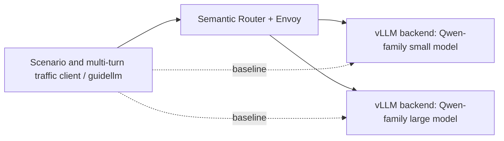
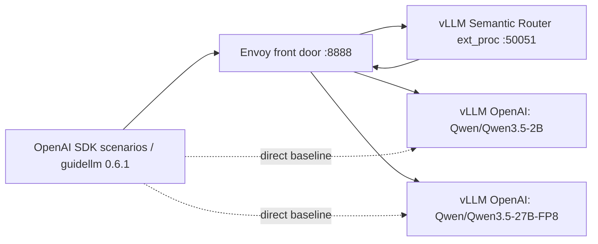

# Semantic Router VM Routing and Performance Validation

| Field | Value |
|---|---|
| Date | 2026-06-25 |
| Round | 1 |
| Repository | `/Users/zhengwan/Desktop/dev/semantic-router` |
| Scope | Deploy two Qwen-family OpenAI-compatible model backends, deploy semantic-router, test routing behavior under multiple configs and traffic mixes, and quantify performance impact with guidellm. |
| Current status | Completed |

## Initial Assumptions

- The VM is a CoreOS-like EC2 GPU host reachable as `cloud-user@bastion.75s2z.sandbox2921.opentlc.com`.
- Four temporary NVMe disks can be used for model/cache/work data, but live disk state must be confirmed before formatting, mounting, or reusing them.
- The user requested Qwen 3.5 2B and Qwen 3.5 27B. Exact public model identifiers must be verified before deployment because public naming may differ from the shorthand.
- Semantic-router should be tested through an OpenAI-compatible client path, with direct backend access used as the benchmark baseline.
- Raw curl is acceptable only for low-level health checks; scenario traffic and pressure testing should use a purpose-built tool.
- Multi-turn tests must include topic switching inside the same conversation to verify whether each turn can be re-evaluated and routed to a different backend.

## Planned Architecture



## Evidence and Audit Links

- Steps log: [../wzh-steps/wzh-steps-2026.06.25.09.21.md](../wzh-steps/wzh-steps-2026.06.25.09.21.md)
- Raw command outputs: [../wzh-steps/files/wzh-steps-2026-06-25-09-21](../wzh-steps/files/wzh-steps-2026-06-25-09-21)
- Packaged remote result archive: [../wzh-steps/files/wzh-steps-2026-06-25-09-21/semantic-router-results-2026-06-25.tgz](../wzh-steps/files/wzh-steps-2026-06-25-09-21/semantic-router-results-2026-06-25.tgz)

## Final Architecture



## Deployment Result

| Component | Result |
|---|---|
| GPU VM | 4 x NVIDIA L4, Podman runtime, NVMe workspace mounted at `/var/mnt/semantic-router-bench`. |
| Docker | Not installed; package metadata checks failed, so the stable path used Podman on the CoreOS-like host. |
| Small backend | `Qwen/Qwen3.5-2B`, served as `qwen35-2b`, OpenAI-compatible health passed. |
| Large backend | `Qwen/Qwen3.5-27B-FP8`, served as `qwen35-27b-fp8`, OpenAI-compatible health passed. |
| Large backend tuning | Initial TP=2 + 8192 context failed CUDA OOM during profiling; stable config used TP=2, `--max-model-len 4096`, `--gpu-memory-utilization 0.80`, and `--enforce-eager`. |
| Router front door | semantic-router + Envoy exposed OpenAI-compatible `/v1/models` and `/v1/chat/completions` through port `18888` on the VM. |
| Final live state | Router restored to `router-basic.yaml` after benchmarks to avoid leaving default traffic on the large model. |

The requested model `Qwen/Qwen3.5-27B-FP8` was used. Model availability was checked through Hugging Face API search for Qwen 3.5 models, including `Qwen/Qwen3.5-2B`, `Qwen/Qwen3.5-27B`, and `Qwen/Qwen3.5-27B-FP8`.

## Routing Configurations Tested

| Config | Default | High-priority rule | Observed behavior |
|---|---|---|---|
| `router-basic.yaml` | `qwen35-2b` | Large-task keywords route to `qwen35-27b-fp8`; small-task keywords route to `qwen35-2b`. | Content-sensitive split: simple summary/translation stayed on 2B, complex debug/proof routed to 27B-FP8. |
| `router-aggressive-large.yaml` | `qwen35-27b-fp8` | Explicit lightweight keywords force `qwen35-2b`. | Default-large policy: complex/default traffic went to 27B-FP8, while greeting/translation/summarize requests forced 2B. |

Important operational finding: decision priority is higher-number-first. The initial `router-basic.yaml` priorities caused `default-small` to win even when large keywords matched. After correcting priorities, large keyword requests selected `route-large-keyword` as intended.

## Scenario Routing Evidence

| Scenario | Basic config selected | Aggressive-large selected | Interpretation |
|---|---:|---:|---|
| Simple customer greeting | 2B / `route-small-keyword` | 2B / `force-small` | Lightweight intent stays inexpensive. |
| Distributed algorithm debug | 27B-FP8 / `route-large-keyword` | 27B-FP8 / `default-large` | Complex reasoning traffic reaches the large backend. |
| Theorem/proof prompt | 27B-FP8 / `route-large-keyword` | 27B-FP8 / `default-large` | Reasoning-style traffic routes large. |
| Translation-only prompt | 2B / `route-small-keyword` | 2B / `force-small` | Explicit simple task remains small. |

## Multi-Turn Topic Switching

Both tested configurations dynamically switched backend models across turns in the same conversation:

| Turn | User topic | Basic config | Aggressive-large config |
|---:|---|---|---|
| 1 | Short retail welcome | 2B | 2B |
| 2 | Debug flaky distributed queue | 27B-FP8 | 27B-FP8 |
| 3 | Summarize previous answer in one sentence | 2B | 2B |

Conclusion: semantic-router re-evaluated each request with the current conversation payload and selected a different backend after topic changes. In this test it could switch from small to large and then back to small in one multi-turn session.

## guidellm Benchmark

`guidellm` 0.6.1 was selected as the load tool because it is purpose-built for OpenAI-compatible LLM benchmarking and records per-request latency, token, and throughput metrics. A clean `python:3.12-slim` client container was used; the vLLM image was not used as the benchmark client because its built-in vLLM/torchvision packages conflicted with `guidellm` imports.

Benchmark profile: `openai_http`, `chat_completions`, `concurrent` profile, concurrency 1, 8 requests per case, synthetic 64 input / 32 output token target. The table below is computed from request-level successful samples in the JSON reports.

| Case | Successful | Errors | Mean latency (s) | p50 latency (s) | Mean TTFT (ms) | Output tok/s mean | Total tok/s mean |
|---|---:|---:|---:|---:|---:|---:|---:|
| direct-small | 8 | 0 | 0.5621 | 0.5628 | 62.81 | 57.78 | 193.06 |
| router-small | 8 | 0 | 0.9711 | 0.5487 | 53.99 | 53.55 | 181.52 |
| direct-large | 8 | 0 | 3.5508 | 3.5485 | 240.52 | 9.13 | 30.00 |
| router-large | 8 | 0 | 3.4958 | 3.5696 | 161.19 | 9.22 | 30.28 |

Interpretation:

- Small path: p50 latency was effectively similar, but mean router latency was higher because one or more samples included router/front-door overhead or cold-path variance. Output throughput dropped from 57.78 to 53.55 output tokens/s in this small sample.
- Large path: router and direct were effectively the same order; mean latency was slightly lower through the router in this sample, which should be treated as measurement noise rather than a router speedup claim.
- The router overhead is small relative to 27B-FP8 generation time, but more visible on the 2B path where generation is fast.
- Sample size is intentionally small; for production SLO decisions, rerun with higher request counts, multiple concurrency levels, and warmed router/model caches.

## Risks and Follow-Ups

- The 27B-FP8 backend fits on two L4 GPUs only with reduced context and eager mode in this environment. Longer context or CUDA graph mode needs more memory tuning.
- `guidellm` 0.6.1 console aggregate metrics can show zero measured totals when all requests fall into warmup/cooldown accounting; the request-level JSON entries were used for this report.
- The aggressive-large configuration is useful to show config sensitivity, but it is cost-heavy because default traffic goes to 27B-FP8.
- This round validates keyword/default-driven routing behavior. It does not validate semantic-quality classifiers, production Redis/Postgres replay stores, or high-concurrency saturation.
- Envoy briefly returned a 500 on `/v1/models` immediately after a router restart; a subsequent check returned 200. Production rollout should include readiness gating during router restarts.

## Created Artifact: `wzh-steps/files/wzh-steps-2026-06-25-09-21/runlog.sh`

```zsh
#!/bin/zsh
set -u

if [[ $# -lt 2 ]]; then
  print -u2 "usage: runlog.sh <label> <command> [args...]"
  exit 64
fi

label="$1"
shift

: "${WZH_STEPS_MD:?WZH_STEPS_MD is required}"
: "${WZH_RAW_DIR:?WZH_RAW_DIR is required}"

mkdir -p "$WZH_RAW_DIR"

safe_label="$(print -r -- "$label" | tr -c 'A-Za-z0-9_.-' '-')"
stamp="$(date '+%Y-%m-%dT%H:%M:%S%z')"
stdout_file="$WZH_RAW_DIR/${safe_label}.stdout.txt"
stderr_file="$WZH_RAW_DIR/${safe_label}.stderr.txt"
meta_file="$WZH_RAW_DIR/${safe_label}.meta.txt"
cmd_display="$(printf '%q ' "$@")"

{
  print -r -- "timestamp=$stamp"
  print -r -- "cwd=$PWD"
  print -r -- "command=$cmd_display"
} > "$meta_file"

"$@" > "$stdout_file" 2> "$stderr_file"
exit_code=$?

stdout_bytes="$(wc -c < "$stdout_file" | tr -d ' ')"
stderr_bytes="$(wc -c < "$stderr_file" | tr -d ' ')"
stdout_lines="$(wc -l < "$stdout_file" | tr -d ' ')"
stderr_lines="$(wc -l < "$stderr_file" | tr -d ' ')"

{
  print -r -- ""
  print -r -- "### ${label}"
  print -r -- ""
  print -r -- "| Field | Value |"
  print -r -- "|---|---|"
  print -r -- "| Timestamp | ${stamp} |"
  print -r -- "| Working directory | \`${PWD}\` |"
  print -r -- "| Command | \`${cmd_display}\` |"
  print -r -- "| Exit code | ${exit_code} |"
  print -r -- "| stdout | [${safe_label}.stdout.txt](files/wzh-steps-2026-06-25-09-21/${safe_label}.stdout.txt) (${stdout_lines} lines, ${stdout_bytes} bytes) |"
  print -r -- "| stderr | [${safe_label}.stderr.txt](files/wzh-steps-2026-06-25-09-21/${safe_label}.stderr.txt) (${stderr_lines} lines, ${stderr_bytes} bytes) |"
  print -r -- "| meta | [${safe_label}.meta.txt](files/wzh-steps-2026-06-25-09-21/${safe_label}.meta.txt) |"
} >> "$WZH_STEPS_MD"

exit "$exit_code"
```

## Created Artifact Links

- Router basic config: [files/wzh-solution-2026-06-25-09-21/router-basic.yaml](files/wzh-solution-2026-06-25-09-21/router-basic.yaml)
- Router aggressive-large config: [files/wzh-solution-2026-06-25-09-21/router-aggressive-large.yaml](files/wzh-solution-2026-06-25-09-21/router-aggressive-large.yaml)
- Envoy config: [files/wzh-solution-2026-06-25-09-21/envoy-vsr.yaml](files/wzh-solution-2026-06-25-09-21/envoy-vsr.yaml)
- Scenario traffic client: [files/wzh-solution-2026-06-25-09-21/traffic_scenarios.py](files/wzh-solution-2026-06-25-09-21/traffic_scenarios.py)
- guidellm benchmark matrix script: [files/wzh-solution-2026-06-25-09-21/guidellm_matrix.sh](files/wzh-solution-2026-06-25-09-21/guidellm_matrix.sh)
- Packaged remote results: [../wzh-steps/files/wzh-steps-2026-06-25-09-21/semantic-router-results-2026-06-25.tgz](../wzh-steps/files/wzh-steps-2026-06-25-09-21/semantic-router-results-2026-06-25.tgz)

## Completion State

Round 1 is complete. The two model backends, Envoy, and semantic-router were left running on the VM, with semantic-router restored to the `router-basic.yaml` configuration.
