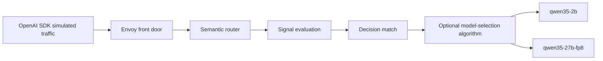

# Round 2: Extended Semantic Router Routing-Mode Validation

| Field | Value |
|---|---|
| Date | 2026-06-25 |
| Environment | GPU VM from `.wzh/env.txt`, Podman runtime, two vLLM backends from round 1 |
| Models | `Qwen/Qwen3.5-2B` as `qwen35-2b`; `Qwen/Qwen3.5-27B-FP8` as `qwen35-27b-fp8` |
| Goal | Validate routing modes beyond keyword matching, including signal-driven routing and model-selection algorithms. |

## Planned Coverage

This round separates two layers that are easy to conflate:

1. Signal routing: request content, metadata, and conversation shape produce matched signals such as embedding, structure, language, context, authz, PII, jailbreak, event, feedback, reask, preference, and projection.
2. Model selection: once a decision matches, algorithms such as RouterDC, AutoMix, Hybrid, MultiFactor, LatencyAware, Elo, and SessionAware choose between the two candidate Qwen backends.

## Test Artifacts

- [router-multisignal.yaml](files/wzh-solution-2026-06-25-10-59/router-multisignal.yaml): multi-signal routing config with no external service dependencies.
- [router-selection-algorithms.yaml](files/wzh-solution-2026-06-25-10-59/router-selection-algorithms.yaml): per-decision model-selection algorithm config over the two Qwen backends.
- [traffic_multisignal.py](files/wzh-solution-2026-06-25-10-59/traffic_multisignal.py): OpenAI SDK single-turn and multi-turn signal traffic.
- [traffic_selection_algorithms.py](files/wzh-solution-2026-06-25-10-59/traffic_selection_algorithms.py): OpenAI SDK model-selection algorithm traffic.

## Results

### Multi-Signal Routing

The multi-signal configuration completed 20 OpenAI SDK requests with no request errors:

| Metric | Value |
|---|---|
| Successful rows | 20 / 20 |
| Routed to `qwen35-27b-fp8` | 11 |
| Routed to `qwen35-2b` | 9 |
| Result summary | [multisignal-summary.json](../wzh-steps/files/wzh-steps-2026-06-25-10-59/extracted-round2/benchmarks/round2-2026-06-25-10-59/multisignal-summary.json) |
| Raw request evidence | [multisignal-results.jsonl](../wzh-steps/files/wzh-steps-2026-06-25-10-59/extracted-round2/benchmarks/round2-2026-06-25-10-59/multisignal-results.jsonl) |

Validated non-keyword routing signals included:

| Signal / mechanism | Evidence |
|---|---|
| embedding | `technical_support` routed to 27B-FP8; `account_management` routed to 2B. |
| structure | `first_then_flow` routed to 27B-FP8 and emitted `high_escalation` projection. |
| language | Chinese request emitted `zh` and routed to 2B. |
| context | Long prompt emitted `long_context` and routed to 27B-FP8. |
| projection | `high_escalation` appeared on the ordered workflow / support escalation path. |
| authz | Admin headers emitted `admin,premium_user` and routed to 27B-FP8. |
| jailbreak | Prompt-injection text emitted `prompt_injection` and routed to the guarded 2B lane. |
| PII | Synthetic SSN/card prompt emitted `restricted_pii` and routed to the guarded 2B lane. |
| event | `payment_failed critical TXN_DECLINE urgent` emitted `critical_payment_event` and routed to 27B-FP8. |
| preference | Terse/bullet request emitted `terse_answers` and routed to 2B. |
| fact-check | Repeated checkout-cause question emitted `needs_fact_check` and routed to 27B-FP8. |
| user-feedback / reask / conversation | Multi-turn wrong-answer and repeated-question cases emitted `wrong_answer`, `likely_dissatisfied`, and `multi_turn_user`. |

The important multi-turn result is that the router can switch backend models during a conversation when the current turn and accumulated context change the matched signals. In `multi_turn_topic_switch`, turn 1 routed to 2B via `account_management`; turn 2 switched to 27B-FP8 via technical/event/context/conversation escalation; turn 3 stayed on 27B-FP8 due `wrong_answer`, Chinese language, long context, and multi-turn conversation signals. That is dynamic per-request switching, not a sticky session pin.

### Model Selection Algorithms

The per-decision model-selection configuration completed 10 OpenAI SDK requests with no request errors after removing algorithms rejected by the current image:

| Algorithm | Simple prompt | Complex prompt | Status |
|---|---|---|---|
| router_dc | 2B | 27B-FP8 | Validated |
| automix | 27B-FP8 | 27B-FP8 | Validated |
| hybrid | 2B | 27B-FP8 | Validated |
| multi_factor | 2B | 2B | Validated |
| latency_aware | 2B | 2B | Validated |

Evidence:

- [selection-algorithms-summary.json](../wzh-steps/files/wzh-steps-2026-06-25-10-59/extracted-round2/benchmarks/round2-2026-06-25-10-59/selection-algorithms-summary.json)
- [selection-algorithms-results.jsonl](../wzh-steps/files/wzh-steps-2026-06-25-10-59/extracted-round2/benchmarks/round2-2026-06-25-10-59/selection-algorithms-results.jsonl)

Two algorithms were intentionally attempted but rejected by the current `ghcr.io/vllm-project/semantic-router/vllm-sr:latest` image when configured as per-decision algorithms:

| Algorithm | Current-image result |
|---|---|
| elo | Rejected at config load: moved to global router learning/adaptation. |
| session_aware | Rejected at config load: moved to global router learning/protection. |

So the correct conclusion is not "Elo/session-aware do not exist"; it is "they are no longer accepted as `routing.decisions[].algorithm.type` in this image and need the newer global learning configuration path."

## Operational Notes

- Authz role bindings are strict: once an authz decision references role bindings, requests need an identity header. The test traffic therefore sent `x-authz-user-id: anonymous` for ordinary requests and admin group headers only for the authz scenario.
- Some classifier-backed signals require model initialization on first use. The helper waits for Envoy `/v1/models` after router startup to avoid false failures while classifier assets initialize.
- The VM was restored to `router-basic.yaml` at the end of the successful selection-only run.

## Artifacts

- [round 2 result archive](../wzh-steps/files/wzh-steps-2026-06-25-10-59/semantic-router-round2-results-2026-06-25-10-59.tgz)
- [round 2 command audit](../wzh-steps/wzh-steps-2026.06.25.10.59.md)
