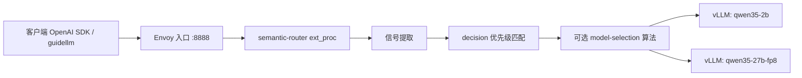
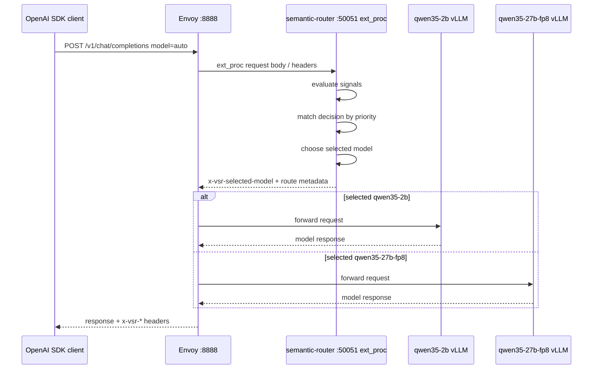

# Semantic Router 从入门到进阶：部署、配置、路由判断与测试结果综合报告

| 字段 | 值 |
|---|---|
| 报告日期 | 2026-06-25 |
| 面向读者 | 熟悉 IT / 容器 / API，但刚开始接触 semantic-router 的用户 |
| 测试环境 | GPU VM，Podman 运行容器，两个 vLLM 后端，一个 semantic-router，一个 Envoy |
| 后端模型 | `Qwen/Qwen3.5-2B` 与 `Qwen/Qwen3.5-27B-FP8` |
| 主要目标 | 解释什么配置会导致什么路由结果，以及怎样从配置读懂 semantic-router 的行为 |
| 原始证据 | [round 1 报告](wzh-solution-2026.06.25.09.21.md), [round 2 报告](wzh-solution-2026.06.25.10.59.md), [round 2 结果包](../wzh-steps/files/wzh-steps-2026-06-25-10-59/semantic-router-round2-results-2026-06-25-10-59.tgz) |

## 1. 先给结论

semantic-router 的核心套路可以压缩成一句话：

> 客户端仍然请求一个 OpenAI 兼容入口，但 router 会先读取请求内容、请求头和对话历史，计算一批信号，然后根据 `routing.decisions` 的优先级选中一条决策，再把请求转发到某个真实后端模型。

在本次 VM 测试里，最终验证了三类能力：

| 能力 | 配置入口 | 测试结果 |
|---|---|---|
| 简单 keyword / default 路由 | `routing.signals.keywords` + `routing.decisions[].rules` | 简单问候/翻译走 2B，复杂调试/证明走 27B-FP8 |
| 多信号路由 | embedding, context, structure, language, authz, PII, jailbreak, event, feedback, reask, preference, projection | 20 个 OpenAI SDK 场景全部成功，11 次走 27B-FP8，9 次走 2B |
| 决策命中后的模型选择算法 | `routing.decisions[].algorithm.type` | router_dc / automix / hybrid / multi_factor / latency_aware 全部跑通 |

最重要的使用技巧：

1. `decisions[].priority` 决定谁先匹配。数字越大越先执行。
2. `rules.conditions` 决定“什么请求命中这个 decision”。
3. `modelRefs` 决定“命中后有哪些候选模型”。
4. 如果没有 `algorithm`，通常就是按 decision 指定的模型走。
5. 如果有 `algorithm`，decision 先命中，然后算法在 `modelRefs` 候选模型里二次选择。
6. 多轮对话不是固定粘住一个模型，router 会按当前 turn 和上下文重新判断。

## 2. mental model：semantic-router 到底在干什么

把 semantic-router 想成一个“LLM 请求的智能网关”。

普通 LLM 调用是：


semantic-router 之后变成：



用户看到的是同一个 `/v1/chat/completions` API，但系统内部多做了几件事：

| 阶段 | 做什么 | 主要配置 |
|---|---|---|
| 入口 | 接收 OpenAI 兼容请求 | Envoy `envoy-vsr.yaml` |
| 解析 | 读取 messages、headers、model=`auto` | semantic-router runtime |
| 信号 | 判断关键词、语义、语言、上下文长度、PII、安全、事件等 | `routing.signals` |
| 决策 | 用布尔规则决定哪条路由命中 | `routing.decisions[].rules` |
| 选模型 | 在候选模型里直接选或算法选 | `modelRefs`, `algorithm` |
| 转发 | 改写/选择上游 backend | `providers.models[].backend_refs` |
| 返回 | 把 `x-vsr-*` 响应头带回来 | router response headers |

## 3. 运行环境

### 3.1 VM 与磁盘

测试在一个 GPU VM 上完成。关键事实如下：

| 项 | 值 |
|---|---|
| GPU | 4 x NVIDIA L4 |
| 容器运行时 | Podman |
| Docker | 没有采用。环境更适合 Podman，且之前安装 Docker 的路径不稳定 |
| 工作目录 | `/var/mnt/semantic-router-bench` |
| 模型/cache 目录 | `/var/mnt/semantic-router-bench/hf-cache` |
| router 配置目录 | `/var/mnt/semantic-router-bench/configs` |
| 流量脚本目录 | `/var/mnt/semantic-router-bench/traffic` |
| 结果目录 | `/var/mnt/semantic-router-bench/benchmarks` |
| 日志目录 | `/var/mnt/semantic-router-bench/logs` |

### 3.2 运行了哪些容器

最终长期运行的容器是这四个：

| 容器 | 作用 | 暴露端口 | 关键挂载 / 配置 |
|---|---|---|---|
| `vsr-qwen35-2b` | 小模型 vLLM OpenAI 后端 | host `18001` -> container `8000` | `hf-cache:/data/hf-cache`, `logs:/logs` |
| `vsr-qwen35-27b-fp8` | 大模型 vLLM OpenAI 后端 | host `18002` -> container `8000` | `hf-cache:/data/hf-cache`, `logs:/logs` |
| `vsr-router` | semantic-router runtime 与 ext_proc 服务 | host `18080`, `15051`, `19190` | `configs/<router>.yaml:/app/config.yaml`, `models:/app/models`, `logs:/logs` |
| `vsr-envoy` | OpenAI API 前门和 ext_proc 调用方 | host `18888`, admin `19901` | `configs/envoy-vsr.yaml:/etc/envoy/envoy.yaml` |

最终恢复后的 router 挂载状态已经确认：

| 容器 | 当前配置 |
|---|---|
| `vsr-router` | `/var/mnt/semantic-router-bench/configs/router-basic.yaml -> /app/config.yaml` |

### 3.3 这些目录和文件分别干什么

| 路径 | 作用 |
|---|---|
| `/var/mnt/semantic-router-bench/configs/router-basic.yaml` | round 1 的基础路由配置，最终环境恢复到这个配置 |
| `/var/mnt/semantic-router-bench/configs/router-aggressive-large.yaml` | round 1 的默认大模型配置，用于对比 default 策略 |
| `/var/mnt/semantic-router-bench/configs/router-multisignal.yaml` | round 2 的多信号配置，测试 embedding/context/language/authz/PII 等 |
| `/var/mnt/semantic-router-bench/configs/router-selection-algorithms.yaml` | round 2 的模型选择算法配置，测试 router_dc/automix/hybrid 等 |
| `/var/mnt/semantic-router-bench/configs/envoy-vsr.yaml` | Envoy 前门配置，定义 OpenAI API 请求如何走 ext_proc 和上游 |
| `/var/mnt/semantic-router-bench/hf-cache` | Hugging Face 模型缓存，vLLM 后端模型从这里复用 |
| `/var/mnt/semantic-router-bench/models` | semantic-router classifier / embedding 相关模型资产目录 |
| `/var/mnt/semantic-router-bench/traffic/*.py` | OpenAI SDK 模拟流量脚本 |
| `/var/mnt/semantic-router-bench/benchmarks` | guidellm 和 round 2 JSONL 结果 |

## 4. 系统启动时下载或初始化了什么模型

这里要分清两类模型。

### 4.1 vLLM 后端模型

这是最终真正生成答案的 LLM：

| 后端 | Hugging Face 模型 | served-model-name | 作用 |
|---|---|---|---|
| 小模型 | `Qwen/Qwen3.5-2B` | `qwen35-2b` | 简单、短、低成本请求 |
| 大模型 | `Qwen/Qwen3.5-27B-FP8` | `qwen35-27b-fp8` | 复杂分析、长上下文、排错、安全/事件等 |

27B-FP8 在这台机器上的稳定参数是：

```text
--tensor-parallel-size 2
--max-model-len 4096
--gpu-memory-utilization 0.80
--enforce-eager
```

原因是：早期使用更长上下文和 CUDA graph 时遇到显存压力，稳定路径改成 TP=2、4096 上下文、eager mode。

### 4.2 semantic-router 自己用的 classifier / embedding 模型

semantic-router 不是只靠目标 LLM 做判断，它自己也会加载一些轻量模型或 classifier 资产。

日志证据显示：

| 资产 / 后端 | 观察到的日志行为 | 用途 |
|---|---|---|
| `models/mmbert-embed-32k-2d-matryoshka` | 首次 basic router 健康检查时下载，28 个文件，下载成功 | embedding 语义相似度、RouterDC 等 |
| mmBERT embedding backend | `mmBERT embedding model registered with 2D Matryoshka support` | 把请求和候选描述转成向量 |
| mmBERT 32K PII backend | `pii_detector_backend_selected backend=mmbert_32k` | 检测敏感信息 |
| mmBERT 32K jailbreak backend | `jailbreak_detector_backend_selected backend=mmbert_32k` | 检测 prompt injection / jailbreak |
| mmBERT 32K category backend | `category_classifier_backend_selected backend=mmbert_32k` | domain / category 类信号 |
| model-selection registry | 注册 router_dc、automix、hybrid、multi_factor、latency_aware 等 | decision 命中后的候选模型选择 |

round 2 多信号配置启动时日志显示 `required_models_already_present total_models=5`。这说明某些 classifier 资产在前面启动/调试过程中已经下载或准备好，后续只是复用。

运行时也出现了 Hugging Face 的 unauthenticated warning：

```text
Warning: You are sending unauthenticated requests to the HF Hub. Please set a HF_TOKEN to enable higher rate limits and faster downloads.
```

这不是错误，只是说明没有配置 HF_TOKEN，下载速率可能受限。报告和脚本里没有保存任何 HF token。

## 5. 访问流量路径

所有正式测试都尽量走“真实前门”，而不是直接 curl 后端。

### 5.1 正常 OpenAI SDK 流量



### 5.2 为什么 `model=auto`

测试客户端请求的是：

```text
model = auto
```

`auto` 的意思是：客户端不指定真实模型，让 semantic-router 选择。响应头里会看到：

| 响应头 | 意义 |
|---|---|
| `x-vsr-selected-model` | 最终选中的后端模型 |
| `x-vsr-selected-decision` | 命中的 routing decision |
| `x-vsr-selected-confidence` | decision 或算法给出的置信度 |
| `x-vsr-selected-reasoning` | 是否启用 reasoning 参数 |
| `x-vsr-matched-*` | 命中的信号，比如 embedding、context、language、pii |

这批 header 是理解 semantic-router 的关键。测试脚本之所以用 OpenAI SDK 的 raw response，就是为了把这些 header 捕获下来。

## 6. 配置文件怎么看

semantic-router 配置有四个最重要的区域：

```yaml
providers:
  models:
    - name: qwen35-2b
      backend_refs:
        - endpoint: vsr-qwen35-2b:8000
    - name: qwen35-27b-fp8
      backend_refs:
        - endpoint: vsr-qwen35-27b-fp8:8000

routing:
  signals:
    ...
  projections:
    ...
  decisions:
    ...
```

### 6.1 providers.models：真实后端在哪里

`providers.models` 负责声明“router 知道哪些模型，以及这些模型的后端 endpoint 在哪里”。

本测试中：

| semantic-router 内部模型名 | 真实 backend endpoint |
|---|---|
| `qwen35-2b` | `vsr-qwen35-2b:8000` |
| `qwen35-27b-fp8` | `vsr-qwen35-27b-fp8:8000` |

这些 endpoint 是容器网络 `vsr-bench` 里的 DNS 名字，不是宿主机端口。

### 6.2 routing.signals：怎样识别请求

signal 是“请求特征”。比如：

| signal 类型 | 本次例子 | 用途 |
|---|---|---|
| keyword | `large_task_keywords`, `small_task_keywords` | 最直接的关键词匹配 |
| embedding | `technical_support`, `account_management` | 语义相似，不要求字面关键词完全一样 |
| context | `short_context`, `long_context` | 按 token 数判断长短 |
| structure | `many_questions`, `first_then_flow` | 判断请求形状，比如很多问号、先后流程 |
| language | `zh` | 中文请求 |
| pii | `restricted_pii` | 敏感信息 |
| jailbreak | `prompt_injection` | prompt injection / jailbreak |
| event | `critical_payment_event` | 支付失败、交易拒绝、紧急事件 |
| authz | `admin`, `premium_user` | 基于请求头身份和用户组 |
| user_feedback | `wrong_answer` | 用户说前一轮回答错了 |
| reask | `likely_dissatisfied` | 用户重复问类似问题 |
| preference | `terse_answers` | 用户偏好短回答、bullet only |

### 6.3 routing.decisions：命中后走哪里

decision 是“如果满足这些 signal，就路由到这些模型”。

一个典型 decision：

```yaml
- name: route-support-embedding-large
  priority: 780
  rules:
    operator: AND
    conditions:
      - type: embedding
        name: technical_support
  modelRefs:
    - model: qwen35-27b-fp8
      use_reasoning: true
      reasoning_effort: medium
```

读法：

1. 如果请求命中 `embedding: technical_support`
2. 并且没有被更高 priority 的 decision 抢先命中
3. 那么选 `qwen35-27b-fp8`
4. 并开启 reasoning

### 6.4 priority：非常重要

本项目里的实际观察是：priority 数字越大越先匹配。

round 1 初始配置曾经出过一个典型问题：`default-small` priority 太高，导致默认路由抢先命中，即使 large keyword 也没有走大模型。修正后：

| decision | priority |
|---|---:|
| `route-large-keyword` | 300 |
| `route-small-keyword` | 200 |
| `default-small` | 0 |

这样复杂关键词才会先被 `route-large-keyword` 捕获。

## 7. round 1：基础 keyword / default 配置

### 7.1 `router-basic.yaml`

配置意图：

| 规则 | 目标模型 |
|---|---|
| 命中复杂任务关键词，比如 proof、debug、architecture、root cause | `qwen35-27b-fp8` |
| 命中简单任务关键词，比如 hello、translate、summarize、short | `qwen35-2b` |
| 都没命中 | `qwen35-2b` |

测试结果：

| 请求 | 命中 decision | 模型 | 直接关联的配置 |
|---|---|---|---|
| 简短客服欢迎语 | `route-small-keyword` | 2B | `small_task_keywords` 命中 short/greeting |
| 分布式算法 debug | `route-large-keyword` | 27B-FP8 | `large_task_keywords` 命中 debug/root cause/tradeoff |
| theorem/proof | `route-large-keyword` | 27B-FP8 | `large_task_keywords` 命中 proof/theorem |
| 翻译类请求 | `route-small-keyword` | 2B | `small_task_keywords` 命中 translate |

配置技巧：

1. basic 模式适合保守上线：默认省钱，只有明确复杂才走大模型。
2. 对新业务最安全，因为误判时通常不会把大量流量打到 27B。
3. 但它依赖关键词覆盖，复杂请求如果没有关键词可能会漏到 2B。

### 7.2 `router-aggressive-large.yaml`

配置意图：

| 规则 | 目标模型 |
|---|---|
| 明确轻量任务 | 强制走 2B |
| 其他所有请求 | 默认走 27B-FP8 |

测试结果：

| 请求 | 命中 decision | 模型 |
|---|---|---|
| 简短欢迎语 | `force-small` | 2B |
| 分布式 debug | `default-large` | 27B-FP8 |
| theorem/proof | `default-large` | 27B-FP8 |
| 翻译类请求 | `force-small` | 2B |

配置技巧：

1. aggressive 模式适合质量优先或 PoC 展示。
2. 成本更高，因为默认走大模型。
3. 如果生产流量里多数请求很简单，不建议直接用 default-large。

## 8. round 1：多轮对话是否能动态切模型

测试对话：

| Turn | 内容 | basic 结果 | aggressive 结果 |
|---:|---|---|---|
| 1 | 简短欢迎语 | 2B | 2B |
| 2 | 切换到分布式队列 debug | 27B-FP8 | 27B-FP8 |
| 3 | 再切回一句话总结 | 2B | 2B |

结论：

semantic-router 不是把一个 session 永久绑到一个模型。每一次请求都会重新看当前 conversation payload，然后重新匹配规则。所以多轮里主题变化时，模型可以切换。

这件事对使用很重要：

| 场景 | 建议 |
|---|---|
| 客服聊天，用户从寒暄切到复杂故障 | 允许从 2B 升到 27B |
| 复杂分析结束后只要求一句总结 | 可以降回 2B |
| 工具调用 / agent 工作流 | 需要额外考虑 session-aware / protection 类配置，避免上下文迁移成本过大 |

## 9. round 1：guidellm 压测结果怎么读

guidellm 用来比较“直接访问后端”和“经过 semantic-router”的性能。

| Case | Successful | Errors | Mean latency (s) | p50 latency (s) | Mean TTFT (ms) |
|---|---:|---:|---:|---:|---:|
| direct-small | 8 | 0 | 0.5621 | 0.5628 | 62.81 |
| router-small | 8 | 0 | 0.9711 | 0.5487 | 53.99 |
| direct-large | 8 | 0 | 3.5508 | 3.5485 | 240.52 |
| router-large | 8 | 0 | 3.4958 | 3.5696 | 161.19 |

解释：

1. 对 2B 小模型来说，模型本身很快，所以 router 额外路径更容易被看见。
2. 对 27B-FP8 来说，生成耗时远大于 router 判断耗时，所以 router overhead 相对不明显。
3. 这个样本数很小，只能说明数量级，不应该当作生产 SLO。
4. 生产压测要增加请求量、并发、预热、多轮、多 prompt 类型。

## 10. round 2：多信号配置 `router-multisignal.yaml`

round 2 的核心是证明：semantic-router 不只是 keyword。

多信号配置包括：

| 配置块 | 例子 | 测试目的 |
|---|---|---|
| `embeddings` | `technical_support`, `account_management` | 语义相似路由 |
| `context` | `short_context`, `long_context` | 按上下文 token 数路由 |
| `structure` | `many_questions`, `first_then_flow`, `format_directive_dense` | 按请求结构路由 |
| `language` | `zh` | 中文请求路由 |
| `role_bindings` | admin / premium-support | 按身份头路由 |
| `pii` | `restricted_pii` | 敏感信息走保护 lane |
| `jailbreak` | `prompt_injection` | prompt injection 走保护 lane |
| `events` | `critical_payment_event` | 关键支付事件走大模型 |
| `preferences` | `terse_answers` | 偏好短答走小模型 |
| `reasks` | `likely_dissatisfied` | 重复提问升级 |
| `projections` | `escalation_score -> high_escalation` | 多个信号加权成派生信号 |

### 10.1 projection 是什么

projection 是把多个信号合成一个新结果。

本次配置：

```yaml
escalation_score =
  technical_support confidence * 0.30
  + long_context * 0.25
  + many_questions * 0.25
  + first_then_flow * 0.20
```

然后：

| 分数 | projection output |
|---|---|
| `< 0.30` | `low_escalation` |
| `>= 0.30` | `high_escalation` |

所以当一个请求既像技术支持，又是流程性请求，或者上下文长，就可能被打成 `high_escalation`，再被 decision 捕获。

### 10.2 多信号测试总结果

| 指标 | 值 |
|---|---:|
| 总请求 | 20 |
| 成功 | 20 |
| 错误 | 0 |
| 路由到 2B | 9 |
| 路由到 27B-FP8 | 11 |
| summary | [multisignal-summary.json](../wzh-steps/files/wzh-steps-2026-06-25-10-59/extracted-round2/benchmarks/round2-2026-06-25-10-59/multisignal-summary.json) |
| raw JSONL | [multisignal-results.jsonl](../wzh-steps/files/wzh-steps-2026-06-25-10-59/extracted-round2/benchmarks/round2-2026-06-25-10-59/multisignal-results.jsonl) |

### 10.3 多信号：配置与结果逐项对应

| 测试场景 | 命中信号 | 命中 decision | 最终模型 | 为什么 |
|---|---|---|---|---|
| 安装失败、解释错误、排错步骤 | `embedding=technical_support` | `route-support-embedding-large` | 27B-FP8 | technical support 语义相似度命中，配置要求走大模型 |
| 重置密码、账号设置、账单 | `embedding=account_management` | `route-account-embedding-small` | 2B | 账号类请求被定义为小模型 lane |
| 很多问题 | `structure=many_questions`, `fact_check=needs_fact_check`, `event=critical_payment_event` | `route-critical-event-large` | 27B-FP8 | 高 priority 的 event decision 先于 structure decision |
| 编号步骤 | 只有 short context / no_fact_check | `default-small` | 2B | 本次 regex 没匹配到配置里的 numbered_steps，落默认 |
| First...then...finally 流程 | `structure=first_then_flow`, `projection=high_escalation` | `route-structure-large` | 27B-FP8 | structure decision priority 840，高于 projection decision 820 |
| 中文总结 | `language=zh` | `route-zh-small` | 2B | 中文规则直接绑定小模型 |
| 长上下文事故总结 | `context=long_context` | `route-long-context-large` | 27B-FP8 | token count 约 1793，超过 long_context 阈值 |
| factual claim 验证 | `pii=restricted_pii` | `route-pii-small-guarded` | 2B | classifier 把文本识别为受限 PII 风险，PII decision priority 940 抢先 |
| jailbreak 文本 | `jailbreak=prompt_injection` | `route-jailbreak-small-guarded` | 2B | prompt injection 保护 lane |
| synthetic SSN/card | `pii=restricted_pii` | `route-pii-small-guarded` | 2B | 敏感信息保护 lane |
| payment_failed critical TXN_DECLINE | `event=critical_payment_event` | `route-critical-event-large` | 27B-FP8 | 关键事件 priority 960，很靠前 |
| Keep concise, bullet only | `preference=terse_answers`, `structure=format_directive_dense` | `route-preference-small` | 2B | 短答偏好配置成小模型 |
| admin header | `authz=admin,premium_user` | `route-authz-admin-large` | 27B-FP8 | admin decision priority 980，最高 |

这里有两个非常重要的学习点。

第一，多个信号可以同时命中，但最终只有一个 decision 获胜，通常由 priority 决定。例如 `structure_many_questions` 同时有 `many_questions` 和 `critical_payment_event`，最后走 `route-critical-event-large`，因为 event decision priority 960 高于 structure decision 840。

第二，检测结果不一定只符合人的直觉。比如 fact_check 场景被 PII rule 抢先，这说明 classifier 路由需要结合业务数据反复校准阈值和 priority。semantic-router 给了你可观测 header，方便你发现这种现象。

## 11. round 2：多轮对话中的动态切换

### 11.1 主题切换测试

| Turn | 用户意图 | 命中信号 | decision | 模型 |
|---:|---|---|---|---|
| 1 | 重置密码、账号设置 | `account_management` | `route-account-embedding-small` | 2B |
| 2 | 切换到安装失败排错 | `technical_support`, `wrong_answer`, `long_context`, `multi_turn_user`, `critical_payment_event`, `high_escalation` | `route-critical-event-large` | 27B-FP8 |
| 3 | 再切中文总结 | `wrong_answer`, `zh`, `long_context`, `multi_turn_user` | `route-user-feedback-large` | 27B-FP8 |

这个结果说明：

1. semantic-router 会读取整个 conversation payload，不只是最后一句。
2. 多轮历史会让 `context=long_context`、`conversation=multi_turn_user` 这类信号出现。
3. “切回简单任务”不一定会降回 2B，因为历史上下文和 feedback 信号可能继续把它留在 27B-FP8。

这就是多轮路由的真实复杂性：当前 turn 简单，不代表整个请求简单。

### 11.2 wrong answer / reask 测试

| 场景 | Turn | 命中信号 | 模型 |
|---|---:|---|---|
| 用户说回答错了 | 1 | `terse_answers` | 2B |
| 用户说 wrong and needs clarification | 2 | `wrong_answer`, `multi_turn_user` | 27B-FP8 |
| 用户重复问 checkout queue | 1 | `needs_fact_check` | 27B-FP8 |
| 用户重复同一问题 | 2 | `needs_fact_check`, `wrong_answer`, `likely_dissatisfied`, `multi_turn_user`, `long_context` | 27B-FP8 |

使用技巧：

1. 如果你希望“用户不满意时升级模型”，就配置 `user_feedback` 或 `reask` 到大模型。
2. 如果你希望“只是继续短答，不升级”，要调低 feedback decision 的 priority，或者把 feedback 与其他条件组合起来。

## 12. round 2：模型选择算法配置

前面的多信号配置是“哪个 decision 命中”。模型选择算法是“decision 命中后，在候选模型里怎么选”。

### 12.1 测试配置结构

每个算法都用一个 keyword 只负责触发 decision，例如：

```yaml
- name: select-routerdc
  rules:
    conditions:
      - type: keyword
        name: alg_routerdc
  modelRefs:
    - model: qwen35-2b
    - model: qwen35-27b-fp8
  algorithm:
    type: router_dc
```

这样设计的原因是：把“decision 是否命中”和“algorithm 怎么选模型”分开。keyword 只是开关，真正观察的是算法在 2B/27B 之间的选择。

### 12.2 算法测试总结果

| 指标 | 值 |
|---|---:|
| 总请求 | 10 |
| 成功 | 10 |
| 错误 | 0 |
| 路由到 2B | 6 |
| 路由到 27B-FP8 | 4 |
| summary | [selection-algorithms-summary.json](../wzh-steps/files/wzh-steps-2026-06-25-10-59/extracted-round2/benchmarks/round2-2026-06-25-10-59/selection-algorithms-summary.json) |
| raw JSONL | [selection-algorithms-results.jsonl](../wzh-steps/files/wzh-steps-2026-06-25-10-59/extracted-round2/benchmarks/round2-2026-06-25-10-59/selection-algorithms-results.jsonl) |

### 12.3 算法逐项结果

| Algorithm | 简单请求结果 | 复杂请求结果 | 解释 |
|---|---|---|---|
| router_dc | 2B | 27B-FP8 | 根据 query-model contrastive similarity 选择，简单账号类偏 2B，复杂事故分析偏 27B |
| automix | 27B-FP8 | 27B-FP8 | 当前质量分和配置使它偏向高质量模型 |
| hybrid | 2B | 27B-FP8 | 混合 RouterDC / AutoMix / cost 等权重，简单走小，复杂走大 |
| multi_factor | 2B | 2B | quality/latency/cost/load 权重与 SLO 配置下偏向便宜/快的 2B |
| latency_aware | 2B | 2B | 当前 latency-aware 配置和可用观测下偏向 2B |

### 12.4 Elo 和 session_aware 为什么没作为 per-decision 跑通

我们也尝试过：

```yaml
algorithm:
  type: elo
```

和：

```yaml
algorithm:
  type: session_aware
```

当前 `ghcr.io/vllm-project/semantic-router/vllm-sr:latest` 镜像拒绝这两种 per-decision 配置：

| 算法 | 当前镜像报错含义 |
|---|---|
| elo | 已迁到 global router learning/adaptation |
| session_aware | 已迁到 global router learning/protection |

正确理解是：它们不是不存在，而是不能再按 `routing.decisions[].algorithm.type` 这种旧路径配置。要继续测试，需要研究当前版本的 global learning 配置。

## 13. authz 的坑

本次 authz 测试暴露了一个很实际的点：

只要配置了 role binding 并且 decision 使用 authz signal，router 会要求请求里有身份头。

普通请求如果没有：

```text
x-authz-user-id
```

就会被拒绝，错误类似：

```text
authz signal evaluation failed: user identity header is empty
```

所以 round 2 后来这样处理：

| 请求类型 | header |
|---|---|
| 普通请求 | `x-authz-user-id: anonymous` |
| admin 测试 | `x-authz-user-id: alice`, `x-authz-user-groups: admins,premium-support` |

使用技巧：

1. 如果你只想测试 authz 场景，不要让所有请求都被 authz 阻塞。
2. 可以给普通请求注入匿名身份头。
3. 生产里应该由认证网关注入可信 header，而不是让客户端随便填。

## 14. 配置和测试结果的直接关联

这是本报告最重要的一张表。

| 你改的配置 | 会直接影响什么 | 本次证据 |
|---|---|---|
| `providers.models[].backend_refs.endpoint` | 请求实际转发到哪个容器 | 2B endpoint 是 `vsr-qwen35-2b:8000`，27B endpoint 是 `vsr-qwen35-27b-fp8:8000` |
| `providers.defaults.default_model` | 没有路由命中时默认模型 | basic / multisignal 默认是 `qwen35-2b` |
| `routing.signals.keywords` | 字面关键词命中 | basic 配置中 debug/proof 走 27B，translate/short 走 2B |
| `routing.signals.embeddings.threshold` | 语义相似命中难易 | technical support 走 27B，account management 走 2B |
| `routing.signals.context.min_tokens/max_tokens` | 长上下文判断 | 1793 tokens 的请求命中 `long_context`，走 27B |
| `routing.signals.structure` | 请求形状判断 | `first_then_flow` 命中后走 27B |
| `routing.projections.scores` | 多信号加权派生 | first/then 流程产生 `high_escalation` |
| `routing.decisions[].priority` | 多个 decision 同时匹配时谁赢 | event priority 960 抢过 structure priority 840 |
| `routing.decisions[].rules.operator` | 条件是 AND / OR / NOT | feedback decision 用 OR，wrong_answer 或 need_clarification 都能命中 |
| `routing.decisions[].modelRefs` | 命中 decision 后的候选模型 | 单模型 modelRefs 直接决定结果；多模型 modelRefs 交给 algorithm |
| `routing.decisions[].algorithm` | 候选模型二次选择方式 | router_dc 简单选 2B、复杂选 27B；multi_factor 两个都选 2B |

## 15. 学习路线：从入门到熟练

### 15.1 入门配置：只做 keyword + default

适合目标：

| 目标 | 做法 |
|---|---|
| 先跑通 | 一个小模型，一个大模型，一个默认 2B |
| 控成本 | default-small |
| 可解释 | 用 keyword 明确控制 |

建议配置：

```yaml
decisions:
  - name: route-large-keyword
    priority: 300
    rules:
      conditions:
        - type: keyword
          name: large_task_keywords
    modelRefs:
      - model: qwen35-27b-fp8

  - name: default-small
    priority: 0
    rules:
      conditions: []
    modelRefs:
      - model: qwen35-2b
```

### 15.2 进阶配置：加 embedding / context / language

适合目标：

| 目标 | 做法 |
|---|---|
| 关键词覆盖不够 | 加 embedding |
| 长文档自动升级 | 加 context |
| 中文请求单独策略 | 加 language |

建议：

1. embedding threshold 不要一开始设太高，先观察 header。
2. context 阈值要结合模型真实上下文能力。
3. language routing 要考虑业务目标，不是所有中文都一定要走小模型。

### 15.3 高级配置：projection + model selection

适合目标：

| 目标 | 做法 |
|---|---|
| 多信号综合判断 | projection weighted_sum |
| 同一 decision 内动态选模型 | algorithm |
| 质量/成本/延迟折中 | hybrid 或 multi_factor |

建议：

1. projection 输出要有清晰含义，比如 `high_escalation`。
2. algorithm 测试要用简单/复杂两类 prompt，不能只测一种。
3. 用 `x-vsr-selected-decision` 和 `x-vsr-selected-model` 证明结果，不要只看回答内容。

### 15.4 运维配置：readiness、日志和回滚

本次测试里踩到过两个运维点：

| 问题 | 解决 |
|---|---|
| router 容器起来很快，但 classifier 模型还在初始化，Envoy `/v1/models` 短暂 500 | 启动脚本等待 Envoy `/v1/models` 成功再发流量 |
| 试验配置跑完后可能留下 default-large 或算法配置 | 最后显式恢复 `router-basic.yaml` |

建议生产化时：

1. 把 router readiness 和 Envoy front-door readiness 分开检查。
2. 每次切配置前保存当前 config。
3. 每次测试结束恢复成本安全的 default-small 配置。
4. 保留 `x-vsr-*` header 到日志或 trace，方便事后解释路由。

## 16. 如何读一次请求的路由结果

拿一条 raw JSONL：

```json
{
  "scenario_id": "embedding_technical_support",
  "headers": {
    "x-vsr-selected-model": "qwen35-27b-fp8",
    "x-vsr-selected-decision": "route-support-embedding-large",
    "x-vsr-matched-embeddings": "technical_support",
    "x-vsr-matched-context": "short_context",
    "x-vsr-matched-projections": "low_escalation"
  }
}
```

读法：

1. 看 `x-vsr-selected-model`：最终去了 `qwen35-27b-fp8`。
2. 看 `x-vsr-selected-decision`：是 `route-support-embedding-large` 决定的。
3. 去配置里找这个 decision。
4. 发现它要求 `embedding: technical_support`。
5. 再看 matched header，确实有 `x-vsr-matched-embeddings: technical_support`。
6. 结论：这个请求不是 keyword 路由，而是 embedding 语义路由导致走大模型。

这就是调试 semantic-router 的基本方法。

## 17. 本次测试中容易误解的现象

| 现象 | 正确解释 |
|---|---|
| 多个信号同时出现，但只选一个 decision | decision priority 决定最终 winner |
| 当前 turn 很简单，但多轮里仍走 27B | 历史上下文、feedback、conversation 信号也参与判断 |
| fact_check 场景走了 PII guarded lane | PII decision priority 更高，且 classifier 判断有 PII 风险 |
| numbered_steps 没走 structure-large | 说明 regex/输入格式没有按预期命中，需要调试 pattern |
| AutoMix 简单请求也选 27B | 当前 quality_score / algorithm 配置偏质量，不是所有算法都会省钱 |
| latency_aware 复杂请求仍选 2B | 当前 latency 观测或配置偏快模型，符合 latency-aware 的目标 |
| Elo / session_aware 不能 per-decision 配置 | 当前镜像把它们迁到 global learning 配置路径 |

## 18. 推荐的实际落地策略

### 18.1 第一阶段：保守上线

| 项 | 建议 |
|---|---|
| 默认模型 | 2B |
| 大模型规则 | 明确复杂关键词 + 少量 embedding |
| 观测 | 强制记录 `x-vsr-selected-*` 和 `x-vsr-matched-*` |
| 回滚 | 保留 `router-basic.yaml` |

### 18.2 第二阶段：扩大语义信号

| 项 | 建议 |
|---|---|
| 支持类请求 | embedding technical_support |
| 账号类请求 | embedding account_management |
| 长上下文 | context long_context |
| 多轮升级 | user_feedback / reask |
| 安全 | PII / jailbreak guarded lane |

### 18.3 第三阶段：算法选型

| 目标 | 建议算法 |
|---|---|
| 语义匹配候选模型能力 | router_dc |
| 偏质量、允许升级 | automix |
| 质量/语义/成本折中 | hybrid |
| 显式质量/延迟/成本/load 权重 | multi_factor |
| 强延迟目标 | latency_aware |

### 18.4 第四阶段：生产化治理

需要补的东西：

1. 更大规模 guidellm 压测。
2. 多并发和长上下文混合流量。
3. authz header 从可信认证网关注入。
4. classifier 阈值和 priority 的灰度调参。
5. 将路由 header 接入日志系统。
6. 若要测试 Elo / session-aware，改走当前版本 global learning 配置。

## 19. 本次最终状态

测试完成后，VM 已恢复到安全默认：

| 项 | 状态 |
|---|---|
| `vsr-qwen35-2b` | running |
| `vsr-qwen35-27b-fp8` | running |
| `vsr-envoy` | running |
| `vsr-router` | running |
| router 配置 | `router-basic.yaml` |
| router health | healthy |

## 20. 证据索引

| 内容 | 链接 |
|---|---|
| round 1 原始报告 | [wzh-solution-2026.06.25.09.21.md](wzh-solution-2026.06.25.09.21.md) |
| round 2 原始报告 | [wzh-solution-2026.06.25.10.59.md](wzh-solution-2026.06.25.10.59.md) |
| round 1 command audit | [wzh-steps-2026.06.25.09.21.md](../wzh-steps/wzh-steps-2026.06.25.09.21.md) |
| round 2 command audit | [wzh-steps-2026.06.25.10.59.md](../wzh-steps/wzh-steps-2026.06.25.10.59.md) |
| round 3 command audit | [wzh-steps-2026.06.25.11.30.md](../wzh-steps/wzh-steps-2026.06.25.11.30.md) |
| basic config | [router-basic.yaml](files/wzh-solution-2026-06-25-09-21/router-basic.yaml) |
| aggressive config | [router-aggressive-large.yaml](files/wzh-solution-2026-06-25-09-21/router-aggressive-large.yaml) |
| multi-signal config | [router-multisignal.yaml](files/wzh-solution-2026-06-25-10-59/router-multisignal.yaml) |
| model-selection config | [router-selection-algorithms.yaml](files/wzh-solution-2026-06-25-10-59/router-selection-algorithms.yaml) |
| multi-signal raw results | [multisignal-results.jsonl](../wzh-steps/files/wzh-steps-2026-06-25-10-59/extracted-round2/benchmarks/round2-2026-06-25-10-59/multisignal-results.jsonl) |
| model-selection raw results | [selection-algorithms-results.jsonl](../wzh-steps/files/wzh-steps-2026-06-25-10-59/extracted-round2/benchmarks/round2-2026-06-25-10-59/selection-algorithms-results.jsonl) |
| round 2 result archive | [semantic-router-round2-results-2026-06-25-10-59.tgz](../wzh-steps/files/wzh-steps-2026-06-25-10-59/semantic-router-round2-results-2026-06-25-10-59.tgz) |

## 21. 最短学习口诀

如果你只记五句话：

1. `signals` 负责识别请求。
2. `decisions` 负责把信号变成路由。
3. `priority` 决定多个 decision 同时命中时谁赢。
4. `modelRefs` 是候选模型，`algorithm` 是候选模型的二次选择器。
5. 看 `x-vsr-selected-*` 和 `x-vsr-matched-*`，就能反推一次请求为什么走这个模型。
