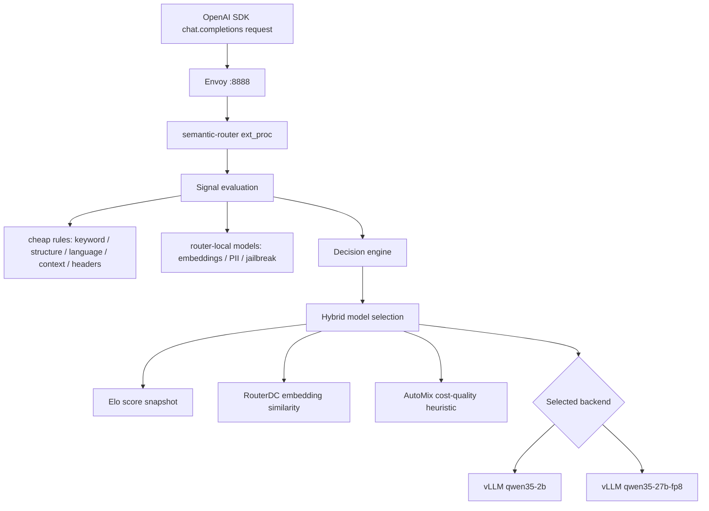

# Semantic Router Round 4：融合多信号与算法选模验证报告

| 字段 | 值 |
|---|---|
| 测试日期 | 2026-06-25 |
| 测试环境 | GPU VM，4 x NVIDIA L4，rootless Podman，vLLM OpenAI backend，semantic-router + Envoy |
| 后端模型 | `Qwen/Qwen3.5-2B`，`Qwen/Qwen3.5-27B-FP8` |
| 本轮重点 | 多信号先命中，随后由模型选择算法在 2B/27B-FP8 之间选模；记录 OpenAI SDK 原始请求；分析信号命中成本 |
| 主要证据 | [steps](../wzh-steps/wzh-steps-2026.06.25.15.25.md)，[结果包](../wzh-steps/files/wzh-steps-2026-06-25-15-25/semantic-router-round4-results-2026-06-25-15-25.tgz)，[场景表 CSV](../wzh-steps/files/wzh-steps-2026-06-25-15-25/round4-fused-scenario-table.csv)，[分析 JSON](../wzh-steps/files/wzh-steps-2026-06-25-15-25/round4-fused-analysis-summary.json) |

## 结论

本轮恢复了重启后的 GPU VM，并成功部署两个 vLLM 后端：`qwen35-2b` 和 `qwen35-27b-fp8`。由于 rootless Podman 容器在 SSH 会话结束时被 SIGTERM 杀掉，本轮启用了 `loginctl enable-linger cloud-user`，之后通过独立 SSH 会话验证两个后端仍然存活，`/v1/models` 均返回 200。

融合配置验证成功：请求先经过 keyword、embedding、language、context、structure、authz、PII、jailbreak、conversation、projection 等信号计算；命中 decision 后，再用 `hybrid` 算法在 `qwen35-2b` 和 `qwen35-27b-fp8` 两个候选模型中选择。18 条 OpenAI SDK 场景流量全部成功，14 次选到 2B，4 次选到 27B-FP8。多轮对话会按当前 turn 重新计算信号；主题或反馈变化后可以动态改变后端模型，例如 `multi_wrong_answer_feedback` 第 1 轮选 2B，第 2 轮因多轮上下文/反馈转为 27B-FP8。

最重要的成本结论：信号命中阶段不会调用后端 Qwen 2B 或 Qwen 27B-FP8 做生成式推理。它主要在 semantic-router 内部完成。便宜信号是字符串、正则、header、语言、结构、上下文 token/会话事实计算；embedding、PII、jailbreak 等信号会调用 router-local 的小型 embedding/classifier 推理，日志显示 backend 为 `candle`、model 为 `mmbert`、dim 为 768。也就是说，“命中成本”不是一次后端大模型生成，而是规则计算 + 可选本地小模型分类/向量计算 + 选模算法计算。

## 路径

## 本轮配置

融合配置保存在 [router-fused-signals-hybrid.yaml](files/wzh-solution-2026-06-25-15-25/router-fused-signals-hybrid.yaml)，共 354 行。核心思想是：

- `models` 定义两个候选后端及虚拟价格/质量元数据：`qwen35-2b` 和 `qwen35-27b-fp8`。
- `signals` 定义多类可命中的规则：keyword、embedding、language、context、structure、role_bindings、jailbreak、PII、user_feedbacks、reasks、preferences、conversation、events、projections。
- `routing.decisions[0]` 使用 OR 条件，只要多个信号之一命中就进入 `fused-signal-hybrid-selector`。
- decision 的 `modelRefs` 同时包含 2B 和 27B-FP8。
- decision 的 `algorithm.type: hybrid`，让 router 在候选模型之间继续选择，而不是由单个信号直接硬编码模型。
- `defaultModel: qwen35-2b` 保留无信号或不可选时的低成本默认路径。

OpenAI SDK 审计流量脚本保存在 [traffic_fused_audit.py](files/wzh-solution-2026-06-25-15-25/traffic_fused_audit.py)，共 392 行。它使用 `client.chat.completions.with_raw_response.create(...)`，每条记录保存：

- 原始请求 method/url/headers/body；
- HTTP status、完整 response headers、`x-vsr-*` 选模和命中信号 headers；
- response body、usage、model；
- 场景 id、期望、耗时、多轮 session id。

## 算法含义

`hybrid` 是本轮实际可运行的融合选模算法。它内部组合多个分数来源：

| 参数 | 含义 |
|---|---|
| `elo_weight` | 经验/质量历史分。当前 runtime 中 standalone `elo` 已迁移，但 hybrid 内部仍可使用 Elo selector 的即时评分组件；本轮日志里候选初始 rating 均为 0。 |
| `router_dc_weight` | RouterDC 的语义相似度权重。它对请求和模型描述/能力做 embedding 相似度比较，偏向更语义匹配的模型。 |
| `automix_weight` | AutoMix 的成本/质量启发式权重。它把模型质量、价格、tradeoff 结合起来，常常会把低复杂度请求压回 2B。 |
| `cost_weight` | 成本惩罚强度。值越高，越倾向便宜模型，除非其它分数足以证明大模型收益。 |
| `normalize_scores` | 是否先归一化各组件分数，避免某一组件的尺度天然压倒其它组件。 |

RouterDC 的关键参数：

| 参数 | 含义 |
|---|---|
| `embedding_dimension` | embedding 向量维度。本轮为 768。 |
| `temperature` | 相似度转概率/置信度时的平滑参数。 |
| `min_similarity` | 最低相似度阈值；低于阈值时选择置信度会下降。 |
| `use_capabilities` | 是否把模型能力描述纳入语义匹配。 |

AutoMix 的关键参数：

| 参数 | 含义 |
|---|---|
| `quality_threshold` | 质量收益门槛。 |
| `cost_quality_tradeoff` | 成本和质量的权衡。越偏成本，越容易选 2B；越偏质量，越容易选 27B-FP8。 |
| `max_escalations` | 控制升级到更强模型的次数/倾向。 |
| `discount_factor` | 对历史/迭代收益的折扣。 |

Elo 和 session-aware 的当前 runtime 结论：

- 本地仓库文档和类型仍能看到 `algorithm.type=elo`、`algorithm.type=session_aware` 的配置结构。
- 但本轮实际 router image 明确拒绝旧路径：
  - `session_aware`: `routing.decisions[0].algorithm.type=session_aware is no longer supported; remove algorithm.type=session_aware and enable global.router.learning.protection`
  - `elo`: `routing.decisions[0].algorithm.type=elo has moved to global.router.learning.adaptation; remove algorithm.type=elo and choose a request-time base algorithm only when needed`
- 因此在当前镜像中，Elo/session-aware 应按新的 `global.router.learning.adaptation/protection` 路径继续研究，不能再作为 per-decision `algorithm.type` 直接使用。

## 信号命中成本

信号命中可以分三层理解。

第一层是便宜的 CPU/内存计算。这类信号不会调用任何模型：

- keyword/BM25/regex：对文本做词或正则匹配。源码中 `keyword_classifier_dispatch.go` 记录 `BM25 keyword classification matched rule ...`。
- language：使用 `lingua-go` 做语言识别，日志为 `Language classification: code=...`。
- structure/context/conversation：统计问号、编号、first/then 流程、上下文长度、多轮状态等。
- authz/event/projection：解析 header、键值字段或基于已有 signal 做 projection。

第二层是 router-local 小模型推理。这类会有模型推理成本，但不是调用 Qwen 后端：

- embedding signal 和 RouterDC：日志显示 `[Perf] embedding inference (phase=request, backend=candle, model=mmbert, dim=768)`。
- PII signal：源码对唯一 content 执行 `c.piiInference.ClassifyTokens(content)`，再对多个规则复用缓存结果。
- jailbreak signal：源码对唯一 content 执行 `c.jailbreakInference.Classify(content)`，contrastive 规则则走本地分析路径。

第三层是模型选择算法。它发生在 signal 命中和 backend 转发之间：

- hybrid 会调用 Elo、RouterDC、AutoMix 的评分组件，然后做加权求和和成本调整。
- 本轮 router log 展示了每次 `[HybridSelector] Combining scores ...` 和 `[ModelSelection] Selected ...`。
- backend LLM 生成只发生在选定模型以后，Envoy 才把请求转发到对应 vLLM。

本轮实测成本数据来自 [分析 JSON](../wzh-steps/files/wzh-steps-2026-06-25-15-25/round4-fused-analysis-summary.json)：

| 指标 | 本轮观测 |
|---|---:|
| fused 请求数 | 18 |
| 成功数 | 18 |
| request body 记录完整数 | 18 |
| router routing latency 中位数 | 360.5 ms |
| router routing latency 最大值 | 23625 ms |
| embedding inference 中位数 | 97.2635 ms |
| embedding inference 最大值 | 12009.831 ms |

这里的最大值来自少数冷启动/长文本/RouterDC embedding 路径，不代表每次命中的稳定成本。更典型的热路径 embedding inference 约几十到一百多毫秒。真正的后端生成耗时另算，本轮 2B 请求常见约 0.7-3 秒，27B-FP8 请求约 10-25 秒，取决于 max_tokens、冷启动和文本长度。

## 测试结果

fused 场景结果来自 [fused-results.jsonl](../wzh-steps/files/wzh-steps-2026-06-25-15-25/extracted-round4-final/benchmarks/round4-2026-06-25-15-25/fused-results.jsonl) 和 [场景表 CSV](../wzh-steps/files/wzh-steps-2026-06-25-15-25/round4-fused-scenario-table.csv)。

| 项目 | 结果 |
|---|---:|
| 总请求 | 18 |
| 成功请求 | 18 |
| 选到 `qwen35-2b` | 14 |
| 选到 `qwen35-27b-fp8` | 4 |
| 命中 `fused-signal-hybrid-selector` | 17 |
| 命中 `default-small-no-signal` | 1 |
| 记录原始 OpenAI SDK request body | 18 |

代表性场景：

| 场景 | 命中信号 | 选择结果 | 说明 |
|---|---|---|---|
| `simple_account_short` | `explicit_simple` + `account_management` + `short_context` | `qwen35-2b` | 简短账户类请求被成本/AutoMix 压到小模型。 |
| `technical_support_complex` | `explicit_complex` + `technical_support` | `qwen35-27b-fp8` | 复杂技术支持请求触发大模型。 |
| `numbered_steps_architecture` | `explicit_complex` | `qwen35-27b-fp8` | 架构/步骤请求被 hybrid 选到大模型。 |
| `long_context_root_cause` | `explicit_complex` + `long_context` | `qwen35-2b` | 长上下文不必然选大模型，成本权重仍可能压回 2B。 |
| `authz_admin_policy` | `explicit_complex` + `admin,premium_user` | `qwen35-27b-fp8` | header role signal 参与分流。 |
| `multi_wrong_answer_feedback` 第 2 轮 | `long_context` + `multi_turn_user` | `qwen35-27b-fp8` | 多轮反馈后动态切换到 27B-FP8。 |
| `multi_reask_same_question` 第 1 轮 | 无强信号 | `qwen35-2b` / default | 默认小模型路径。 |
| `multi_reask_same_question` 第 2 轮 | `long_context` + `multi_turn_user` | `qwen35-2b` / fused | 多轮重问触发 fused decision，但算法仍选 2B。 |

## 多轮动态切换

多轮对话不是“首次选中后固定后端”。本轮脚本给多轮请求带了同一个 `x-session-id`，并把历史 messages 一并发送。router 会重新做 signal evaluation，并在 selection context 中带入 session/conversation 信息。

实测说明：

- `multi_topic_switch_account_to_incident_to_chinese` 三轮都重新计算了 signal。第 2 轮从账户任务切换到 incident/root cause，命中 `explicit_complex` + `technical_support` + `multi_turn_user`，但 hybrid 在成本和 AutoMix 作用下仍选 2B。
- `multi_wrong_answer_feedback` 第 1 轮是简单定义，选 2B；第 2 轮出现“wrong / clarification / evidence”一类反馈语义，加上多轮上下文，选到 27B-FP8。
- `multi_reask_same_question` 第 1 轮走 default-small-no-signal；第 2 轮因为历史使 context/conversation 信号变化，进入 fused decision，但最终仍选 2B。

所以答案是：semantic-router 能在多轮对话中动态切换后端，但切换结果取决于 signal 命中和算法权重，不是看到“主题变化”就一定升级到大模型。

## 版本差异风险

本轮使用的 router image 为 `855af44c3aa4...`，创建时间 `2026-06-23 08:52:39 UTC`；vLLM image 为 `f37691f675bb...`，创建时间 `2026-06-12 23:32:00 UTC`。实际 runtime 比本地部分配置文档更严格，已经把 per-decision Elo/session-aware 迁移到全局 learning 路径。

这意味着：

- 旧文档或旧配置里的 `routing.decisions[].algorithm.type=elo/session_aware` 在当前镜像不可用。
- hybrid 仍可作为 request-time base algorithm 使用，并可组合 Elo-like 经验分、RouterDC 和 AutoMix。
- 若要验证真正的跨请求 Elo 学习或 session-aware protection，需要下一轮围绕 `global.router.learning.adaptation` 和 `global.router.learning.protection` 建立新配置，而不是沿用旧 algorithm block。

## 运维记录

VM 重启后，4 块临时盘重新裸盘。本轮只格式化并挂载 `/dev/nvme1n1` 到 `/var/mnt/semantic-router-bench`，其余盘未动。后端启动脚本保存在 [start_backends_after_linger.sh](files/wzh-solution-2026-06-25-15-25/start_backends_after_linger.sh)。关键修复是：

- `sudo loginctl enable-linger cloud-user`
- 使用 rootless Podman 重新启动两个 vLLM 容器
- 独立 SSH 会话验证容器存活和 `/v1/models` 200

后端验证结果：

| 后端 | 端口 | 验证 |
|---|---:|---|
| `qwen35-2b` | 18001 | `/v1/models` 200 |
| `qwen35-27b-fp8` | 18002 | `/v1/models` 200 |
| semantic-router | 18080 | fused config health ready |
| Envoy OpenAI endpoint | 18888 | `/v1/models` 200，chat completions 200 |

## 后续建议

1. 针对 `global.router.learning.adaptation/protection` 做一个专门 round，确认新 Elo/session-aware 的配置 schema、状态持久化和跨请求学习效果。
2. 对 embedding/RouterDC 冷启动做预热：本轮最高 12 秒 embedding inference 明显是少数冷路径，生产压测应先 warmup。
3. 如果目标是“复杂请求更稳定走 27B-FP8”，需要降低 `cost_weight` 或调高 27B 的质量收益/RouterDC 描述相关性；当前配置更偏成本保护。
4. 用 guidellm 对 fused router 重新做一轮稳定压测，区分 router overhead、信号计算 overhead、后端生成 latency 三类成本。
