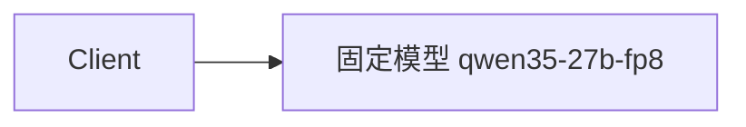
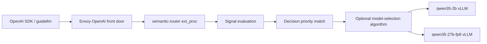
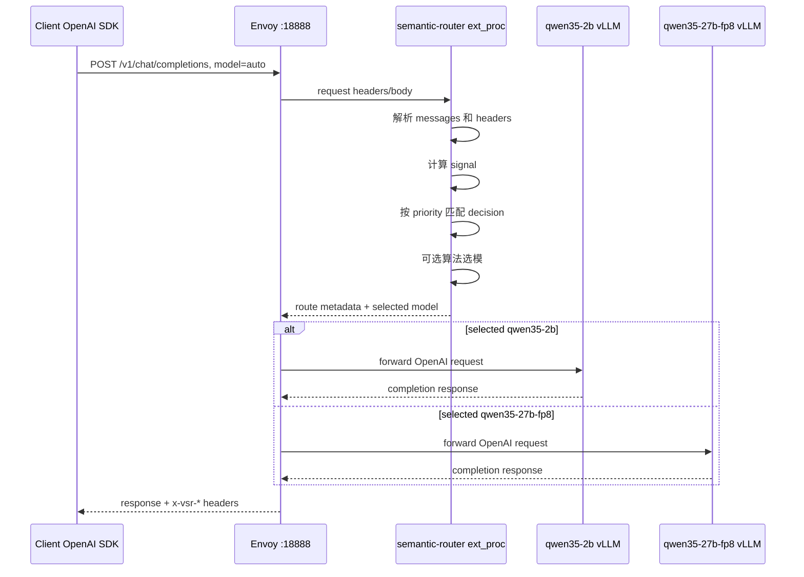
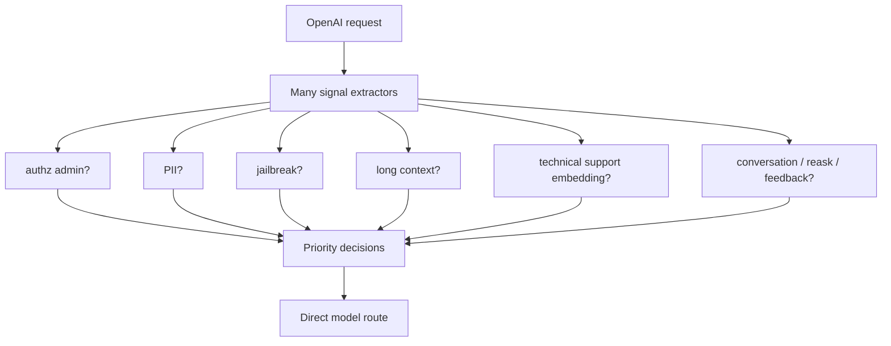
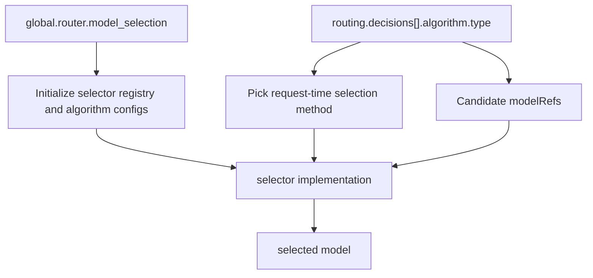
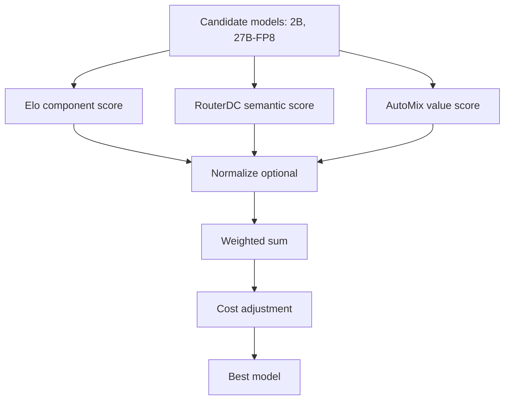
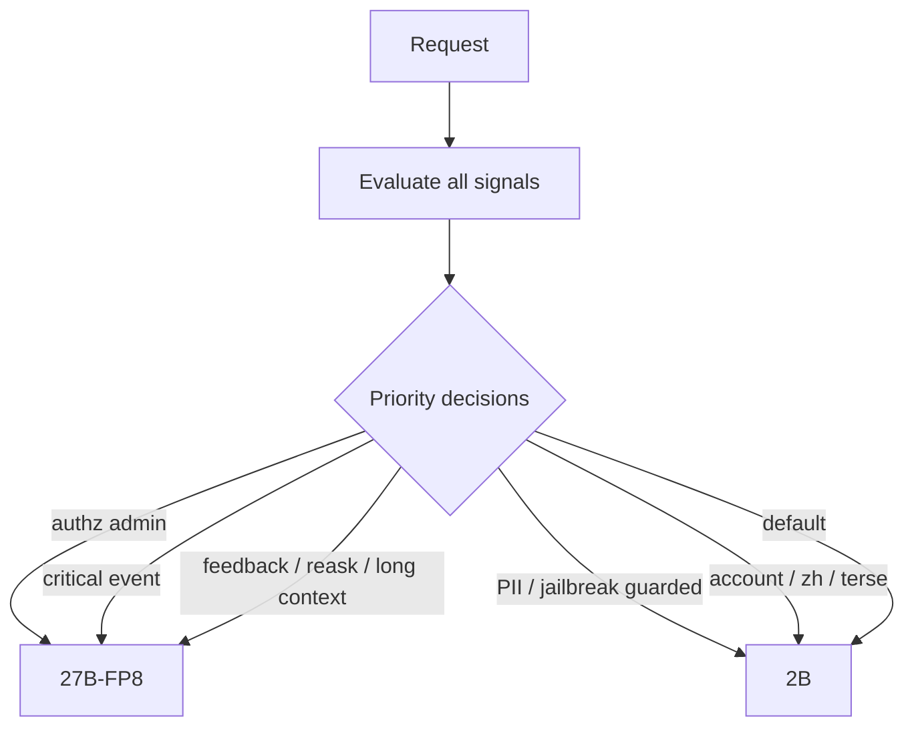
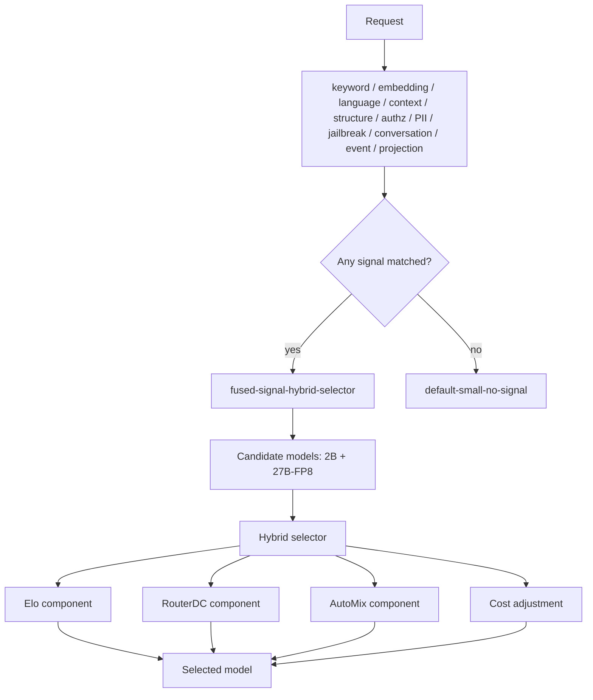
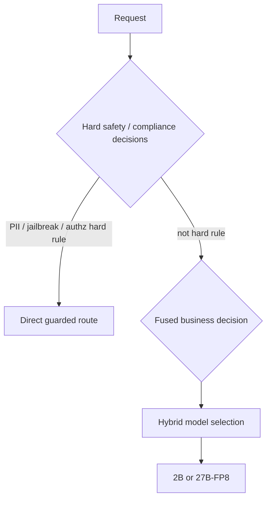
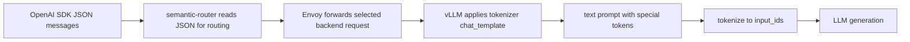

# Semantic Router 从入门到精通：从简单路由、模型选择算法到融合配置的完整中文报告

| 字段 | 值 |
|---|---|
| 报告日期 | 2026-06-25 |
| 面向读者 | 刚毕业、会写 API 调用和 YAML，但还没有系统理解 semantic-router 的工程同学 |
| 测试环境 | GPU VM，4 x NVIDIA L4，rootless Podman，两个 vLLM OpenAI 后端，一个 semantic-router，一个 Envoy |
| 后端模型 | `Qwen/Qwen3.5-2B` 与 `Qwen/Qwen3.5-27B-FP8` |
| 核心目标 | 把前几轮研究结果合并成一条学习路线：先学简单路由，再学模型选择算法，最后学两种融合配置 |
| 主要实测证据 | [round 1 报告](wzh-solution-2026.06.25.09.21.md)，[round 2 报告](wzh-solution-2026.06.25.10.59.md)，[round 3 入门报告](wzh-solution-2026.06.25.11.30.md)，[round 4 融合报告](wzh-solution-2026.06.25.15.25.md)，[本轮步骤](../wzh-steps/wzh-steps-2026.06.25.19.50.md) |
| 关键配置文件 | [router-basic.yaml](files/wzh-solution-2026-06-25-09-21/router-basic.yaml)，[router-aggressive-large.yaml](files/wzh-solution-2026-06-25-09-21/router-aggressive-large.yaml)，[router-multisignal.yaml](files/wzh-solution-2026-06-25-10-59/router-multisignal.yaml)，[router-selection-algorithms.yaml](files/wzh-solution-2026-06-25-10-59/router-selection-algorithms.yaml)，[router-fused-signals-hybrid.yaml](files/wzh-solution-2026-06-25-15-25/router-fused-signals-hybrid.yaml) |
| 原始请求记录 | [fused-results.jsonl](../wzh-steps/files/wzh-steps-2026-06-25-15-25/extracted-round4-final/benchmarks/round4-2026-06-25-15-25/fused-results.jsonl) |

## 0. 先给总答案

semantic-router 的核心不是“多写几个 if else，把关键词分到不同模型”。它更像一个 LLM 网关：客户端继续用 OpenAI SDK 请求 `/v1/chat/completions`，请求先到 Envoy，再经 Envoy 的 ext_proc 机制交给 semantic-router。router 读取请求的 `messages`、headers、会话信息和模型元数据，计算一批信号，然后按 `routing.decisions` 找到一个命中的 decision。命中后可以直接选一个模型，也可以把多个候选模型交给 `router_dc`、`automix`、`hybrid`、`multi_factor`、`latency_aware` 这类模型选择算法继续比较。

这次最终验证出来的学习路径是：

| 阶段 | 你要学会什么 | 对应配置 | 适合什么时候用 |
|---|---|---|---|
| 入门 | 用 keyword 和 default 把明显简单/复杂请求分开 | `router-basic.yaml`，`router-aggressive-large.yaml` | 第一次部署、验证路径、证明 router 能动态分流 |
| 进阶 | 把请求内容、语言、上下文、结构、安全、PII、用户反馈、多轮形态都变成 signal | `router-multisignal.yaml` | 想让分流不只依赖关键词，而是看请求语义和上下文 |
| 算法 | decision 命中后，在多个候选模型之间用算法选 | `router-selection-algorithms.yaml` | 想把“命中规则”和“最终模型选择”拆开 |
| 融合方法一 | 多 signal + 多 decision，优先级控制，命中后直接绑定模型 | `router-multisignal.yaml` | 需要可解释、可审计、生产上稳一点的策略 |
| 融合方法二 | 多 signal 先进入一个 fused decision，再由 `hybrid` 算法在 2B/27B 间选 | `router-fused-signals-hybrid.yaml` | 需要更灵活的成本/质量权衡，让算法参与最终选择 |

本次 VM 上跑通的真实后端是：

| 模型 | served-model-name | 角色 |
|---|---|---|
| `Qwen/Qwen3.5-2B` | `qwen35-2b` | 低成本、低延迟、短请求、简单账户/摘要/翻译/普通问答 |
| `Qwen/Qwen3.5-27B-FP8` | `qwen35-27b-fp8` | 复杂推理、技术排查、安全分析、架构分析、代码/事故类请求 |

最重要的实测结论：

| 问题 | 结论 |
|---|---|
| 能不能部署两个模型并通过 router 分流？ | 能。两个 vLLM 后端和 semantic-router + Envoy 都跑通。 |
| 能不能动态切模型？ | 能。每一次 OpenAI SDK 调用都会重新计算信号；多轮对话中主题变化后可以换后端。 |
| 多轮对话是不是 `messages` 里有很多 `role/content`？ | 是。每轮请求通常会把之前 user/assistant 历史和当前 user 消息一起带上。 |
| 信号命中的时候会不会调用 2B/27B 后端推理？ | 不会。命中阶段主要在 router 内部计算；有些信号会用 router-local embedding/classifier 小模型，但不是调用后端 Qwen 做生成。 |
| `decision.algorithm` 和 `global.router.model_selection` 是什么关系？ | decision 决定本次请求用什么算法和哪些候选模型；global 负责初始化 selector registry 和提供算法参数块。没有 decision algorithm 时默认 static，不会因为 global method 自动替你选。 |
| `automix`、`hybrid`、`router_dc` 是 CPU 还是 GPU？ | AutoMix/Hybrid 主体是 Go/CPU 打分逻辑；RouterDC 和 Hybrid 中的 RouterDC 组件会调用 embedding 函数，embedding backend 可用 candle/openvino 等，本轮日志里是 router-local candle/mmBERT 路径。 |
| raw OpenAI SDK input 记录在哪里？ | [fused-results.jsonl](../wzh-steps/files/wzh-steps-2026-06-25-15-25/extracted-round4-final/benchmarks/round4-2026-06-25-15-25/fused-results.jsonl)，每行的 `request.body` 就是发送前的 JSON body。 |

## 1. 先建立 mental model

普通 LLM 调用通常是这样：



这很简单，但有两个问题。第一，简单请求也会烧大模型钱；第二，复杂请求如果固定走小模型，质量可能不够。

加上 semantic-router 后变成：



注意这里有三层东西非常容易混：

| 层 | 中文解释 | 例子 | 作用 |
|---|---|---|---|
| Signal | 信号，router 对请求做出的观察 | keyword 命中、embedding 相似、中文、长上下文、PII、多轮、reask | “这是什么请求” |
| Decision | 决策，多个 signal 组成布尔规则，再按 priority 匹配 | `route-large-keyword`，`route-pii-small-guarded` | “这类请求进入哪条路由策略” |
| Model selection | 选模算法，decision 命中后在候选模型中二次选择 | `router_dc`，`automix`，`hybrid` | “候选模型里最终选哪个” |

一句话记忆：

> signal 是观察，decision 是规则入口，algorithm 是命中后怎么在候选模型里挑。

## 2. 流量到底怎么走

本次部署有四个核心容器：

| 容器 | 角色 | 端口 | 说明 |
|---|---|---:|---|
| `vsr-qwen35-2b` | 小模型 vLLM OpenAI 后端 | host `18001` -> container `8000` | 服务 `qwen35-2b` |
| `vsr-qwen35-27b-fp8` | 大模型 vLLM OpenAI 后端 | host `18002` -> container `8000` | 服务 `qwen35-27b-fp8` |
| `vsr-router` | semantic-router | host `15051` ext_proc，`18080` health | 计算信号、命中 decision、选模型 |
| `vsr-envoy` | OpenAI API 前门 | host `18888` -> container `8888` | 接收客户端请求，调用 router，转发到 vLLM |

真实请求路径是：



为什么客户端传 `model=auto`？因为真实模型由 router 决定。客户端只说“我要自动路由”，最终结果看响应头：

| Header | 作用 |
|---|---|
| `x-vsr-selected-model` | 最终选中的模型，例如 `qwen35-2b` |
| `x-vsr-selected-decision` | 命中的 decision，例如 `fused-signal-hybrid-selector` |
| `x-vsr-selected-confidence` | router 对选择的置信度 |
| `x-vsr-matched-keywords` | 命中的 keyword signal |
| `x-vsr-matched-embeddings` | 命中的 embedding signal |
| `x-vsr-matched-context` | 命中的上下文长度 signal |
| `x-vsr-matched-conversation` | 命中的多轮信号 |

这些 header 是调试分流最重要的证据。不要只看最终回答内容，要看 router 说自己为什么这么选。

## 3. 配置文件的骨架

本次配置都使用 `version: v0.3`，主要分成四块：

```yaml
version: v0.3

listeners:
  - name: http-8888
    address: 0.0.0.0
    port: 8888

providers:
  defaults:
    default_model: qwen35-2b
  models:
    - name: qwen35-2b
      backend_refs:
        - endpoint: vsr-qwen35-2b:8000
    - name: qwen35-27b-fp8
      backend_refs:
        - endpoint: vsr-qwen35-27b-fp8:8000

routing:
  modelCards: []
  signals: {}
  decisions: []

global:
  router:
    model_selection: {}
```

每块意思如下：

| 配置块 | 用人话解释 |
|---|---|
| `listeners` | router 对外监听的 HTTP 入口。这里是容器内 `8888`。 |
| `providers.defaults.default_model` | 没有明确选出模型时使用哪个默认模型。 |
| `providers.models` | 注册真实后端。这里把逻辑模型名映射到 vLLM backend endpoint。 |
| `routing.modelCards` | 描述每个候选模型的能力、质量分、上下文窗口、价格等，算法选模会用。 |
| `routing.signals` | 定义 router 可以识别哪些信号。 |
| `routing.decisions` | 定义信号命中后走哪条策略，以及候选模型是什么。 |
| `global.router.model_selection` | 初始化和配置各种模型选择算法的全局参数。 |

一个新同学最容易犯的错是：看到 `providers.models` 以为配置完后端就会自动智能路由。不是。`providers.models` 只是告诉系统“有哪些后端可以用”。真正决定怎么分流的是 `routing.signals` 和 `routing.decisions`。

## 4. 入门：最简单的 keyword/default 路由

最适合入门的是 [router-basic.yaml](files/wzh-solution-2026-06-25-09-21/router-basic.yaml)。

这个配置的意图很保守：

| 请求类型 | 目标模型 |
|---|---|
| 明显复杂：proof/debug/architecture/root cause/算法/架构/调试 | `qwen35-27b-fp8` |
| 明显简单：hello/summarize/translate/short/简短/翻译/总结 | `qwen35-2b` |
| 都没命中 | 默认 `qwen35-2b` |

核心配置长这样：

```yaml
providers:
  defaults:
    default_model: qwen35-2b

routing:
  signals:
    keywords:
      - name: large_task_keywords
        operator: OR
        method: bm25
        keywords: [proof, theorem, algorithm, debug, architecture, root cause, 推理, 证明, 架构, 调试]
      - name: small_task_keywords
        operator: OR
        method: bm25
        keywords: [hello, summarize, translate, short, concise, 简短, 翻译, 总结]

  decisions:
    - name: route-large-keyword
      priority: 300
      rules:
        operator: AND
        conditions:
          - type: keyword
            name: large_task_keywords
      modelRefs:
        - model: qwen35-27b-fp8
          use_reasoning: true
          reasoning_effort: medium

    - name: route-small-keyword
      priority: 200
      rules:
        operator: AND
        conditions:
          - type: keyword
            name: small_task_keywords
      modelRefs:
        - model: qwen35-2b
          use_reasoning: false

    - name: default-small
      priority: 0
      rules:
        operator: AND
        conditions: []
      modelRefs:
        - model: qwen35-2b
```

逐项解释：

| 字段 | 含义 |
|---|---|
| `signals.keywords[].name` | 给这组关键词起名字，后面 decision 会引用。 |
| `operator: OR` | 这组关键词里任意一个命中即可。 |
| `method: bm25` | 用 BM25/文本相关性方式算匹配，比纯字符串 contains 稍微宽一点。 |
| `bm25_threshold` | 命中阈值，越低越容易命中。 |
| `decisions[].priority` | 优先级，数字越大越先判断。这个非常重要。 |
| `rules.operator: AND` | conditions 之间全部满足才命中。 |
| `conditions[].type/name` | 引用前面定义过的信号。 |
| `modelRefs` | 这条 decision 命中后可选的模型。如果只有一个，就基本直接选它。 |
| `use_reasoning` | 是否给 Qwen reasoning family 传 reasoning 相关参数。 |
| `reasoning_effort` | reasoning 强度，本次用于 `qwen35-27b-fp8` 的中等推理路径。 |

实测结果：

| 场景 | Basic config selected | 解释 |
|---|---|---|
| 简单欢迎语 | `qwen35-2b` / `route-small-keyword` | 命中 small keyword |
| 分布式队列 debug | `qwen35-27b-fp8` / `route-large-keyword` | 命中 debug/root cause 类关键词 |
| theorem/proof | `qwen35-27b-fp8` / `route-large-keyword` | proof/theorem 是复杂推理关键词 |
| 只翻译/简短总结 | `qwen35-2b` / `route-small-keyword` | 明确低成本任务 |

### 4.1 priority 是入门阶段最容易踩的坑

`priority` 是数字越大越先执行，不是越小越先执行。

如果 `default-small` 的优先级比 `route-large-keyword` 高，那所有请求都会先命中 default，因为 default 的 conditions 是空数组，等价于“永远满足”。本次 round 1 早期就遇到过这个问题，修正后复杂请求才按预期走 27B-FP8。

这条规则很实用：

> default decision 永远放最后，priority 用 0；越特殊、越危险、越需要优先处理的规则，priority 越高。

### 4.2 default-small 和 default-large 的区别

[router-aggressive-large.yaml](files/wzh-solution-2026-06-25-09-21/router-aggressive-large.yaml) 是另一个入门对照配置。它把默认模型改成大模型：

```yaml
providers:
  defaults:
    default_model: qwen35-27b-fp8

routing:
  signals:
    keywords:
      - name: force_small_keywords
        keywords: [hello, greeting, translate only, short answer, one sentence, 简短, 只翻译]

  decisions:
    - name: force-small
      priority: 300
      conditions:
        - type: keyword
          name: force_small_keywords
      modelRefs:
        - model: qwen35-2b

    - name: default-large
      priority: 0
      conditions: []
      modelRefs:
        - model: qwen35-27b-fp8
```

它的策略是：

| 请求 | 结果 |
|---|---|
| 明确轻量 | 2B |
| 其它所有请求 | 27B-FP8 |

这种配置适合演示“配置会直接改变成本策略”，但生产上要小心，因为默认走大模型会贵很多。更保守的上线策略通常从 `default-small` 开始，把确实需要质量的请求逐步升级到大模型。

## 5. 入门配置下的多轮对话

多轮对话不是“第一轮选了 2B，后面就一直粘在 2B”。OpenAI Chat Completions 的请求体里有 `messages` 数组，每次请求都可以带多条历史消息：

```json
{
  "model": "auto",
  "messages": [
    {"role": "user", "content": "Hi, give me a short welcome."},
    {"role": "assistant", "content": "Welcome!"},
    {"role": "user", "content": "Now debug this distributed queue incident..."}
  ]
}
```

router 会读取这次请求里的完整 `messages`，但最终做路由时重点看当前请求内容和可用上下文信号。实测 round 1 多轮：

| Turn | 用户主题 | Basic config | Aggressive-large config |
|---:|---|---|---|
| 1 | Short retail welcome | 2B | 2B |
| 2 | Debug flaky distributed queue | 27B-FP8 | 27B-FP8 |
| 3 | Summarize previous answer in one sentence | 2B | 2B |

这说明 semantic-router 是 per-request 路由：每一轮都重新判断。它可以从小模型切到大模型，也可以再切回小模型。

切换不是没有代价。切模型后，后端 vLLM 的 KV cache 不共享，长上下文会重新计算，首 token 延迟可能升高。所以“能切”不等于“任何时候都应该切”。后面讲 session-aware / cache affinity 时会再回到这个问题。

## 6. guidellm 压测怎么看

本次没有用裸 `curl` 做主要流量测试，而是使用 OpenAI SDK 模拟真实请求，并用 `guidellm` 做压测。`curl` 适合健康检查，压测和 LLM 延迟分析更适合 `guidellm` 这类专门工具。

round 1 的 `guidellm` 结果：

| Case | Successful | Errors | Mean latency (s) | p50 latency (s) | Mean TTFT (ms) | Output tok/s mean |
|---|---:|---:|---:|---:|---:|---:|
| direct-small | 8 | 0 | 0.5621 | 0.5628 | 62.81 | 57.78 |
| router-small | 8 | 0 | 0.9711 | 0.5487 | 53.99 | 53.55 |
| direct-large | 8 | 0 | 3.5508 | 3.5485 | 240.52 | 9.13 |
| router-large | 8 | 0 | 3.4958 | 3.5696 | 161.19 | 9.22 |

怎么读这个表：

| 指标 | 意思 |
|---|---|
| Mean latency | 一次请求从发出到完成的平均耗时。 |
| p50 latency | 中位数请求耗时，抗个别异常值能力比 mean 好。 |
| TTFT | time to first token，首 token 延迟。 |
| Output tok/s | 输出 token 吞吐。 |

结论要保守：

1. 小模型本身很快，所以 router/front-door overhead 更容易被看见。
2. 大模型生成很慢，router overhead 在总耗时里占比小。
3. 样本数只有 8，不能拿来做生产 SLO，只能证明大概量级。
4. 生产压测应该增加请求数、并发级别、预热轮次，并区分后端生成耗时和 router 信号计算耗时。

## 7. 进阶：多 signal 路由

只靠 keyword 有明显缺点。用户可能不写 `debug`，但问题本质是技术排查；用户可能中文描述，关键词表没覆盖；用户可能在多轮里表达“你刚才错了”，这类反馈不是普通关键词能稳妥表达的。

所以 round 2 做了 [router-multisignal.yaml](files/wzh-solution-2026-06-25-10-59/router-multisignal.yaml)。它验证了这些 signal：

| Signal 类型 | 能看什么 | 例子 |
|---|---|---|
| `embedding` | 语义相似度 | “安装失败、报错解释、系统配置”接近 technical_support |
| `fact_check` | 是否需要事实核查 | 重复追问某个原因，需要证据 |
| `user_feedbacks` | 用户是否认为回答错了或不清楚 | wrong_answer, need_clarification |
| `reasks` | 用户是不是重复问同一件事 | likely_dissatisfied |
| `preferences` | 用户偏好的回答风格 | terse_answers |
| `language` | 语言 | zh, es |
| `context` | 上下文长短 | short_context, long_context |
| `structure` | 文本结构 | 很多问号、编号步骤、first/then 流程 |
| `role_bindings` | 请求身份/权限 | admin, premium_user |
| `jailbreak` | prompt injection / jailbreak | ignore previous instructions |
| `pii` | 敏感信息 | restricted_pii |
| `conversation` | 多轮形态 | 至少两个 user message |
| `events` | 业务事件 | payment_failed critical TXN_DECLINE |
| `projections` | 把多个信号加权组合成新分数 | escalation_score -> high_escalation |

多 signal 配置的关键思想是：



### 7.1 多 signal 配置的 decision 风格

多 signal 配置采用“多 decision，高优先级先命中”的方式：

```yaml
decisions:
  - name: route-authz-admin-large
    priority: 980
    rules:
      conditions:
        - type: authz
          name: admin
    modelRefs:
      - model: qwen35-27b-fp8

  - name: route-pii-small-guarded
    priority: 940
    rules:
      conditions:
        - type: pii
          name: restricted_pii
    modelRefs:
      - model: qwen35-2b

  - name: route-user-feedback-large
    priority: 900
    rules:
      operator: OR
      conditions:
        - type: user_feedback
          name: wrong_answer
        - type: user_feedback
          name: need_clarification
    modelRefs:
      - model: qwen35-27b-fp8

  - name: default-small
    priority: 0
    rules:
      conditions: []
    modelRefs:
      - model: qwen35-2b
```

这种写法非常适合生产：

| 优点 | 说明 |
|---|---|
| 可解释 | 每种风险/业务规则都有自己的 decision 名字。 |
| 可审计 | 看 `x-vsr-selected-decision` 就知道为什么走某条路。 |
| 易调优 | 某一类请求不满意，只改对应 decision 或 priority。 |
| 风险可控 | PII/jailbreak/authz 可以放高优先级，避免被普通语义规则覆盖。 |

缺点也有：

| 缺点 | 说明 |
|---|---|
| 配置较长 | signal 和 decision 一多，YAML 会变大。 |
| 规则顺序很重要 | priority 设计不好会互相抢。 |
| 不够柔性 | 命中后通常直接绑定一个模型，不会综合成本/质量打分。 |

### 7.2 projection 是什么

`projection` 可以理解为“信号的二次加工”。例如你不想让单个 signal 决定升级，而是想综合多个弱信号：

```yaml
projections:
  scores:
    - name: escalation_score
      method: weighted_sum
      inputs:
        - type: embedding
          name: technical_support
          weight: 0.30
        - type: context
          name: long_context
          weight: 0.25
        - type: structure
          name: many_questions
          weight: 0.25
        - type: structure
          name: first_then_flow
          weight: 0.20
  mappings:
    - name: escalation_band
      source: escalation_score
      method: threshold_bands
      outputs:
        - name: low_escalation
          lt: 0.30
        - name: high_escalation
          gte: 0.30
```

翻译成人话：

1. 技术支持语义相似度、长上下文、很多问题、流程化表达都给升级分。
2. 分数超过 `0.30` 就输出 `high_escalation`。
3. decision 可以引用 `high_escalation`，把它当成一个新的 signal。

这比“只要长上下文就上大模型”更细，因为它允许多个弱证据加起来触发升级。

### 7.3 多 signal 实测结果

round 2 的多 signal 配置完成 20 条 OpenAI SDK 请求，全部成功：

| 指标 | 结果 |
|---|---:|
| Successful rows | 20 / 20 |
| Routed to `qwen35-27b-fp8` | 11 |
| Routed to `qwen35-2b` | 9 |

代表性结果：

| 机制 | 观测 |
|---|---|
| embedding | `technical_support` 路由到 27B-FP8；`account_management` 路由到 2B。 |
| structure | `first_then_flow` 触发高升级路径。 |
| language | 中文请求命中 `zh` 并走 2B。 |
| context | 长上下文命中 `long_context` 并走 27B-FP8。 |
| authz | admin headers 命中 `admin,premium_user` 并走 27B-FP8。 |
| jailbreak | prompt injection 文本命中 `prompt_injection` 并走 guarded 2B lane。 |
| PII | synthetic PII 命中 `restricted_pii` 并走 guarded 2B lane。 |
| event | `payment_failed critical TXN_DECLINE urgent` 命中 `critical_payment_event` 并走 27B-FP8。 |
| feedback/reask/conversation | 多轮 wrong answer / repeated question 命中相关信号。 |

## 8. 模型选择算法：decision 命中后再选模型

到这里要理解一个关键升级：

> 多 signal routing 解决的是“什么请求命中什么策略”；model selection 解决的是“策略命中后，候选模型里哪个更合适”。

### 8.1 没有 algorithm 时发生什么

如果一个 decision 的 `modelRefs` 只有一个模型，比如：

```yaml
modelRefs:
  - model: qwen35-27b-fp8
```

那命中后就基本直接走这个模型。

如果一个 decision 有多个模型，但没有 `algorithm`，当前源码里的 `getSelectionMethod()` 默认返回 `static`：

```go
func (r *OpenAIRouter) getSelectionMethod(algorithm *config.AlgorithmConfig) selection.SelectionMethod {
    if algorithm != nil && algorithm.Type != "" {
        if method, ok := selectionMethodByAlgorithmType[algorithm.Type]; ok {
            return method
        }
    }
    return selection.MethodStatic
}
```

所以不要误以为 `global.router.model_selection.method: hybrid` 会自动让所有 decision 用 hybrid。真正本次请求使用什么算法，主要看命中的 decision 有没有 `algorithm.type`。

### 8.2 decision.algorithm 和 global.router.model_selection 的关系

可以这样理解：



两者关系如下：

| 配置位置 | 作用 |
|---|---|
| `routing.decisions[].modelRefs` | 本条 decision 命中后允许选择哪些模型。算法不能选不在这里的模型。 |
| `routing.decisions[].algorithm.type` | 本条 decision 命中后使用哪个 request-time 选模算法。 |
| `routing.decisions[].algorithm.<name>` | 本条 decision 对算法参数的局部覆盖。 |
| `global.router.model_selection` | 初始化 selector registry，提供算法默认参数块。 |
| `global.router.model_selection.method` | 全局模型选择配置的一部分，但当前 request-time 路径不是靠它自动覆盖每个 decision。 |

一句话：

> decision 是本次请求的开关和候选集；global 是算法库和参数底座。

### 8.3 本次跑通的算法

[router-selection-algorithms.yaml](files/wzh-solution-2026-06-25-10-59/router-selection-algorithms.yaml) 专门验证了算法选择。它用 keyword 强制进入不同 algorithm decision：

| Keyword | Decision | Algorithm |
|---|---|---|
| `ALGORITHM_ROUTERDC` | `select-routerdc` | `router_dc` |
| `ALGORITHM_AUTOMIX` | `select-automix` | `automix` |
| `ALGORITHM_HYBRID` | `select-hybrid` | `hybrid` |
| `ALGORITHM_MULTIFACTOR` | `select-multi-factor` | `multi_factor` |
| `ALGORITHM_LATENCY` | `select-latency-aware` | `latency_aware` |

实测结果：

| Algorithm | Simple prompt | Complex prompt | 状态 |
|---|---|---|---|
| `router_dc` | 2B | 27B-FP8 | Validated |
| `automix` | 27B-FP8 | 27B-FP8 | Validated |
| `hybrid` | 2B | 27B-FP8 | Validated |
| `multi_factor` | 2B | 2B | Validated |
| `latency_aware` | 2B | 2B | Validated |

这里不要机械理解成“某算法永远选某模型”。结果由配置、候选模型、模型描述、价格、质量分、延迟统计、上下文、信号命中和当前实现共同决定。

### 8.4 RouterDC

RouterDC 的思路是：把请求和模型能力描述都转成 embedding，计算相似度，哪个模型的能力描述更接近请求，就更倾向选哪个。

配置例子：

```yaml
algorithm:
  type: router_dc
  router_dc:
    temperature: 0.2
    dimension_size: 384
    min_similarity: 0.0
    use_query_contrastive: true
    use_model_contrastive: true
    require_descriptions: false
    use_capabilities: true
```

字段解释：

| 参数 | 含义 |
|---|---|
| `temperature` | softmax 温度，控制相似度分数转概率时的平滑程度。 |
| `dimension_size` | 期望 embedding 维度。注意实际 backend 可能有自己的维度，本轮日志里常见 mmBERT dim=768。 |
| `min_similarity` | 最低相似度门槛，低于门槛会走 fallback。 |
| `use_query_contrastive` | 是否启用 query 侧对比式语义匹配。 |
| `use_model_contrastive` | 是否启用 model 侧对比式语义匹配。 |
| `require_descriptions` | 如果为 true，模型缺 description/capabilities 会报错。 |
| `use_capabilities` | 是否把 model card 的 capabilities 拼进模型描述参与 embedding。 |

RouterDC 会用 embedding。它不是拿 Qwen 2B/27B 去生成一遍再判断，而是在 router 内部通过 embedding 函数计算 query embedding 和 model embedding。

### 8.5 AutoMix

AutoMix 更像一个成本/质量启发式选择器。它会看候选模型的质量、价格、验证概率、tradeoff 等，算一个 expected value。

配置例子：

```yaml
algorithm:
  type: automix
  automix:
    verification_threshold: 0.78
    max_escalations: 2
    cost_aware_routing: true
    cost_quality_tradeoff: 0.35
    discount_factor: 0.9
    use_logprob_verification: true
```

字段解释：

| 参数 | 含义 |
|---|---|
| `verification_threshold` | 质量/验证概率阈值，影响是否认为模型足够可靠。 |
| `max_escalations` | 最大升级次数或升级倾向控制。 |
| `cost_aware_routing` | 是否把成本纳入选择。 |
| `cost_quality_tradeoff` | 成本和质量的折中。越偏成本越容易选便宜模型，越偏质量越容易选大模型。 |
| `discount_factor` | 对未来/迭代收益的折扣系数。 |
| `use_logprob_verification` | 是否使用 logprob 类信号辅助验证。 |

回答用户之前问过的那个问题：AutoMix 本体不是 GPU 上的小模型。源码里它是 Go 逻辑，排序候选、计算 expected value、根据成本和质量选择。除非额外配置外部 verifier，否则默认不是调用 Qwen 小模型来“先试答一遍”。

### 8.6 Hybrid

Hybrid 是本次 fused 配置的主角。它把多个组件分数合起来：

```yaml
algorithm:
  type: hybrid
  hybrid:
    elo_weight: 0.15
    router_dc_weight: 0.35
    automix_weight: 0.15
    cost_weight: 0.35
    quality_gap_threshold: 0.08
    normalize_scores: true
```

字段解释：

| 参数 | 含义 |
|---|---|
| `elo_weight` | 历史/评分组件权重。本次 standalone Elo 已迁移，但 Hybrid 内部仍有 Elo-like 组件参与即时分。 |
| `router_dc_weight` | 语义相似度组件权重。越高越相信 embedding 语义匹配。 |
| `automix_weight` | AutoMix 成本/质量启发式组件权重。 |
| `cost_weight` | 成本惩罚权重。越高越保护成本，越容易选 2B。 |
| `quality_gap_threshold` | 大模型质量优势需要超过多少才值得升级。 |
| `normalize_scores` | 是否先归一化各组件分数，避免某个分数尺度压倒其它组件。 |

Hybrid 的决策流程可以这样看：



这也是为什么 round 4 里有些复杂/长上下文请求仍然选 2B：因为 fused 配置的 `cost_weight: 0.35` 较高，AutoMix 和成本惩罚会把一些“不足以证明大模型收益”的请求压回 2B。

### 8.7 MultiFactor

MultiFactor 是把质量、延迟、成本、负载变成一个统一分数：

```yaml
algorithm:
  type: multi_factor
  multi_factor:
    weights:
      quality: 0.45
      latency: 0.25
      cost: 0.20
      load: 0.10
    slo:
      max_tpot_ms: 300
      max_ttft_ms: 1200
      max_cost_per_1m: 1.0
      max_inflight: 50
    latency_percentile: 95
    on_no_candidates: cheapest
```

字段解释：

| 参数 | 含义 |
|---|---|
| `weights.quality` | 模型质量分权重，来自 model card 里的 `quality_score` 等。 |
| `weights.latency` | 延迟权重，读 TPOT/TTFT 统计。 |
| `weights.cost` | 成本权重，读 pricing。 |
| `weights.load` | 当前 inflight 负载权重。 |
| `slo.max_*` | 硬门槛，超过就先剔除候选模型。 |
| `latency_percentile` | 用 p95、p90 这类百分位延迟，而不是平均值。 |
| `on_no_candidates` | 所有候选都被 SLO 剔除时怎么办，例子里用 `cheapest`。 |

MultiFactor 很适合生产 SLO 思路：先按硬指标过滤，再按权重打分。

### 8.8 LatencyAware

LatencyAware 专门看延迟统计：

```yaml
algorithm:
  type: latency_aware
  latency_aware:
    tpot_percentile: 90
    ttft_percentile: 95
```

它适合你已经有比较稳定的延迟指标时使用。刚启动、没有统计数据时，它可能 fallback 到第一个候选模型。这也是本次它经常选 2B 的原因之一。

### 8.9 Elo 和 Session-Aware 当前版本差异

本地类型和历史文档里还能看到 `elo`、`session_aware`，但本轮实际 runtime image 拒绝它们作为 per-decision algorithm：

| Algorithm | 当前 image 结果 |
|---|---|
| `elo` | 被拒绝，提示已迁移到 `global.router.learning.adaptation` |
| `session_aware` | 被拒绝，提示已迁移到 `global.router.learning.protection` |

正确结论不是“Elo/session-aware 不存在”，而是：

> 在当前镜像中，它们不能再写成 `routing.decisions[].algorithm.type=elo/session_aware`。跨请求学习和会话保护要按新的 `global.router.learning.adaptation/protection` 路径继续验证。

## 9. 信号命中成本：到底有没有调用小模型

用户之前问过“信号命中的时候，是不是调用了小模型推理”。答案要分层。

### 9.1 最便宜的一层：CPU/内存规则

这些通常不调用模型：

| 信号 | 计算方式 | 成本 |
|---|---|---|
| keyword / BM25 | 文本匹配、词频相关性 | 很低 |
| regex structure | 正则检查问号、编号、first/then | 很低 |
| context | 估算/统计 token 或文本长度 | 低 |
| conversation | 数 `messages` 里有多少 user/assistant | 低 |
| authz | 读 header 或身份字段 | 低 |
| event | 读业务字段/文本中的事件标记 | 低 |
| projection | 对已有 signal 分数加权求和 | 低 |

### 9.2 中等成本：router-local embedding/classifier

这些会调用 router 本地的小模型或 embedding/classifier runtime：

| 信号/算法 | 可能调用什么 | 说明 |
|---|---|---|
| embedding signal | mmBERT / embedding backend | 把请求和候选短语转向量，比相似度。 |
| RouterDC | embedding function | 把 query 和 model description/capabilities 转向量。 |
| PII | PII classifier | 检测敏感 token/type。 |
| jailbreak | jailbreak classifier 或 hybrid detector | 检测 prompt injection/jailbreak。 |
| category/fact-like classifier | classifier backend | 根据当前实现和配置加载。 |

本轮日志里的关键观察是：

```text
[Perf] embedding inference (phase=request, backend=candle, model=mmbert, dim=768)
```

这说明成本发生在 semantic-router 内部的小模型推理路径，不是调用后端 `qwen35-2b` 或 `qwen35-27b-fp8` 生成回答。

### 9.3 最贵的一层：后端 LLM 生成

只有 router 最终选定模型后，Envoy 才把请求发给 vLLM 后端。此时才发生 Qwen 2B 或 27B-FP8 的生成式推理。

所以完整耗时可以拆成：

```text
总耗时 = Envoy/router 开销
      + signal 计算开销
      + 选模算法开销
      + 选中的 vLLM 后端生成开销
```

round 4 fused 实测：

| 指标 | 本轮观测 |
|---|---:|
| fused 请求数 | 18 |
| 成功数 | 18 |
| request body 记录完整数 | 18 |
| router routing latency 中位数 | 360.5 ms |
| router routing latency 最大值 | 23625 ms |
| embedding inference 中位数 | 97.2635 ms |
| embedding inference 最大值 | 12009.831 ms |

最大值来自少数冷启动/长文本/embedding 路径，不代表稳定热路径。生产压测一定要预热。

## 10. 融合配置方法一：多 signal、多 decision、直接绑定模型

这是 [router-multisignal.yaml](files/wzh-solution-2026-06-25-10-59/router-multisignal.yaml) 的模式。

它的核心结构是：



这个方法的配置策略：

1. 先列出所有 signal。
2. 再把 signal 按业务优先级变成多个 decision。
3. 每个 decision 直接绑定一个模型。
4. 最后放一个 default-small。

典型 priority 设计：

| Priority | Decision 类型 | 原因 |
|---:|---|---|
| 980 | authz admin -> large | 高价值/高权限用户优先保障质量。 |
| 960 | critical event -> large | 严重业务事件优先大模型。 |
| 940 | PII guarded -> small | 敏感信息走受控路径。 |
| 920 | jailbreak guarded -> small | 安全风险走保守路径。 |
| 900 | wrong answer / clarification -> large | 用户明确不满意时升级。 |
| 880 | reask -> large | 重复追问可能表示前一答不够好。 |
| 860 | conversation -> large | 多轮上下文可能需要更强模型。 |
| 800 | long_context -> large | 长上下文更可能需要综合能力。 |
| 780 | technical_support embedding -> large | 技术支持语义命中。 |
| 760 | account_management embedding -> small | 账户类简单请求低成本处理。 |
| 720 | zh -> small | 本次示例把普通中文请求放小模型。 |
| 0 | default-small | 保守默认，控制成本。 |

这种融合方法的优点是“非常好解释”。例如命中 `route-critical-event-large`，客户或运维一看就知道：这是严重支付事件，所以走大模型。

适用场景：

| 场景 | 是否适合 |
|---|---|
| 生产早期上线 | 很适合 |
| 安全/PII/权限规则优先 | 很适合 |
| 客户需要可解释审计 | 很适合 |
| 希望算法自动权衡成本/质量 | 不够，需要方法二 |

## 11. 融合配置方法二：多 signal 先命中，再用 Hybrid 选模型

这是 [router-fused-signals-hybrid.yaml](files/wzh-solution-2026-06-25-15-25/router-fused-signals-hybrid.yaml) 的模式。

它的核心结构是：



核心 decision：

```yaml
decisions:
  - name: fused-signal-hybrid-selector
    priority: 900
    rules:
      operator: OR
      conditions:
        - type: keyword
          name: explicit_simple
        - type: keyword
          name: explicit_complex
        - type: embedding
          name: technical_support
        - type: embedding
          name: account_management
        - type: language
          name: zh
        - type: context
          name: long_context
        - type: structure
          name: many_questions
        - type: projection
          name: high_escalation
        - type: pii
          name: restricted_pii
        - type: jailbreak
          name: prompt_injection
        - type: user_feedback
          name: wrong_answer
        - type: reask
          name: likely_dissatisfied
        - type: preference
          name: terse_answers
        - type: conversation
          name: multi_turn_user
        - type: authz
          name: admin
    modelRefs:
      - model: qwen35-2b
        use_reasoning: false
      - model: qwen35-27b-fp8
        use_reasoning: true
        reasoning_effort: medium
    algorithm:
      type: hybrid
      hybrid:
        elo_weight: 0.15
        router_dc_weight: 0.35
        automix_weight: 0.15
        cost_weight: 0.35
        quality_gap_threshold: 0.08
        normalize_scores: true
```

这段配置的意思是：

1. 很多 signal 任何一个命中，就进入 fused decision。
2. fused decision 不直接说“这个 signal 就走哪个模型”。
3. 它把 2B 和 27B-FP8 都作为候选。
4. `hybrid` 综合语义匹配、成本/质量、Elo-like 分数和成本惩罚。
5. 最终可能选 2B，也可能选 27B-FP8。

这种方法的优点是灵活：

| 优点 | 说明 |
|---|---|
| 不需要为每种 signal 写一条模型绑定规则 | 配置更像“进入智能选择池”。 |
| 可以综合多个因素 | 同时看语义、质量、成本。 |
| 可以做成本保护 | `cost_weight` 高时，小模型更容易赢。 |
| 可以通过 modelCards 调整算法理解 | description/capabilities/quality/pricing 都会影响选择。 |

缺点也明显：

| 缺点 | 说明 |
|---|---|
| 可解释性弱一点 | 命中 fused 后还要看算法分数和权重。 |
| 调参更复杂 | 结果不是某个 signal 直接决定。 |
| 可能和直觉不同 | 长上下文或 complex keyword 不一定走大模型，因为成本权重可能压回 2B。 |
| 冷启动成本更明显 | RouterDC/embedding 路径可能在冷启动时较慢。 |

### 11.1 fused 实测结果

round 4 fused 配置跑了 18 条 OpenAI SDK 场景流量，全部成功：

| 项目 | 结果 |
|---|---:|
| 总请求 | 18 |
| 成功请求 | 18 |
| 选到 `qwen35-2b` | 14 |
| 选到 `qwen35-27b-fp8` | 4 |
| 命中 `fused-signal-hybrid-selector` | 17 |
| 命中 `default-small-no-signal` | 1 |
| 记录原始 OpenAI SDK request body | 18 |

代表性场景：

| 场景 | 命中信号 | 选择结果 | 解释 |
|---|---|---|---|
| `simple_account_short` | `explicit_simple` + `account_management` + `short_context` | `qwen35-2b` | 简短账户类请求，低成本模型足够。 |
| `technical_support_complex` | `explicit_complex` + `technical_support` | `qwen35-27b-fp8` | 技术复杂请求，语义和复杂度支持升级。 |
| `many_questions_incident` | `explicit_complex` + `technical_support` + `many_questions` + `high_escalation` | `qwen35-2b` | 虽然信号复杂，但当前 hybrid 权重仍可能因成本选 2B。 |
| `numbered_steps_architecture` | `explicit_complex` | `qwen35-27b-fp8` | 架构/步骤类请求被选到大模型。 |
| `long_context_root_cause` | `explicit_complex` + `long_context` + `high_escalation` | `qwen35-2b` | 长上下文不必然走大模型，成本权重很强。 |
| `authz_admin_policy` | `explicit_complex` + `admin,premium_user` | `qwen35-27b-fp8` | 高权限/策略请求走大模型。 |
| `multi_wrong_answer_feedback` 第 2 轮 | `long_context` + `multi_turn_user` | `qwen35-27b-fp8` | 多轮反馈后升级到大模型。 |
| `multi_reask_same_question` 第 2 轮 | `long_context` + `multi_turn_user` | `qwen35-2b` | 进入 fused，但算法仍认为 2B 更合适。 |

### 11.2 为什么复杂请求有时仍选 2B

很多人第一次看到这个结果会困惑：不是命中了 `explicit_complex` 和 `long_context` 吗，为什么不是 27B？

原因是 fused 方法里 signal 只决定“进入 fused decision”，不直接决定模型。真正模型由 Hybrid 选。Hybrid 的权重里：

```yaml
router_dc_weight: 0.35
automix_weight: 0.15
cost_weight: 0.35
```

`cost_weight` 和 `router_dc_weight` 一样高。也就是说，成本不是附属因素，而是主要因素之一。如果一个请求虽然复杂，但 RouterDC/AutoMix 认为 27B 的收益没有明显超过成本，2B 就可能胜出。

如果你的目标是“复杂请求更稳定走 27B-FP8”，可以调这些：

| 调整 | 效果 |
|---|---|
| 降低 `cost_weight` | 减少成本对大模型的压制。 |
| 提高 `router_dc_weight` | 更相信语义匹配。 |
| 提高 `qwen35-27b-fp8` 的 `quality_score` | 增强大模型质量优势。 |
| 改写 27B 的 description/capabilities | 让 RouterDC 更容易把复杂请求匹配到 27B。 |
| 降低 `quality_gap_threshold` | 降低升级门槛。 |

## 12. 两种融合方法怎么选

| 对比项 | 方法一：多 decision 直接绑定模型 | 方法二：fused decision + Hybrid |
|---|---|---|
| 可解释性 | 强。命中哪个 decision 就知道原因。 | 中。需要看算法分数和权重。 |
| 配置长度 | 长。每类规则一条 decision。 | 中。一个大 decision + 算法参数。 |
| 成本控制 | 靠规则决定。 | 靠 `cost_weight`、pricing、quality gap 动态决定。 |
| 安全/合规 | 更适合放高优先级硬规则。 | 不建议把安全硬约束完全交给算法。 |
| 调参方式 | 调 priority 和 modelRefs。 | 调 weights、modelCards、pricing、quality_score。 |
| 行为稳定性 | 更稳定、可预测。 | 更灵活，但更可能出现“复杂信号仍选小模型”。 |
| 推荐阶段 | 生产早期、客户演示、合规场景。 | 成本/质量优化阶段、灰度实验。 |

实际落地建议：

1. 先用方法一承接安全、PII、权限、严重事件这类硬规则。
2. 再在低风险业务流量上尝试方法二，让 Hybrid 做成本/质量优化。
3. 不要一上来把所有东西都丢给 Hybrid。先把“不能错”的规则固定住。

一个更工程化的组合是：



这叫“硬规则兜底 + 算法优化”。生产上比“纯规则”更灵活，也比“纯算法”更安全。

## 13. 多轮对话和主题转换

多轮对话中，一次 OpenAI SDK call 的 `messages` 可能越来越长：

```json
[
  {"role": "system", "content": "You are a support assistant."},
  {"role": "user", "content": "Reset my password, short answer."},
  {"role": "assistant", "content": "Use the reset link..."},
  {"role": "user", "content": "Now analyze this production incident root cause..."}
]
```

semantic-router 每次收到新的请求都会重新做：

1. 读取 headers。
2. 读取 `messages`。
3. 提取当前文本和历史上下文特征。
4. 计算 signals。
5. 匹配 decision。
6. 选模型。
7. 转发到后端。

round 4 的多轮测试：

| 场景 | turn | 结果 |
|---|---:|---|
| `multi_topic_switch_account_to_incident_to_chinese` | 1 | `explicit_simple` + `account_management` -> 2B |
| 同上 | 2 | `explicit_complex` + `technical_support` + `multi_turn_user`，但 Hybrid 仍选 2B |
| 同上 | 3 | 中文 + 多轮 + 简短意图，选 2B |
| `multi_wrong_answer_feedback` | 1 | 简单定义，选 2B |
| 同上 | 2 | 多轮反馈后选 27B-FP8 |
| `multi_reask_same_question` | 1 | default-small-no-signal，选 2B |
| 同上 | 2 | long_context + multi_turn_user 进入 fused，但仍选 2B |

结论：

> semantic-router 能动态切换后端，但切换不是只看“主题变了没有”。它看 signal 命中、decision、算法权重、成本/质量、上下文等综合结果。

### 13.1 cache affinity 和 model switch gate

早期报告里也分析过两个相关机制：

| 机制 | 作用 |
|---|---|
| Cache Affinity | 当候选模型得分很接近时，倾向留在当前模型，减少 KV cache 失效成本。 |
| Model Switch Gate | 用 shadow/enforce 模式评估切换收益是否超过 handoff penalty/cache warmth 损失。 |

这不是说 router 不能切，而是说它可以更聪明地切：强信号时允许切，弱信号时别为了微弱收益损失上下文/cache。

当前镜像还把 old `session_aware` per-decision path 迁移到了 `global.router.learning.protection`，所以真正生产化的会话保护需要下一轮按新 schema 专门验证。

## 14. OpenAI SDK raw input 在哪里

round 4 的 [traffic_fused_audit.py](files/wzh-solution-2026-06-25-15-25/traffic_fused_audit.py) 使用：

```python
client.chat.completions.with_raw_response.create(...)
```

每条请求的原始输入记录在：

[fused-results.jsonl](../wzh-steps/files/wzh-steps-2026-06-25-15-25/extracted-round4-final/benchmarks/round4-2026-06-25-15-25/fused-results.jsonl)

每行是一个 JSON record，关键字段：

| 字段 | 内容 |
|---|---|
| `request.method` | HTTP method，通常是 `POST` |
| `request.url` | OpenAI endpoint URL |
| `request.headers` | 请求头，包括 auth/session/authz 等 |
| `request.body` | 发送给 OpenAI-compatible endpoint 的 JSON body |
| `response.http_status` | HTTP 状态 |
| `response.headers` | 响应头，包括 `x-vsr-*` |
| `response.body` | 后端模型返回体 |
| `selected_model` | 从 header/response 解析出的最终模型 |
| `selected_decision` | 命中的 decision |

多轮记录可以这样找：

```text
kind == "multi"
request.body.messages 包含多个 role/content 对象
```

所以回答之前的问题：是的，多轮对话时 `messages` 里会有很多个 `{role, content}`。这些历史消息是 chat completion API 的标准输入形态。

## 15. Chat template 是什么

OpenAI SDK 发出去的是结构化 JSON：

```json
{
  "model": "auto",
  "messages": [
    {"role": "user", "content": "你好"},
    {"role": "assistant", "content": "你好！"},
    {"role": "user", "content": "现在帮我分析这个事故..."}
  ]
}
```

但后端 LLM 不是直接吃 JSON。vLLM 收到 `/v1/chat/completions` 后，会根据模型 tokenizer 里的 `chat_template` 把 messages 渲染成一段模型训练时熟悉的文本格式，再 tokenize 成 `input_ids`。

以 Qwen chat 模型为例，概念上会接近：

```text
<|im_start|>user
你好<|im_end|>
<|im_start|>assistant
你好！<|im_end|>
<|im_start|>user
现在帮我分析这个事故...<|im_end|>
<|im_start|>assistant
```

这不是模型权重本身，但和模型训练强相关。原因是 chat/instruction 模型在训练时就是按某种 role/control token 格式学习的。模板不匹配会导致模型看不懂角色边界，质量下降，甚至输出格式异常。

所以链路是：



router 做分流时看的是 JSON/messages/headers；后端模型真正推理时看到的是 chat template 渲染后的 token 序列。

## 16. 配置项逐个解释

### 16.1 providers.defaults

```yaml
providers:
  defaults:
    default_model: qwen35-2b
    default_reasoning_effort: low
    reasoning_families:
      qwen3:
        type: chat_template_kwargs
        parameter: enable_thinking
```

| 字段 | 解释 |
|---|---|
| `default_model` | 没选出模型时的默认后端。成本敏感场景建议小模型。 |
| `default_reasoning_effort` | reasoning 默认强度。 |
| `reasoning_families.qwen3` | Qwen reasoning 参数如何传给后端。 |
| `parameter: enable_thinking` | 对 Qwen3/Qwen3.5 类模型，用 chat template kwargs 控制 thinking。 |

### 16.2 providers.models

```yaml
models:
  - name: qwen35-2b
    provider_model_id: qwen35-2b
    api_format: openai
    pricing:
      prompt_per_1m: 0.20
      completion_per_1m: 0.40
    backend_refs:
      - endpoint: vsr-qwen35-2b:8000
```

| 字段 | 解释 |
|---|---|
| `name` | router 内部模型名，也是 decision `modelRefs` 引用的名字。 |
| `provider_model_id` | 后端 OpenAI-compatible 服务看到的模型名。 |
| `api_format` | 后端 API 格式，本次是 `openai`。 |
| `pricing` | 虚拟价格/成本元数据，MultiFactor/Hybrid/AutoMix 会用。 |
| `backend_refs` | 真正的后端 endpoint，可以有多个并用 weight 做后端负载。 |

### 16.3 routing.modelCards

```yaml
modelCards:
  - name: qwen35-27b-fp8
    param_size: 27B
    context_window_size: 4096
    description: Larger FP8 reasoning model for technical support...
    capabilities: [chat, reasoning, code, technical-support, security]
    quality_score: 0.91
    tags: [large, reasoning, expensive]
```

| 字段 | 解释 |
|---|---|
| `param_size` | 参数规模，AutoMix/Hybrid 可用来估计能力或成本。 |
| `context_window_size` | 上下文窗口大小，cache affinity / 上下文适配会用。 |
| `description` | 模型能力描述，RouterDC 会把它 embedding。 |
| `capabilities` | 结构化能力标签，也可进入 RouterDC 描述文本。 |
| `quality_score` | 人工给的质量分，MultiFactor/AutoMix 等会用。 |
| `tags` | 辅助描述，不同算法/工具可能读取。 |

### 16.4 signals.keywords

```yaml
keywords:
  - name: explicit_complex
    operator: OR
    method: bm25
    keywords: ["root cause", "architecture", "incident", "security", "debug"]
    case_sensitive: false
    bm25_threshold: 0.05
```

| 字段 | 解释 |
|---|---|
| `operator` | 多个关键词之间 OR/AND。 |
| `method` | 匹配方法，示例用 BM25。 |
| `case_sensitive` | 是否大小写敏感。 |
| `bm25_threshold` | 阈值越低越容易命中。 |

### 16.5 signals.embeddings

```yaml
embeddings:
  - name: technical_support
    threshold: 0.60
    aggregation_method: max
    candidates:
      - installation failure and troubleshooting
      - root cause investigation
      - production incident mitigation
```

| 字段 | 解释 |
|---|---|
| `threshold` | 请求和候选语义相似度超过多少算命中。 |
| `aggregation_method` | 多个候选短语如何聚合，`max` 表示取最高相似度。 |
| `candidates` | 这类意图的语义样例。写得越贴近真实请求越好。 |

### 16.6 signals.context

```yaml
context:
  - name: long_context
    min_tokens: "121"
    max_tokens: "8K"
```

| 字段 | 解释 |
|---|---|
| `min_tokens` | 下界。 |
| `max_tokens` | 上界，可以用 `8K` 这类表达。 |
| 用途 | 长上下文可能表示复杂任务，但不一定必须走大模型，要看 decision/algorithm。 |

### 16.7 signals.structure

```yaml
structure:
  - name: many_questions
    feature:
      type: count
      source:
        type: regex
        pattern: '[?？]'
    predicate:
      gte: 4
```

| 字段 | 解释 |
|---|---|
| `feature.type` | 特征类型，例如 count、exists、sequence、density。 |
| `source.type` | 特征来源，例如 regex、sequence、keyword_set。 |
| `predicate` | 判断条件，例如 `gte: 4`。 |

### 16.8 role_bindings/authz

```yaml
role_bindings:
  - name: admins
    subjects:
      - kind: Group
        name: admins
    role: admin
```

authz 类规则通常依赖 header 或身份解析。它适合做高价值客户、管理员、premium support 这种差异化策略。但要注意：一旦 authz decision 引用身份，测试流量也要带正确的身份 header，否则可能不会命中。

### 16.9 jailbreak 和 PII

```yaml
jailbreak:
  - name: prompt_injection
    method: hybrid
    threshold: 0.55
    include_history: true
    jailbreak_patterns:
      - ignore previous instructions

pii:
  - name: restricted_pii
    threshold: 0.55
    include_history: true
    pii_types_allowed:
      - EMAIL_ADDRESS
```

这类信号是安全/合规相关。实践建议：

1. 不要把它们放在低优先级。
2. 不要完全交给成本/质量算法。
3. 建议作为硬规则先处理。

### 16.10 conversation/reask/user_feedback

```yaml
conversation:
  - name: multi_turn_user
    feature:
      type: count
      source:
        type: message
        role: user
    predicate:
      gte: 2
```

这些信号用于多轮对话：

| 信号 | 含义 |
|---|---|
| `conversation.multi_turn_user` | 至少两个 user message，有历史。 |
| `reask.likely_dissatisfied` | 用户重复问，可能不满意。 |
| `user_feedback.wrong_answer` | 用户明确说之前回答错了。 |
| `user_feedback.need_clarification` | 用户要求更清楚/更详细。 |

它们不等价于“一定上大模型”。在 direct-mapping 配置中可以把它们路由到 27B；在 fused+hybrid 配置中，它们只是进入算法选择的一部分证据。

## 17. 生产落地路线

推荐路线如下：

### 17.1 第一步：只跑 basic

目标：证明链路通。

配置：

| 项 | 建议 |
|---|---|
| default | `qwen35-2b` |
| large keyword | debug/root cause/architecture/security/proof |
| small keyword | hello/translate/short/summarize |
| decision 数量 | 3 条：large、small、default |

验证：

1. `/v1/models` 返回 200。
2. 简单请求走 2B。
3. 复杂请求走 27B。
4. 响应头能看到 selected decision/model。

### 17.2 第二步：加安全和业务硬规则

目标：把不能错的路径先固定。

建议优先级：

1. PII / jailbreak / safety。
2. authz / premium。
3. critical event。
4. user feedback / reask。
5. context / structure / embedding。
6. default。

### 17.3 第三步：引入算法 selection

目标：让模型选择不只靠硬编码。

建议从 `router_dc` 和 `hybrid` 开始：

| 算法 | 为什么先试 |
|---|---|
| `router_dc` | 语义直观：请求和模型能力描述相似就选。 |
| `hybrid` | 能同时考虑语义、成本、质量，适合优化。 |
| `multi_factor` | 等你有稳定 latency/load/cost 观测后再用。 |
| `latency_aware` | 等延迟统计稳定后再用。 |

### 17.4 第四步：融合策略

建议采用“硬规则 + fused business pool”：

```yaml
decisions:
  - name: pii-hard-guard
    priority: 1000
    modelRefs: [guarded-small-or-special-model]

  - name: jailbreak-hard-guard
    priority: 990
    modelRefs: [guarded-small-or-special-model]

  - name: critical-event-large
    priority: 980
    modelRefs: [qwen35-27b-fp8]

  - name: business-fused-hybrid
    priority: 500
    modelRefs: [qwen35-2b, qwen35-27b-fp8]
    algorithm:
      type: hybrid

  - name: default-small
    priority: 0
    modelRefs: [qwen35-2b]
```

这样安全规则不会被算法冲掉，普通业务请求又能享受算法优化。

## 18. 常见误解

| 误解 | 正确理解 |
|---|---|
| `providers.models` 写了两个模型就会自动智能分流 | 不会。必须写 signals/decisions，或 algorithm。 |
| default decision 放哪里都一样 | 不一样。default 空条件会永远满足，应放最低 priority。 |
| 命中 complex signal 一定走大模型 | 不一定。fused+hybrid 中 signal 只是进入算法池，最终还看权重。 |
| 多轮对话会粘住第一个模型 | 默认每次请求重新路由，可以切换。 |
| 信号命中会调用 Qwen 后端做判断 | 通常不会。信号阶段是规则 + router-local 小模型/embedding。 |
| AutoMix 是先让小模型生成再验证 | 本次默认实现不是这样，它主要是 CPU 侧成本/质量打分；外部 verifier 另说。 |
| `global.model_selection.method` 会自动覆盖所有 decision | 当前 request-time 路径主要看 decision.algorithm；无 algorithm 默认 static。 |
| Elo/session_aware 不能用 | 不能作为当前镜像的 per-decision algorithm 旧路径使用；应研究新的 global learning path。 |

## 19. 证据索引

| 内容 | 路径 |
|---|---|
| round 1 部署和 guidellm 报告 | [wzh-solution-2026.06.25.09.21.md](wzh-solution-2026.06.25.09.21.md) |
| round 2 多 signal / 算法报告 | [wzh-solution-2026.06.25.10.59.md](wzh-solution-2026.06.25.10.59.md) |
| round 3 入门综合报告 | [wzh-solution-2026.06.25.11.30.md](wzh-solution-2026.06.25.11.30.md) |
| round 4 fused hybrid 报告 | [wzh-solution-2026.06.25.15.25.md](wzh-solution-2026.06.25.15.25.md) |
| 本轮 steps | [../wzh-steps/wzh-steps-2026.06.25.19.50.md](../wzh-steps/wzh-steps-2026.06.25.19.50.md) |
| basic 配置 | [files/wzh-solution-2026-06-25-09-21/router-basic.yaml](files/wzh-solution-2026-06-25-09-21/router-basic.yaml) |
| aggressive-large 配置 | [files/wzh-solution-2026-06-25-09-21/router-aggressive-large.yaml](files/wzh-solution-2026-06-25-09-21/router-aggressive-large.yaml) |
| 多 signal 配置 | [files/wzh-solution-2026-06-25-10-59/router-multisignal.yaml](files/wzh-solution-2026-06-25-10-59/router-multisignal.yaml) |
| 算法选择配置 | [files/wzh-solution-2026-06-25-10-59/router-selection-algorithms.yaml](files/wzh-solution-2026-06-25-10-59/router-selection-algorithms.yaml) |
| fused hybrid 配置 | [files/wzh-solution-2026-06-25-15-25/router-fused-signals-hybrid.yaml](files/wzh-solution-2026-06-25-15-25/router-fused-signals-hybrid.yaml) |
| fused 场景结果表 | [../wzh-steps/files/wzh-steps-2026-06-25-15-25/round4-fused-scenario-table.csv](../wzh-steps/files/wzh-steps-2026-06-25-15-25/round4-fused-scenario-table.csv) |
| fused 分析 JSON | [../wzh-steps/files/wzh-steps-2026-06-25-15-25/round4-fused-analysis-summary.json](../wzh-steps/files/wzh-steps-2026-06-25-15-25/round4-fused-analysis-summary.json) |
| raw OpenAI SDK request/response JSONL | [../wzh-steps/files/wzh-steps-2026-06-25-15-25/extracted-round4-final/benchmarks/round4-2026-06-25-15-25/fused-results.jsonl](../wzh-steps/files/wzh-steps-2026-06-25-15-25/extracted-round4-final/benchmarks/round4-2026-06-25-15-25/fused-results.jsonl) |

## 20. 最短口诀

刚开始只要记住这几句：

1. 后端模型写在 `providers.models`。
2. 请求特征写在 `routing.signals`。
3. 分流规则写在 `routing.decisions`。
4. `priority` 数字越大越先匹配。
5. default 空条件必须放最后。
6. `modelRefs` 是候选模型集合。
7. 没有 `algorithm` 基本就是直接/静态选。
8. 有 `algorithm` 就在候选模型里二次选择。
9. 多轮对话每轮都重新路由。
10. 信号命中不是后端大模型生成，真正生成在最终选模之后。

