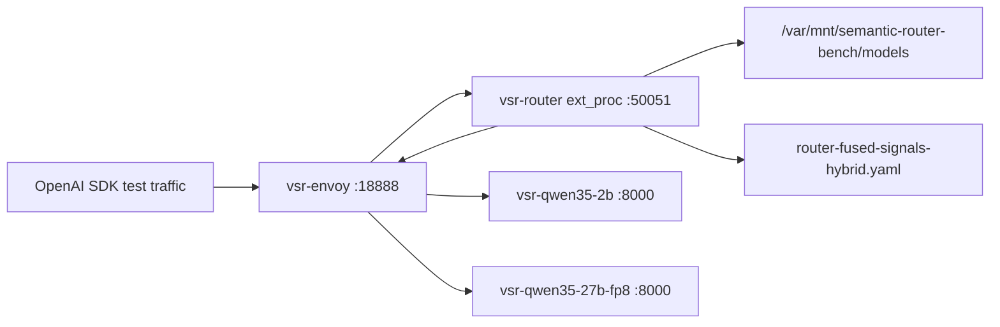

# Round 6: GPU VM 重启后的 semantic-router 恢复验证

| 字段 | 值 |
|---|---|
| 日期 | 2026-06-25 |
| 目标 | 远端 GPU VM 再次重启后，验证并恢复两个 Qwen vLLM 后端、semantic-router、Envoy，并跑 OpenAI SDK 路由烟测 |
| 结论 | 环境已恢复，两个后端、router、Envoy 均在线；18 条 OpenAI SDK 审计请求全部成功 |
| 步骤审计 | [../wzh-steps/wzh-steps-2026.06.25.21.45.md](../wzh-steps/wzh-steps-2026.06.25.21.45.md) |
| SDK 结果 JSONL | [files/wzh-solution-2026-06-25-21-45/round6-fused-sdk-results.jsonl](files/wzh-solution-2026-06-25-21-45/round6-fused-sdk-results.jsonl) |
| SDK 汇总 | [files/wzh-solution-2026-06-25-21-45/round6-fused-sdk-summary.txt](files/wzh-solution-2026-06-25-21-45/round6-fused-sdk-summary.txt) |

## 结论

远端 GPU VM 确实发生过重启。preflight 时看到机器只运行了约 18 分钟，`/var/mnt/semantic-router-bench` 没有挂载，旧容器处于 exited/created 状态，GPU 基本空闲。因此这次不是简单重连，而是需要重新准备 NVMe 工作目录并重启运行时。

本轮已经完成恢复：

- `/dev/nvme1n1` 重新格式化/挂载到 `/var/mnt/semantic-router-bench`，文件系统是 XFS。
- 工作目录恢复为 `hf-cache`、`models`、`configs`、`logs`、`traffic`、`benchmarks`。
- Podman network `vsr-bench` 可用。
- `Qwen/Qwen3.5-2B` 后端恢复为容器 `vsr-qwen35-2b`，host 端口 `18001`。
- `Qwen/Qwen3.5-27B-FP8` 后端恢复为容器 `vsr-qwen35-27b-fp8`，host 端口 `18002`。
- semantic-router 使用上一轮 fused 配置 `router-fused-signals-hybrid.yaml` 恢复为容器 `vsr-router`。
- Envoy 使用 `envoy-vsr.yaml` 恢复为容器 `vsr-envoy`，host 入口端口 `18888`。
- 通过 Envoy 入口跑了 18 条 OpenAI SDK 审计请求，全部成功，并捕获了每次请求的 raw input、响应头、响应正文、selected decision、selected model。

## 当前架构

Envoy 是 OpenAI API 前门。客户端请求先到 Envoy，Envoy 的 ext_proc filter 把请求头/请求体交给 semantic-router。router 计算配置里的信号，选出 decision 和后端 model，然后通过响应头告诉 Envoy 应该把请求发给 `qwen35-2b` 还是 `qwen35-27b-fp8`。

## 恢复证据

最终状态快照显示四个核心容器都在运行：

| 容器 | 状态 | 作用 |
|---|---|---|
| `vsr-qwen35-2b` | Up | 2B vLLM 后端 |
| `vsr-qwen35-27b-fp8` | Up | 27B FP8 vLLM 后端 |
| `vsr-router` | Up | semantic-router ext_proc 与 health/API |
| `vsr-envoy` | Up | OpenAI API 前门 |

最终 health 检查：

- `http://127.0.0.1:18080/health` 返回 `{"status": "healthy", "service": "classification-api"}`。
- `http://127.0.0.1:18888/v1/models` 返回 router 暴露的 `auto`、`fused-round4-auto`、`qwen35-2b`、`qwen35-27b-fp8` 等模型条目。

GPU 显存状态符合预期：

| GPU | 显存使用 | 解释 |
|---|---:|---|
| GPU 0 | 约 7.3 GiB / 23 GiB | 2B 后端 |
| GPU 1 | 约 18.0 GiB / 23 GiB | 27B FP8 后端一部分 |
| GPU 2 | 约 18.0 GiB / 23 GiB | 27B FP8 后端一部分 |
| GPU 3 | 约 1 MiB / 23 GiB | 空闲 |

router 启动时还记录了本地分类器和选择器初始化：

- `embedding_candidates_preloaded`
- `feedback_detector_initialized`
- `pii_detector_initialized`
- `jailbreak_detector_initialized`
- `hybrid_selector_initialized`
- `selection_factory_initialized`
- `startup_complete`

这些日志说明这次不仅是 Envoy/vLLM 通了，semantic-router 的信号计算和模型选择路径也已经加载。

## SDK 路由验证

本轮复用上一轮的 OpenAI SDK 审计脚本 `traffic_fused_audit.py`，通过 Envoy 调用：

- base URL: `http://vsr-envoy:8888/v1`
- model: `auto`
- max tokens: `64`
- mode: `fused`
- output: `/var/mnt/semantic-router-bench/benchmarks/round6-2026-06-25-21-45/fused-smoke-results.jsonl`

本地保存的结果：

- 完整 JSONL: [files/wzh-solution-2026-06-25-21-45/round6-fused-sdk-results.jsonl](files/wzh-solution-2026-06-25-21-45/round6-fused-sdk-results.jsonl)
- 紧凑汇总: [files/wzh-solution-2026-06-25-21-45/round6-fused-sdk-summary.txt](files/wzh-solution-2026-06-25-21-45/round6-fused-sdk-summary.txt)

18 条请求全部成功：

| 场景 | 结果 | decision | selected model | 主要命中 |
|---|---|---|---|---|
| simple account short | ok | `fused-signal-hybrid-selector` | `qwen35-2b` | `explicit_simple` |
| technical support complex | ok | `fused-signal-hybrid-selector` | `qwen35-27b-fp8` | `explicit_complex` |
| many questions incident | ok | `fused-signal-hybrid-selector` | `qwen35-2b` | `explicit_complex` |
| numbered steps architecture | ok | `fused-signal-hybrid-selector` | `qwen35-27b-fp8` | `explicit_complex` |
| Chinese first/then flow | ok | `fused-signal-hybrid-selector` | `qwen35-2b` | `explicit_simple` |
| long context root cause | ok | `fused-signal-hybrid-selector` | `qwen35-2b` | `explicit_complex` |
| jailbreak guarded | ok | `fused-signal-hybrid-selector` | `qwen35-2b` | classifier path |
| fake PII guarded | ok | `fused-signal-hybrid-selector` | `qwen35-2b` | classifier path |
| critical payment event | ok | `fused-signal-hybrid-selector` | `qwen35-2b` | `explicit_complex` |
| authz admin policy | ok | `fused-signal-hybrid-selector` | `qwen35-27b-fp8` | `explicit_complex` |
| no signal default | ok | `fused-signal-hybrid-selector` | `qwen35-2b` | default/cost-favored path |

Envoy access log也证明两个后端都被实际调用：

- `qwen35-2b` 请求走到 `10.89.0.2:8000`。
- `qwen35-27b-fp8` 请求走到 `10.89.0.3:8000`。
- 响应头里出现 `x-vsr-selected-decision` 和 `x-vsr-selected-model`。

## 多轮对话验证

多轮测试也通过了。需要注意的是，semantic-router 的行为不是“只要主题变化就必定切大模型”，而是：

1. 每次 OpenAI SDK call 都会把当前 `messages` 数组发给 Envoy。
2. 多轮时，`messages` 里会包含多组 `role/content`，例如前面的 `user`、`assistant`、新的 `user`。
3. router 会基于当前完整 messages 重新计算信号。
4. 如果命中 conversation 规则，会看到 `x-vsr-matched-conversation=multi_turn_user`。
5. 最终是否切换到 27B，取决于 fused decision 下面的 hybrid 模型选择算法，而不只取决于“是不是多轮”。

本轮结果：

| 多轮场景 | turn | selected model | 说明 |
|---|---:|---|---|
| account -> incident -> Chinese | 1 | `qwen35-2b` | 简单账号问题，选小模型 |
| account -> incident -> Chinese | 2 | `qwen35-2b` | 识别到 `explicit_complex` 和 `multi_turn_user`，但 hybrid 仍选小模型 |
| account -> incident -> Chinese | 3 | `qwen35-2b` | 中文简短总结，选小模型 |
| wrong answer feedback | 1 | `qwen35-2b` | 简单说明，选小模型 |
| wrong answer feedback | 2 | `qwen35-27b-fp8` | 二轮纠错/澄清场景切到大模型 |
| repeated question | 1 | `qwen35-2b` | 无强信号，走默认小模型 |
| repeated question | 2 | `qwen35-2b` | 识别多轮，但仍选小模型 |

因此结论是：多轮请求时 router 会重新看完整 messages，并能动态改变后端模型；但是否改变模型由配置的信号和模型选择算法共同决定。这一点正是 fused hybrid 配置的特点。

## 注意事项和风险

1. `/var/mnt/semantic-router-bench` 是临时 VM 工作盘路径。VM 重启后 mount 和容器状态可能丢失，需要重新挂载并启动容器。
2. 本轮恢复脚本重新格式化了 `/dev/nvme1n1`。这适合当前测试 VM 的临时工作盘，但不应直接套到有持久数据的生产盘。
3. router 启动日志里有 Redis/Postgres replay store 相关 warning/error，但随后 `startup_complete`、`/health`、`/v1/models` 和 SDK 请求都成功。当前配置没有启用这些外部存储能力，所以这是非阻断问题；如果要测试 budget、replay、learning 持久化，需要单独配置后端存储。
4. 本轮只做恢复验证和 SDK 审计烟测，没有重新跑 guidellm 压测。guidellm 性能结论仍参考前面 round 1/round 4 的压测结果。
5. 本轮保留了一个失败尝试：`remote-run-sdk-audit` 的真实 SDK 流量成功，但后置 Python one-liner 汇总写法错误导致命令退出 1；随后 `remote-summarize-sdk-audit` 已成功补齐汇总。这是工具汇总错误，不是 router 或后端推理错误。

## 最终状态

截至本轮最终快照：

- 远端 VM 已恢复 semantic-router 测试环境。
- 两个 Qwen 后端在线。
- fused semantic-router 在线。
- Envoy OpenAI 入口在线。
- OpenAI SDK 审计流量 18/18 成功。
- 本轮命中 2B 和 27B FP8 两个后端，证明分流链路有效。
