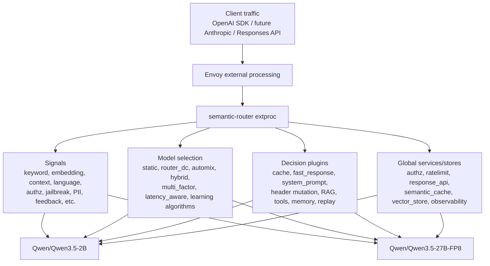

# Round 8 solution: semantic-router missed feature coverage audit

| Field | Value |
|---|---|
| Date | 2026-06-26 |
| Repository | `/Users/zhengwan/Desktop/dev/semantic-router` |
| Purpose | Find which semantic-router features were still not tested after rounds 1-7, especially after the budget feature was only tested when explicitly prompted. |
| Steps log | [wzh-steps-2026.06.26.10.55.md](../wzh-steps/wzh-steps-2026.06.26.10.55.md) |
| Raw evidence directory | [wzh-steps/files/wzh-steps-2026-06-26-10-55](../wzh-steps/files/wzh-steps-2026-06-26-10-55) |
| Coverage helper | [coverage_audit.py](files/wzh-solution-2026-06-26-10-55/coverage_audit.py) |

## 1. Executive conclusion

是的，前几轮确实漏了不少功能面。

最准确的说法是：前几轮主要验证了 **routing signal 命中、OpenAI SDK 真实访问、两模型部署、多轮主题切换、几个 model-selection 算法、budget/cost 相关行为**。但 semantic-router 项目不只是“信号路由器”，它还有一层很大的 **decision plugin surface**，一层 **global services/stores/integrations**，以及若干 **协议入口和高级运行时能力**。这些大部分没有端到端跑过。

最大漏测区域不是关键字分流，也不是 `automix/hybrid/multi_factor` 这些我们已经碰过的算法，而是下面几类：

1. **Decision plugins 漏测最多**：`semantic-cache`、`fast_response`、`system_prompt`、`header_mutation`、`hallucination`、`router_replay`、`memory`、`rag`、`tools`、`tool_selection`、`image_gen`、`response_jailbreak` 基本没有端到端验证；只有 `request_params` 在 round 7 跟 budget/cost 相关场景里验证过。
2. **Global services/stores 漏测很多**：`response_api`、`observability`、`authz` 的凭据注入路径、外部 `ratelimit` provider、`semantic_cache` 后端、`memory` store、`vector_store`、`looper`、`startup_status` 没有形成完整测试闭环。
3. **协议入口漏测**：OpenAI Chat Completions 的非 streaming 路径测了，但 `stream: true`、Anthropic passthrough、Responses API 没有验证。
4. **高级 model selection / learning 漏测**：`router_dc`、`automix`、`hybrid`、`multi_factor`、`latency_aware` 测过；`elo` 和 `session_aware` 只证明了“不能作为 per-decision algorithm.type 使用”，没有验证 global learning/adaptation/protection 路径；`rl_driven`、`gmtrouter`、`knn/kmeans/svm/mlp` 完全没测。
5. **会话级模型切换保护没测完整**：我们测过多轮主题切换时能动态改选模型，但没有专门测试 `model_switch_gate`、`session_transition`、cache affinity、handoff penalty、remaining-turn prior 这些“防止乱跳/控制切换成本”的机制。

一句话总结：  
**前几轮证明了 semantic-router 可以在 VM 上跑起来，并验证了核心分流和部分选择算法；但还没有证明整个 semantic-router 产品功能面都被覆盖。**

## 2. Audit method

本轮没有直接上远端 GPU VM 跑新流量，而是做覆盖审计：

1. 从项目文档和代码读取支持的 plugin、signal、selection method、global service。
2. 用 round 1-7 的已有报告、配置、traffic 脚本做反查。
3. 明确区分：
   - **端到端已测**：有 VM/Envoy/OpenAI SDK 或真实响应头/响应体证据。
   - **部分已测**：配置/启动/拒绝路径验证过，但没有完整成功业务路径。
   - **只确认存在**：代码或文档里存在，但没有运行验证。
   - **未测**：几乎没有出现在前几轮证据里。

注意：`coverage_audit.py` 输出的是关键词计数，只能帮忙定位“前几轮有没有提过”，不能把“提过”自动等同于“测过”。最终结论以人工分类为准。

## 3. Feature map

前几轮主要覆盖了图里的 `Signals` 和 `Selection` 的一部分。`Plugins` 和 `Global` 还有大量缺口。

## 4. What was already tested enough

### 4.1 Deployment and traffic path

已测：

- GPU VM 上部署两个后端模型：
  - `Qwen/Qwen3.5-2B`
  - `Qwen/Qwen3.5-27B-FP8`
- Envoy + semantic-router + vLLM 后端的 OpenAI-compatible 访问路径。
- OpenAI SDK 模拟流量，而不是只用 curl。
- `guidellm` 对直连后端和经过 semantic-router 的访问性能做压测。
- VM 重启后的恢复、容器状态、Envoy 路由恢复。

### 4.2 Basic routing and multi-turn topic switch

已测：

- 基础关键字/优先级/default 模型路由。
- 多轮对话里主题从简单问题切到复杂技术问题，后端模型能按当前 turn 的内容切换。
- OpenAI SDK raw request JSON 已记录到 round 4/6/7 的 traffic evidence 文件中。

但还没测：

- session-level `model_switch_gate` 是否会阻止频繁切换。
- `session_transition`/handoff penalty 是否影响切换决策。
- 多轮里历史消息很多时，不同 plugin 和 model-selection 的组合行为。

### 4.3 Signals

端到端或较充分测试过的 signal：

| Signal | Status | Notes |
|---|---|---|
| `keyword` | 已测 | round 1/basic and later fused configs. |
| `embedding` | 已测 | round 2/4 multi-signal path. |
| `language` | 已测 | round 2/4 multi-signal path. |
| `context` | 已测 | round 2/4 multi-signal and multi-turn path. |
| `structure` | 已测 | round 2/4 structured request scenarios. |
| `authz` / `role_bindings` | 部分已测 | 测过按 header/role signal 路由；没测完整 authz credential provider 注入。 |
| `jailbreak` request signal | 已测 | 测过 request-side prompt guard style route. |
| `pii` | 已测 | round 2/4 PII prompt scenarios. |
| `user_feedback` | 已测 | round 2/4 feedback-style scenarios. |
| `reask` | 已测 | round 2/4 repeated/reask scenarios. |
| `preference` | 已测 | round 2/4 preference route scenarios. |
| `conversation` | 已测 | round 2/4 multi-turn context. |
| `event` | 已测 | round 2/4 event-style request scenarios. |
| `projection` | 已测 | round 2/4 projection scenarios. |

需要补测或重测的 signal：

| Signal | Gap |
|---|---|
| `domain` | 前几轮提到过，但没有独立把 domain classifier 的命中、模型加载成本、误判边界跑成清晰表格。 |
| `fact_check` | 在 multi-signal 配置里涉及过，但没有专门测事实核查路径、hallucination mitigation 的组合行为。 |
| `kb` | 只算浅覆盖，没有配真实 KB/vector store 做检索验证。 |
| `complexity` | 与 model-selection 成本/复杂度有关，但没有专门测 complexity module 的输入输出和阈值。 |
| `modality` | 没有完整测 text/image/multimodal 输入路径，只看到代码/配置层能力。 |

## 5. Model selection coverage

### 5.1 已测

| Algorithm | Status | Notes |
|---|---|---|
| `static` | 已测 | 基础默认路由/固定模型选择。 |
| `router_dc` | 已测 | round 2 model-selection config. |
| `automix` | 已测 | round 2/4/5 explained and exercised. |
| `hybrid` | 已测 | round 4 fused config used signal hit first, then hybrid model selection. |
| `multi_factor` | 已测 | round 2 and round 7 cost ceiling/budget-like config. |
| `latency_aware` | 已测 | round 2 model-selection config. |

### 5.2 部分已测但不能算成功覆盖

| Algorithm | Status | What is still missing |
|---|---|---|
| `elo` | 只测到 per-decision rejected | 需要按 global learning/adaptation 路径测试质量反馈、分数更新、后续选择变化。 |
| `session_aware` | 只测到 per-decision rejected | 需要按 global session protection/model switch gate 测试会话连续性、切换惩罚、保护阈值。 |

### 5.3 未测

| Algorithm | Gap |
|---|---|
| `rl_driven` | 没有测试强化学习驱动选择逻辑、state/action/reward 或离线策略输入。 |
| `gmtrouter` | 没有测试。需要先确认 runtime 依赖、配置入口、可复现实验数据。 |
| `knn` / `kmeans` / `svm` / `mlp` | 没有测试。需要分类/聚类模型或样本数据，不应只凭配置启动就算覆盖。 |

## 6. Budget-related coverage

round 7 补测后的结论是：

- 项目里有 `ModelPricing`、`CostEstimator`、`BudgetConfig`、`multi_factor.cost_weight`、`cost_ceiling` 这类成本感知能力。
- 已测 `request_params` 插件可以改请求参数，从而影响后端调用成本。
- 已测 `multi_factor` 的 cost ceiling 行为。
- 已测 local rate limit：预算/限流不足时会返回 429；没有证明它会自动 fallback 到“还有 budget 的模型”。

还没测：

- 外部 ratelimit provider。
- 多模型真实价格表 + 长时间累计消耗 + budget reset window。
- “预算耗尽后自动切换到另一个模型”这一点目前没有证据证明是已实现的 runtime fallback。后续测试不能再把它当成默认事实。

## 7. Plugin coverage: biggest missing area

从 `src/vllm-sr/README.md`、`routing_surface_catalog.go`、`plugin_config.go`、`req_filter_*.go`、`res_filter_*.go` 看到，项目支持大量 decision plugins。前几轮几乎没有系统测试这些插件。

| Plugin | Current coverage | Missing test |
|---|---|---|
| `request_params` | 已测 | round 7 已验证能改请求参数。 |
| `semantic-cache` / `semantic_cache` | 未测 | cache miss、cache write、cache hit、response header、TTL、相似度阈值、后端是否被跳过。 |
| `fast_response` | 未测 | 命中后直接返回固定响应，确认不调用后端 LLM。 |
| `system_prompt` | 未测 | 注入/替换 system prompt，确认最后后端收到的 messages/chat template 变化。 |
| `header_mutation` | 未测 | request header mutation 和 response header mutation 分别验证 add/set/remove。 |
| `hallucination` | 未测 | response-side hallucination detection/explainer/mitigation。 |
| `router_replay` | 未测 | 记录轨迹、查询 replay API、aggregate/cost/trajectory 输出。 |
| `memory` | 未测 | 会话记忆写入、召回、rewrite/context 注入、store backend 行为。 |
| `rag` | 未测 | 本地/外部 vector store 检索、context 注入、fallback、缓存。 |
| `tools` | 未测 | tools 列表过滤/重写/约束是否生效。 |
| `tool_selection` | 未测 | 根据请求选择工具集合，验证 tool_calls 相关输入输出。 |
| `image_gen` | 未测 | image generation 请求转换、Response API/image tool path、后端调用。 |
| `response_jailbreak` | 未测 | output-side jailbreak 拦截和替换/拒绝策略。 |

这个表就是这次最重要的漏测清单。后续如果要说“semantic-router 功能验证完整”，至少要补一轮专门的 plugin matrix。

## 8. Global services/stores/integrations coverage

`global` 不是 decoration。它里面的服务会影响运行时行为，而且跟 per-decision plugin 互相引用。

| Global area | Current coverage | Missing test |
|---|---|---|
| `global.router.model_selection` | 部分已测 | 测过一部分算法；learning/protection/adaptation 没完整跑。 |
| `global.router.streamed_body` | 未测 | streaming body buffering/max bytes/timeout 行为。 |
| `global.router.skip_processing` | 未测 | 按路径/条件跳过 router processing。 |
| `global.services.api` | 部分已测 | 基础 router API 启动路径可用；管理 API 没系统测。 |
| `global.services.response_api` | 未测 | Responses API request/response/object storage path。 |
| `global.services.observability` | 未测 | Prometheus metrics、trace/log correlation、per-decision metrics。 |
| `global.services.authz` | 部分已测 | 测过 authz signal/header；没测 provider/static credentials 注入完整链路。 |
| `global.services.ratelimit` | 部分已测 | local limiter 测过；外部 Envoy ratelimit provider 没测。 |
| `global.services.router_replay` | 未测 | API、storage、aggregate、cost、trajectory 没跑。 |
| `global.services.startup_status` | 未测 | Redis/status gate/startup readiness 没测。 |
| `global.stores.semantic_cache` | 未测 | memory/Redis/Milvus/hybrid backends 没测。 |
| `global.stores.memory` | 未测 | memory store backend、session key、retention 没测。 |
| `global.stores.vector_store` | 未测 | Qdrant/Milvus/OpenAI/external vector store 没测。 |
| `global.integrations.tools` | 未测 | tool registry、filter、selection 没测。 |
| `global.integrations.looper` | 未测 | self-iteration/looping behavior 没测。 |

## 9. Protocol/API coverage gaps

| Protocol or API | Current coverage | Missing test |
|---|---|---|
| OpenAI Chat Completions, non-streaming | 已测 | 主要流量路径。 |
| OpenAI Chat Completions, streaming | 未测 | `stream: true` SSE/chunk 路径、headers、route metadata。 |
| OpenAI Responses API | 未测 | `/v1/responses`、tool/image/cached context path。 |
| Anthropic passthrough | 未测 | `processor_req_body_anthropic.go` 相关路径没有验证。 |
| Tool calls | 未测 | messages/tools/tool_choice/tool_calls 的 OpenAI SDK raw input/output 没测。 |
| Image generation | 未测 | image generation plugin/API path 没测。 |

## 10. Chat template and raw input gap

前几轮已经说明：

- OpenAI SDK 发送给 router 的 raw input 是 JSON，`messages` 数组里会有多个 `{role, content}`。
- 多轮对话时，通常就是把历史轮次作为多个 `role/content` 放进 `messages`。
- 后端 LLM 最终看到的通常不是原始 JSON，而是经过 tokenizer/chat template 渲染后的 prompt token sequence。
- chat template 跟模型训练和 tokenizer 约定强相关，不是 semantic-router 随便发明的格式。

但还没真正测试：

- semantic-router 修改 `system_prompt` 或 RAG/context 后，后端 vLLM 的最终 chat template 前后差异。
- Qwen 2B 和 Qwen 27B-FP8 在同样 messages 下的 tokenizer template 是否完全一致。
- `reasoning_family`、`chat_template_kwargs`、`use_reasoning` 是否改变最终模板或响应形态。

这类测试需要后端开启更详细的请求日志，或使用可控 mock backend，把 router 转发给后端的 JSON 请求完整保存下来。

## 11. Prioritized next test plan

### P0: VM 上最快补齐的核心漏测

这些应该优先测，因为不需要复杂外部依赖，能快速证明 plugin 层不是纸面功能：

1. `fast_response`
   - 配置一个命中即返回固定 JSON 的 decision。
   - 验证响应由 router 产生，后端 2B/27B 请求计数不增加。
2. `system_prompt`
   - 配置注入固定 system prompt。
   - 用 mock backend 或后端请求日志确认转发 messages 被改变。
3. `header_mutation`
   - request side：给后端增加/覆盖 header。
   - response side：给客户端增加/覆盖 header。
4. `semantic-cache` memory backend
   - 第一次 miss 调 backend。
   - 第二次相似请求 hit cache，确认 selected headers 和后端调用次数。
5. `router_replay` memory/file backend
   - 开启 replay。
   - 发几条请求。
   - 查询 replay API/aggregate/cost/trajectory。
6. Streaming Chat Completions
   - OpenAI SDK `stream=True`。
   - 验证 chunk、headers、selected decision、router 延迟。

### P1: 需要一点测试数据/状态的功能

1. `memory`
   - 多轮写入事实，再在后续 turn 召回。
   - 测 session id、retention、rewrite/context injection。
2. `rag`
   - 用本地小知识库或临时 vector store。
   - 测检索命中、context 注入、无命中 fallback。
3. `tools` and `tool_selection`
   - OpenAI SDK 提供多个 tools。
   - 验证 router 根据请求裁剪/选择 tools。
4. `model_switch_gate` and `session_transition`
   - 构造多轮频繁跳变场景。
   - 对比开启/关闭 gate 的 selected model 差异。
5. `response_api`
   - 测 `/v1/responses` 的基本请求、存储、读取。

### P2: 需要外部服务或额外模型的功能

1. Semantic cache Redis/Milvus/hybrid backend。
2. RAG Qdrant/Milvus/OpenAI/external vector store。
3. External Envoy ratelimit provider。
4. Authz provider/static credential injection 完整链路。
5. `hallucination` response filter，需要 detector/explainer 配置。
6. `image_gen`，需要 image generation backend 或 mock。
7. Observability/Prometheus metrics。

### P3: 实验性或训练/反馈依赖更重的功能

1. `elo` global adaptation：需要反馈分数和多轮模型排名变化。
2. `session_aware` global protection：需要多 session 行为和切换惩罚验证。
3. `rl_driven`：需要 state/reward/策略输入或训练好的策略。
4. `gmtrouter`。
5. `knn/kmeans/svm/mlp`：需要训练/加载模型或可复现样本数据。

## 12. Proposed next concrete round

建议下一轮不要再泛泛地“再测一些功能”，而是直接做 **plugin-first coverage round**：

| Step | Test target | Why |
|---|---|---|
| 1 | `fast_response` | 最容易证明 router 可以短路后端，成本为零或接近零。 |
| 2 | `system_prompt` + mock backend | 直接回答“router 改写后的 raw backend request 是什么”。 |
| 3 | `header_mutation` | 验证 request/response 两侧 mutation。 |
| 4 | `semantic-cache` memory backend | 测 cache hit 是否避免后端推理，这是成本问题的核心。 |
| 5 | `router_replay` | 后续所有测试都可以用 replay 做证据和成本分析。 |
| 6 | streaming OpenAI SDK | 补齐真实前端常用访问模式。 |

这轮如果做完，semantic-router 的验证范围会从“路由信号和模型选择”扩展到“路由器作为运行时中间件到底能不能改请求、短路请求、缓存响应、记录轨迹”。

## 13. Correction to previous framing

前几轮我说“测试了很多分流方式”是对 signals 和部分 model-selection 算法成立的；但如果从项目完整功能面看，这句话不够精确。

更严谨的表述应该是：

> 已验证 semantic-router 在两模型 GPU VM 环境下可运行，并验证了多个 request-side signal 和部分 model-selection 算法；尚未系统验证 decision plugins、global services/stores、streaming/Responses/Anthropic API、高级 learning/session protection、以及外部依赖型功能。

这个修正会作为 round 8 的结论，不覆盖前面报告，而是在新的报告里明确补上。

