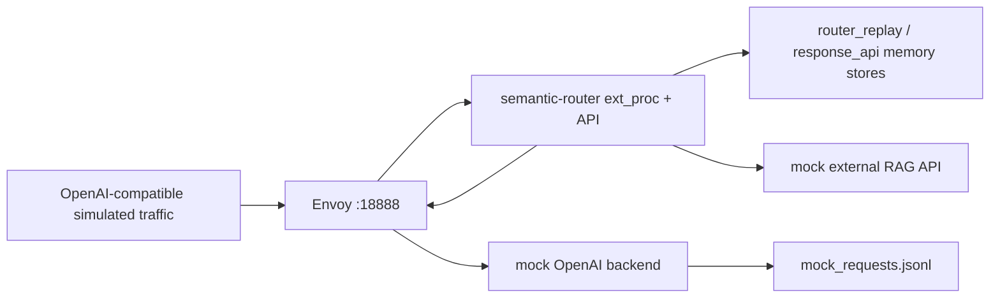
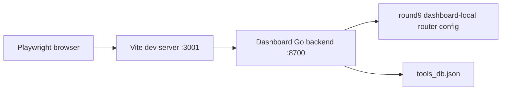

# Round 9: P0/P1 插件能力与 Dashboard 验证报告

| 字段 | 值 |
|---|---|
| 日期 | 2026-06-26 |
| 仓库 | `/Users/zhengwan/Desktop/dev/semantic-router` |
| 测试目标 | 补测 round 8 识别出的 P0/P1 功能缺口，并测试 dashboard |
| 主要环境 | 远端 GPU VM + Podman + `ghcr.io/vllm-project/semantic-router/vllm-sr:latest` + Envoy + 本地 dashboard |
| 原始步骤 | [wzh-steps-2026.06.26.11.11.md](../wzh-steps/wzh-steps-2026.06.26.11.11.md) |
| 证据目录 | [wzh-steps/files/wzh-steps-2026-06-26-11-11](../wzh-steps/files/wzh-steps-2026-06-26-11-11) |
| 配置与脚本 | [wzh-solution/files/wzh-solution-2026-06-26-11-11](files/wzh-solution-2026-06-26-11-11) |

## 一句话结论

P0 插件能力基本通过：`fast_response`、`system_prompt`、`header_mutation`、`semantic-cache`、`router_replay`、OpenAI Chat Completions streaming 都跑通了。

P1 里 `tools/tool_selection`、基础 `response_api` 和 `hybrid` 模型选择跑通；`model_switch_gate` 旧配置在当前 runtime 中已被删除；`memory` 缺少 Milvus/Valkey/Qdrant 外部后端，未能端到端测试；`RAG external_api` 能检索并写入 replay，但实际发给后端 LLM 的请求 body 没带上 RAG context，这是本轮最重要的疑似运行时问题。

Dashboard 方面：开发态 runtime smoke 通过，登录后 Config 和 Playground 页面能渲染；但是 production build 失败，原因是 `dashboard/frontend/src/components/chatStreamingFrameSync.ts` 的 `setTimeout` 返回类型与 `number` 声明不兼容。另外 dashboard backend 全量 `go test ./...` 也有 handlers/OpenClaw 相关测试失败。

## 测试范围说明

本轮重点不是重新压测真实 Qwen 推理，而是隔离 semantic-router 的插件和控制面行为。因此远端路由测试使用了一个 OpenAI-compatible mock backend，记录 router 最终转发给后端的 raw request body、headers、stream 参数等。

这样做有两个好处：

- 可以准确判断某个插件是否真的改写了发给 LLM 的输入。
- 可以避免真实模型输出随机性影响路由插件判断。

它也有一个限制：本轮 P0/P1 插件测试不代表 Qwen 3.5 2B / `Qwen/Qwen3.5-27B-FP8` 的真实推理性能。真实双模型部署、分流和 guidellm 性能影响已经在前面 round 1/4/6 做过。

## 架构



Dashboard 测试路径：



## P0 结果

| 功能 | 结果 | 关键证据 |
|---|---:|---|
| `fast_response` | PASS | [remote-p0-fast-response-retry stdout](../wzh-steps/files/wzh-steps-2026-06-26-11-11/remote-p0-fast-response-retry-.stdout.txt) |
| `system_prompt` | PASS | [remote-p0-rewrite-cache-replay stdout](../wzh-steps/files/wzh-steps-2026-06-26-11-11/remote-p0-rewrite-cache-replay-.stdout.txt) |
| `header_mutation` | PASS | 同上，mock backend 收到新增/更新 header，删除 header 未出现 |
| `semantic-cache` | PASS | 第二次相同请求返回 `x-vsr-cache-hit: true`，mock backend 没有第二次非流式请求 |
| `router_replay` | PASS | `/v1/router_replay` 和 `/v1/router_replay/aggregate` 返回记录与聚合 |
| OpenAI streaming | PASS | streaming 请求返回 SSE chunk 和 `[DONE]`，mock backend 收到 `stream=true` |

### P0 细节

`fast_response` 命中后没有调用后端模型。响应头包含：

- `x-vsr-fast-response: true`
- `x-vsr-response-path: fast_response`
- `x-vsr-selected-decision: p0-fast-response`

mock backend 请求计数为 0，所以这个路径的计算成本主要是 router 判断 signal 和组装响应，不包含后端 LLM 推理。

`system_prompt` 和 `header_mutation` 都发生在请求进入后端之前。mock backend 看到的 messages 第一条是注入的 system prompt，headers 里看到 router 添加/更新的 header，删除目标 header 不再出现。

`semantic-cache` 使用 memory backend。第一次请求进入后端，第二次相同请求直接由 cache 返回，并带有 `x-vsr-cache-hit: true` 和相似度 header。这个功能命中时省掉后端 LLM 推理，但仍然需要 router 做缓存 key/相似度相关判断。

## P1 结果

| 功能 | 结果 | 关键证据 |
|---|---:|---|
| `tools/tool_selection` | PASS | [remote-p1-rag-tools-response-retry stdout](../wzh-steps/files/wzh-steps-2026-06-26-11-11/remote-p1-rag-tools-response-retry-.stdout.txt) |
| `response_api` 基础请求 | PASS | 同上，`/v1/responses` 返回 `object: response`、`conversation_id`、`output_text` |
| `hybrid` model selection | PASS | 同上，多轮第二轮命中 large decision，selected model 为 `qwen35-27b-fp8` |
| `RAG external_api` | PARTIAL / suspected FAIL | [remote-p1-rag-only stdout](../wzh-steps/files/wzh-steps-2026-06-26-11-11/remote-p1-rag-only-.stdout.txt) |
| `model_switch_gate` | BLOCKED | [remote-p1-failure-inspect stdout](../wzh-steps/files/wzh-steps-2026-06-26-11-11/remote-p1-failure-inspect-.stdout.txt) |
| `memory` | BLOCKED | 当前 runtime memory store factory 需要 Milvus/Valkey/Qdrant，VM 未提供外部后端 |

### Tools / Tool Selection

请求里传入两个 tools：`get_weather` 和 `calculate`。用户请求是天气相关后，router 只保留了 `get_weather`，并在响应头里给出：

- `x-vsr-tools-strategy: filter`
- `x-vsr-tools-confidence: 0.6144`
- `x-vsr-tools-latency-ms: 163`

mock backend 最终收到的 OpenAI request body 中只剩 `get_weather`，`calculate` 被删除。因此 tool filtering 是端到端生效的。

### Response API

`POST /v1/responses` 基础路径跑通。router 将 Responses API 输入转换成后端 Chat Completions 请求，并返回 Response API 风格响应，包含 `conversation_id`、`id`、`object: response`、`status: completed`、`output_text` 和 usage 字段。

注意：当 Response API 与 RAG 放在一起时，router 日志出现 `messages array not found`，说明 RAG 注入逻辑在 Responses API 转换之前没有找到 Chat Completions 的 `messages` 数组。基础 Response API 是 PASS，但 Response API + RAG 组合仍需要单独修。

### RAG 的关键问题

RAG-only 测试证明了两件事：

- external RAG API 被调用，mock RAG 返回了 `ROUND9_RAG_CONTEXT`。
- router replay 里记录了 RAG metadata 和注入后的 request body。

但 mock backend 最终收到的 `/v1/chat/completions` body 里没有 RAG context system message，只有原始 user message。也就是说，RAG 的“检索”和“replay 记录”存在，但修改后的请求 body 没有真正传给后端 LLM。

这不是工具筛选覆盖导致的，因为 RAG-only 配置也复现了同样问题。因此当前结论是：`external_api` RAG 在本轮 runtime 中至少是 PARTIAL，实际 prompt 注入疑似 FAIL，需要检查 ext_proc 请求体更新顺序或 `updateRequest` 逻辑。

### Model Switch Gate

旧配置：

```yaml
global:
  router:
    model_selection:
      model_switch_gate: ...
```

当前 runtime 直接拒绝启动，并提示：

```text
removed config fields are no longer supported:
global.router.model_selection.model_switch_gate;
use global.router.learning.adaptation and global.router.learning.protection
for cross-request learning
```

所以 `model_switch_gate` 不是“没测到”，而是当前镜像已删除该字段。下一轮如果要测多轮跨请求学习/保护逻辑，应改用 `global.router.learning.adaptation` 和 `global.router.learning.protection`。

### Memory

代码层面看到 runtime memory store factory 支持 `milvus`、`valkey`、`qdrant`。本轮 VM 没有这些外部服务，也没有对应容器镜像与持久化配置，所以没有做假的 PASS。

如果要测 memory，建议下一轮明确选择一个后端，例如 Valkey 或 Qdrant，启动独立服务后再验证：

- 写入 memory
- 多轮或跨 session 检索
- threshold 对检索命中的影响
- 后端 prompt 是否实际收到 memory context

## Dashboard 结果

| 项目 | 结果 | 证据 |
|---|---:|---|
| `npm ci` | PASS | [local-dashboard-smoke stdout](../wzh-steps/files/wzh-steps-2026-06-26-11-11/local-dashboard-smoke-.stdout.txt) |
| production build | FAIL | 同上，TypeScript `Timeout` vs `number` |
| dashboard backend focused tests | PASS | [local-dashboard-runtime-smoke-final-clean-script stdout](../wzh-steps/files/wzh-steps-2026-06-26-11-11/local-dashboard-runtime-smoke-final-clean-script-.stdout.txt) |
| dashboard backend `go test ./...` | FAIL | [local-dashboard-runtime-smoke stdout](../wzh-steps/files/wzh-steps-2026-06-26-11-11/local-dashboard-runtime-smoke-.stdout.txt) |
| protected config API | PASS | [api-config-all.json](../wzh-steps/files/wzh-steps-2026-06-26-11-11/dashboard-runtime-smoke/api-config-all.json) |
| tools DB API | PASS | [api-tools-db.json](../wzh-steps/files/wzh-steps-2026-06-26-11-11/dashboard-runtime-smoke/api-tools-db.json) |
| Vite SPA routes | PASS | [frontend-routes.txt](../wzh-steps/files/wzh-steps-2026-06-26-11-11/dashboard-runtime-smoke/frontend-routes.txt) |
| 登录后 Config UI | PASS | [config-page-authenticated.png](../wzh-steps/files/wzh-steps-2026-06-26-11-11/dashboard-runtime-smoke/config-page-authenticated.png) |
| 登录后 Playground UI | PASS | [playground-page-authenticated.png](../wzh-steps/files/wzh-steps-2026-06-26-11-11/dashboard-runtime-smoke/playground-page-authenticated.png) |

Dashboard production build 失败点：

```text
src/components/chatStreamingFrameSync.ts(6,3):
error TS2322: Type 'Timeout' is not assignable to type 'number'.
```

这通常说明当前 TypeScript 环境混入了 Node timer type，`globalThis.setTimeout` 的返回值不再被推断为 browser `number`。修复方向可以是使用 `ReturnType<typeof globalThis.setTimeout>` 或显式区分 browser timer 类型。

Dashboard 全量 backend 测试失败集中在 handlers/OpenClaw 相关测试，例如 room message delegation、fallback endpoint、mention dispatch 等。因为用户本轮要求的是 dashboard smoke，而不是修 OpenClaw 测试，所以这里只记录为 dashboard 后端全量测试风险。

## 本轮生成的关键文件

| 文件 | 用途 |
|---|---|
| [mock_backend.py](files/wzh-solution-2026-06-26-11-11/mock_backend.py) | OpenAI-compatible mock backend，记录最终后端请求 |
| [traffic_round9.py](files/wzh-solution-2026-06-26-11-11/traffic_round9.py) | P0/P1 模拟流量客户端 |
| [router-p0-fast-response.yaml](files/wzh-solution-2026-06-26-11-11/router-p0-fast-response.yaml) | P0 fast response 配置 |
| [router-p0-rewrite-cache-replay.yaml](files/wzh-solution-2026-06-26-11-11/router-p0-rewrite-cache-replay.yaml) | P0 system/header/cache/replay/streaming 配置 |
| [router-p1-rag-tools-response.yaml](files/wzh-solution-2026-06-26-11-11/router-p1-rag-tools-response.yaml) | P1 RAG/tools/response_api/model_selection 配置 |
| [router-p1-rag-only.yaml](files/wzh-solution-2026-06-26-11-11/router-p1-rag-only.yaml) | RAG-only 复现配置 |
| [dashboard_runtime_smoke.zsh](files/wzh-solution-2026-06-26-11-11/dashboard_runtime_smoke.zsh) | dashboard runtime/API/UI smoke |
| [dashboard_ui_smoke.mjs](files/wzh-solution-2026-06-26-11-11/dashboard_ui_smoke.mjs) | Playwright 登录后 UI 检查 |
| [secret_scan_round9.py](files/wzh-solution-2026-06-26-11-11/secret_scan_round9.py) | 本轮候选提交文件 secret scan |

## 环境恢复与安全

远端测试结束后执行了容器清理：

- `vsr-router`
- `vsr-envoy`
- `vsr-mock-backend`

清理命令成功返回，证据在 [remote-cleanup-round9-fixed stdout](../wzh-steps/files/wzh-steps-2026-06-26-11-11/remote-cleanup-round9-fixed-.stdout.txt)。

本地 dashboard smoke 使用的临时 `auth.db` 已删除，避免把认证数据库带入提交。

最终 secret scan 扫描 642 个 modified/untracked 候选文本文件，结果为 `findings=0`，证据在 [local-secret-scan-round9-final stdout](../wzh-steps/files/wzh-steps-2026-06-26-11-11/local-secret-scan-round9-final-.stdout.txt)。

## 下一步建议

1. 修 dashboard production build 的 `setTimeout` 类型错误。
2. 修或隔离 dashboard backend handlers/OpenClaw 测试失败，避免 `go test ./...` 长期红。
3. 针对 RAG prompt 没有实际进入后端的问题开 bug：重点查 RAG 插件对 ext_proc request body 的更新是否被后续阶段覆盖，或者 replay 记录使用的是中间态而不是最终上游态。
4. 用 Valkey/Qdrant/Milvus 之一补测 memory。
5. 用当前 runtime 支持的 `global.router.learning.adaptation/protection` 重新设计多轮模型切换/保护测试，替代已删除的 `model_switch_gate`。
