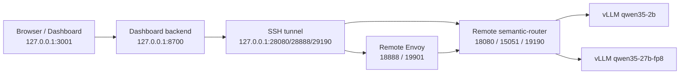

# Round 10: Rebooted GPU VM Recovery, Complex Semantic Router Demo, and Dashboard Handoff

| Field | Value |
|---|---|
| Date | 2026-06-29 |
| Scope | Remote GPU VM recovery, Qwen backend restart, complex semantic-router demo, dashboard startup |
| Dashboard URL | `http://127.0.0.1:3001` |
| Dashboard holder | Detached `screen` session `vsr_round10_dashboard` |
| Evidence log | [wzh-steps-2026.06.29.10.40.md](../wzh-steps/wzh-steps-2026.06.29.10.40.md) |

## Conclusion

The rebooted GPU VM was revalidated and the two Qwen OpenAI-compatible backends were restored:

- `qwen35-2b` backed by `Qwen/Qwen3.5-2B`
- `qwen35-27b-fp8` backed by `Qwen/Qwen3.5-27B-FP8`

A complex semantic-router/Envoy use case is deployed and reachable through a local SSH tunnel. The local dashboard is running at `http://127.0.0.1:3001` and is being held by detached `screen` session `vsr_round10_dashboard`.

## Runtime Shape



## Complex Use Case

The deployed demo config combines multiple routing and transformation features:

- multi-signal matching: keyword, embedding, preference, context, structure, projection, conversation, event, user-feedback
- `hybrid` model selection over the two Qwen backends
- `system_prompt` plugin to inject demo context
- `header_mutation` plugin to expose matched routing evidence
- `semantic-cache` plugin to prove repeated-request cache behavior
- `router_replay` configured in the demo file, with runtime API caveat below

The exact config files are archived here:

- [router-round10-dashboard-demo.yaml](files/wzh-solution-2026-06-29-10-40/router-round10-dashboard-demo.yaml)
- [envoy-round10-dashboard-demo.yaml](files/wzh-solution-2026-06-29-10-40/envoy-round10-dashboard-demo.yaml)
- [traffic_round10_demo.py](files/wzh-solution-2026-06-29-10-40/traffic_round10_demo.py)
- [hold_local_dashboard_round10.zsh](files/wzh-solution-2026-06-29-10-40/hold_local_dashboard_round10.zsh)

## Smoke Results

Remote routed traffic through Envoy passed:

- simple short request selected `qwen35-2b`
- complex incident request matched complex/technical/escalation signals and selected `qwen35-2b` under the hybrid cost/quality tradeoff
- multi-turn topic switch selected `qwen35-27b-fp8` with reasoning enabled
- repeated simple request returned through `semantic-cache` with `x-vsr-cache-hit: true`

Dashboard health passed after moving the holder into detached `screen`:

- `backend_healthz`: 200
- `auth_login`: 200
- `auth_me`: 200
- `router_models_proxy`: 200
- `frontend_root`: 200
- model list included `round10-dashboard-demo-auto`, `qwen35-2b`, and `qwen35-27b-fp8`

## Known Caveats

- The local macOS default `open` command did not have a usable URL handler, and `Google Chrome` was not installed, so the URL must be opened manually.
- `router_replay` routes returned 404 in this runtime even though the plugin was configured. Chat routing, model selection, header mutation, system prompt injection, and semantic-cache were still validated successfully.
- The dashboard is held by a detached `screen` session. Stop it with `screen -S vsr_round10_dashboard -X quit` when finished.
- The dashboard credential was copied outside the repo to `/private/tmp/vsr-round10-dashboard-access.txt`; repo-local copies are redacted to avoid accidental commit.

## Access

Open:

```text
http://127.0.0.1:3001
```

Login details are in the repo-external temporary file:

```text
/private/tmp/vsr-round10-dashboard-access.txt
```
