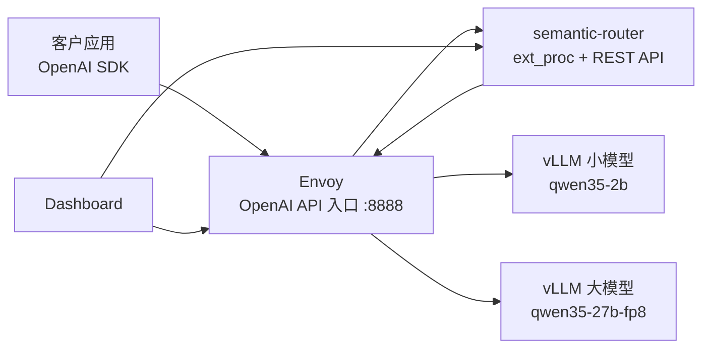

# vLLM Semantic Router 从入门到精通：面向资深 IT 运维客户的环境、配置、路由与观测手册

| 字段 | 值 |
|---|---|
| 文档日期 | 2026-06-29 |
| 目标读者 | 资深 IT 运维、平台工程、SRE、AI 平台运维、私有化大模型网关负责人 |
| 验证环境 | 远端 GPU VM + Podman + vLLM OpenAI API + semantic-router + Envoy + dashboard |
| 验证模型 | `Qwen/Qwen3.5-2B` 与 `Qwen/Qwen3.5-27B-FP8` |
| 入口协议 | OpenAI-compatible `/v1/chat/completions` |
| 学习路径 | 环境搭建 -> 最简单路由 -> 模型选择算法 -> 多信号融合 -> semantic-cache -> dashboard/观测 -> 运维建议 |
| 相关证据 | [Round 10 报告](wzh-solution-2026.06.29.10.40.md)、[Round 10 步骤](../wzh-steps/wzh-steps-2026.06.29.10.40.md) |

## 0. 这份文档解决什么问题

这份文档不是给算法研究员看的，而是给“要把语义路由系统跑起来、管起来、解释清楚、出问题能定位”的 IT 运维客户看的。

我们关心的问题是：

1. 一台 GPU VM 重启后，如何把环境恢复出来？
2. 两个模型，一个小模型、一个大模型，如何同时部署？
3. semantic-router 怎么判断请求该走哪个模型？
4. 简单场景怎么配？复杂场景怎么配？
5. `decision` 下面的模型选择逻辑和 `global.router.model_selection` 是什么关系？
6. `automix`、`router_dc`、`hybrid` 这些算法到底在算什么？
7. 多轮对话里主题变了，是否能动态切换后端模型？
8. 命中一个信号时，计算成本在哪里？是否调用小模型？是否调用后端大模型？
9. dashboard 怎么接入？怎么验证 dashboard 看的是当前真实环境？
10. 什么配置项对成本、质量、延迟、缓存、可观测性有影响？

为了让这份文档自包含，下面会直接写出配置、数据、请求样例、期望响应头和运维解释。你不需要打开别的文件才能理解核心逻辑。

## 1. 总体架构：先看请求怎么走

在本项目里，semantic-router 不是直接替代模型服务，而是放在模型服务前面，作为“语义判断 + 模型选择 + 插件处理”的控制面。Envoy 是流量网关，vLLM 是后端模型服务。



关键点：

- 客户端仍然按 OpenAI SDK 调用 `/v1/chat/completions`。
- Envoy 收到请求后，通过 `ext_proc` 把请求头、请求体交给 semantic-router。
- semantic-router 读取 `messages`、请求头、配置中的 signals/decisions/modelCards，决定 `x-selected-model`。
- Envoy 根据 `x-selected-model` 把请求转发到 2B 或 27B FP8。
- 后端 vLLM 返回 OpenAI-compatible 响应。
- semantic-router 还能在响应上加 `x-vsr-*` 头，告诉你命中了什么规则、选了什么模型、是否缓存命中。

## 2. 环境如何配置

### 2.1 GPU VM 基础要求

建议环境：

| 项目 | 建议值 | 说明 |
|---|---:|---|
| GPU | 4 x NVIDIA L4 或同等级 | 27B FP8 通常需要多 GPU 或足够显存 |
| OS | RHEL/CoreOS/CentOS Stream/Fedora 系 | 本轮验证使用 Podman |
| 容器运行时 | Podman | CoreOS 上 Docker 不一定存在，Podman 更稳 |
| 持久盘 | `/var/mnt` 或 NVMe mount | 不要把模型缓存放在很小的 `/` overlay |
| 网络 | VM 本地容器网络 + 管理端 SSH | 容器之间用 Podman network 名称互通 |
| 镜像 | `vllm/vllm-openai`, `semantic-router/vllm-sr`, `envoyproxy/envoy` | 以实际镜像仓库为准 |

本轮 VM 重启后观察到的运维重点：

- `/` overlay 很小且可能满，所以工作目录必须放在 `/var/mnt/semantic-router-bench`。
- Podman 在 VM 上可用，Docker 不一定有。
- 旧容器可能还在但处于 Exited 状态，可以直接 `podman start` 恢复，避免重新下载模型。
- 模型缓存、embedding 模型、分类器模型都应该放在持久目录。

### 2.2 推荐目录布局

```text
/var/mnt/semantic-router-bench/
  configs/
    router-basic.yaml
    router-fused-signals-hybrid.yaml
    router-round10-dashboard-demo.yaml
    envoy-vsr.yaml
    envoy-round10-dashboard-demo.yaml
  models/
    mmbert-embed-32k-2d-matryoshka/
    ...
  logs/
    router.log
    mock_requests.jsonl
  traffic/
    traffic_round10_demo.py
  dashboard-data/
```

每个目录的作用：

| 目录 | 作用 | 运维建议 |
|---|---|---|
| `configs/` | semantic-router 和 Envoy 配置 | 配置必须版本化，变更前保存副本 |
| `models/` | semantic-router 本地 embedding/classifier/cache 相关模型 | 必须持久化，避免每次重启重新下载 |
| `logs/` | router、mock backend、replay 日志 | 注意脱敏，不要直接提交客户请求正文 |
| `traffic/` | 验证流量脚本 | 建议每次变更配置都跑一遍 smoke |
| `dashboard-data/` | dashboard SQLite/auth/workflow 状态 | 单实例使用，避免多副本同时写 SQLite |

### 2.3 Podman 网络

所有容器放在同一个网络里，例如：

```zsh
podman network create vsr-bench
```

为什么需要自定义网络：

- Envoy 要通过容器名访问 `vsr-router`。
- Envoy 要通过容器名访问 `vsr-qwen35-2b` 和 `vsr-qwen35-27b-fp8`。
- 如果用 host 网络，端口容易冲突，也不利于迁移。

### 2.4 两个 vLLM 后端

本轮使用两个后端模型：

| router 内部模型名 | Hugging Face 模型 | 作用 |
|---|---|---|
| `qwen35-2b` | `Qwen/Qwen3.5-2B` | 低成本、低延迟、简单问题、短摘要 |
| `qwen35-27b-fp8` | `Qwen/Qwen3.5-27B-FP8` | 复杂推理、事故分析、代码/架构/安全问题 |

典型启动方式如下。注意命令里的 token、私有 registry、HF 凭据不要写入文档或 Git。

```zsh
podman run --replace -d \
  --name vsr-qwen35-2b \
  --network vsr-bench \
  --security-opt=label=disable \
  --gpus all \
  -p 18001:8000 \
  -v /var/mnt/semantic-router-bench/models:/root/.cache/huggingface:Z \
  docker.io/vllm/vllm-openai:latest \
  --model Qwen/Qwen3.5-2B \
  --served-model-name qwen35-2b \
  --host 0.0.0.0 \
  --port 8000 \
  --max-model-len 4096
```

```zsh
podman run --replace -d \
  --name vsr-qwen35-27b-fp8 \
  --network vsr-bench \
  --security-opt=label=disable \
  --gpus all \
  -p 18027:8000 \
  -v /var/mnt/semantic-router-bench/models:/root/.cache/huggingface:Z \
  docker.io/vllm/vllm-openai:latest \
  --model Qwen/Qwen3.5-27B-FP8 \
  --served-model-name qwen35-27b-fp8 \
  --host 0.0.0.0 \
  --port 8000 \
  --max-model-len 4096
```

关键参数解释：

| 参数 | 示例 | 解释 |
|---|---|---|
| `--name` | `vsr-qwen35-2b` | 容器名，也是 Envoy 上游 DNS 名 |
| `--network` | `vsr-bench` | 和 Envoy、router 在同一容器网络 |
| `--gpus all` | all | 允许容器使用 GPU |
| `--served-model-name` | `qwen35-2b` | OpenAI API 返回和请求时使用的模型名 |
| `--max-model-len` | `4096` | 最大上下文长度，本轮两个模型都按 4096 验证 |
| `-v models:/root/.cache/huggingface` | 持久缓存 | 防止重启后重复下载模型 |

健康检查：

```zsh
curl -fsS http://127.0.0.1:18001/v1/models
curl -fsS http://127.0.0.1:18027/v1/models
```

期望看到：

```json
{
  "object": "list",
  "data": [
    {
      "id": "qwen35-2b",
      "object": "model"
    }
  ]
}
```

或者：

```json
{
  "object": "list",
  "data": [
    {
      "id": "qwen35-27b-fp8",
      "object": "model"
    }
  ]
}
```

### 2.5 semantic-router 容器

semantic-router 需要读取 router YAML：

```zsh
podman run --replace -d \
  --name vsr-router \
  --network vsr-bench \
  --security-opt=label=disable \
  -p 18080:8080 \
  -p 15051:50051 \
  -p 19190:9190 \
  -e AI_BINDING=candle \
  -v /var/mnt/semantic-router-bench/configs/router-round10-dashboard-demo.yaml:/app/config.yaml:Z \
  -v /var/mnt/semantic-router-bench/models:/app/models:Z \
  -v /var/mnt/semantic-router-bench/logs:/logs:Z \
  ghcr.io/vllm-project/semantic-router/vllm-sr:latest \
  /app/config.yaml
```

端口解释：

| 端口 | 容器内 | 作用 |
|---:|---:|---|
| `18080` | `8080` | router REST API，例如 `/v1/models`、`/health` |
| `15051` | `50051` | Envoy ext_proc gRPC 调用 |
| `19190` | `9190` | metrics |

`AI_BINDING=candle` 的含义：

- semantic-router 里的 embedding、PII、jailbreak 等本地模型推理使用本地 AI runtime。
- 这些本地小模型/embedding 模型不是后端 Qwen 2B/27B。
- 它们用于判断路由，不直接生成最终回答。

### 2.6 Envoy 容器

Envoy 是真正对外提供 OpenAI-compatible API 的入口：

```zsh
podman run --replace -d \
  --name vsr-envoy \
  --network vsr-bench \
  --security-opt=label=disable \
  -p 18888:8888 \
  -p 19901:9901 \
  -v /var/mnt/semantic-router-bench/configs/envoy-round10-dashboard-demo.yaml:/etc/envoy/envoy.yaml:Z \
  docker.io/envoyproxy/envoy:v1.34-latest \
  -c /etc/envoy/envoy.yaml \
  --log-level warn
```

端口解释：

| 端口 | 作用 |
|---:|---|
| `18888` | 对外 OpenAI API 入口 |
| `19901` | Envoy admin / readiness |

健康检查：

```zsh
curl -fsS http://127.0.0.1:18888/v1/models
curl -fsS http://127.0.0.1:19901/ready
```

## 3. 最简单场景：按规则固定走小模型

入门时不要一上来就配十几种 signal。最简单的做法是：所有请求都走小模型。

### 3.1 最小 router 配置

```yaml
version: v0.3

listeners:
  - name: http-8888
    address: 0.0.0.0
    port: 8888
    timeout: 600s

providers:
  defaults:
    default_model: qwen35-2b
  models:
    - name: qwen35-2b
      provider_model_id: qwen35-2b
      api_format: openai
      backend_refs:
        - name: qwen35-2b-vllm
          endpoint: vsr-qwen35-2b:8000
          protocol: http
          weight: 100

routing:
  decisions:
    - name: default-small
      priority: 0
      rules:
        operator: AND
        conditions: []
      modelRefs:
        - model: qwen35-2b
          use_reasoning: false

global:
  router:
    config_source: file
    strategy: priority
    auto_model_name: auto
    include_config_models_in_list: true
```

### 3.2 配置解释

| 字段 | 解释 |
|---|---|
| `version: v0.3` | 配置 schema 版本 |
| `listeners` | router 自己的 HTTP listener，不等于 Envoy listener |
| `providers.defaults.default_model` | 没匹配到模型时默认模型 |
| `providers.models[].name` | semantic-router 内部引用的模型名 |
| `provider_model_id` | 转发给后端 OpenAI API 的模型名 |
| `backend_refs[].endpoint` | 后端 vLLM 容器地址 |
| `routing.decisions` | 路由决策列表 |
| `priority` | 决策优先级，数字越大越先匹配 |
| `rules.conditions: []` | 空条件作为兜底规则 |
| `modelRefs` | 这个 decision 可选择哪些模型 |
| `use_reasoning: false` | 对 Qwen3 类模型，不启用 thinking/reasoning |
| `global.router.auto_model_name` | 客户请求里可以用的自动路由模型名 |

### 3.3 请求样例

```json
{
  "model": "auto",
  "messages": [
    {
      "role": "user",
      "content": "Give me a short summary of semantic routing."
    }
  ],
  "max_tokens": 64,
  "temperature": 0
}
```

期望结果：

- HTTP 200
- `x-vsr-selected-model: qwen35-2b`
- 后端响应 JSON 里的 `model` 也是 `qwen35-2b`

### 3.4 什么时候用这个场景

适合：

- 刚开始验证网络链路。
- 验证 Envoy ext_proc 是否正常调用 router。
- 验证 vLLM 后端模型是否正常。
- 做低风险 smoke test。

不适合：

- 按内容智能分流。
- 控制成本和质量。
- 验证多轮对话动态切换。

## 4. 第二步：关键词路由

最简单的智能路由是关键词：看到“短、简单、一句话”走小模型；看到“事故、架构、root cause、debug”进入复杂决策。

### 4.1 关键词 signal 配置

```yaml
routing:
  signals:
    keywords:
      - name: explicit_simple
        operator: OR
        method: bm25
        keywords: ["simple", "short", "concise", "one sentence", "一句话", "简短"]
        case_sensitive: false
        bm25_threshold: 0.05
      - name: explicit_complex
        operator: OR
        method: bm25
        keywords: ["root cause", "architecture", "incident", "security", "debug", "troubleshoot", "proof", "排查", "架构", "事故"]
        case_sensitive: false
        bm25_threshold: 0.05
```

### 4.2 参数解释

| 字段 | 示例 | 解释 |
|---|---|---|
| `name` | `explicit_simple` | signal 名字，后面 decision 里引用 |
| `operator` | `OR` | 多个关键词之间的关系。`OR` 表示命中任意一个即可 |
| `method` | `bm25` | 使用 BM25 方式而不是简单 substring |
| `keywords` | `["short", "concise"]` | 触发词列表 |
| `case_sensitive` | `false` | 是否区分大小写 |
| `bm25_threshold` | `0.05` | BM25 命中阈值，越低越容易命中 |

### 4.3 `bm25_threshold` 怎么调

经验值：

| 阈值 | 行为 | 风险 |
|---:|---|---|
| `0.01` | 很容易命中 | 误判多 |
| `0.05` | demo/PoC 友好 | 有一定误判 |
| `0.20` | 更保守 | 漏判更多 |
| `0.50+` | 非常严格 | 很多自然语言表达不会命中 |

运维建议：

- PoC 期可以用 `0.05`。
- 生产期要结合真实日志回放调参。
- 关键词规则适合高确定性需求，比如“billing”“password reset”“incident”。
- 不要把关键词当成唯一智能能力，它对同义词、隐含语义和中英混合表达不够稳。

## 5. 第三步：模型清单和成本配置

semantic-router 做模型选择前，需要知道每个模型的能力、成本和质量。这里有两层：

1. `providers.models`: 怎么访问后端模型，以及价格。
2. `routing.modelCards`: 模型能力、质量、上下文等描述。

### 5.1 providers 配置

```yaml
providers:
  defaults:
    default_model: qwen35-2b
    default_reasoning_effort: low
    reasoning_families:
      qwen3:
        type: chat_template_kwargs
        parameter: enable_thinking
  models:
    - name: qwen35-2b
      provider_model_id: qwen35-2b
      api_format: openai
      reasoning_family: qwen3
      pricing:
        currency: USD
        prompt_per_1m: 0.20
        cached_input_per_1m: 0.05
        completion_per_1m: 0.40
      backend_refs:
        - name: qwen35-2b-vllm
          endpoint: vsr-qwen35-2b:8000
          protocol: http
          weight: 100
    - name: qwen35-27b-fp8
      provider_model_id: qwen35-27b-fp8
      api_format: openai
      reasoning_family: qwen3
      pricing:
        currency: USD
        prompt_per_1m: 8.00
        cached_input_per_1m: 2.00
        completion_per_1m: 16.00
      backend_refs:
        - name: qwen35-27b-fp8-vllm
          endpoint: vsr-qwen35-27b-fp8:8000
          protocol: http
          weight: 100
```

### 5.2 pricing 数值解释

这里的价格是路由算法使用的成本模型，不一定等于供应商真实账单。生产环境建议填真实内部结算价。

| 字段 | 2B 示例 | 27B 示例 | 含义 |
|---|---:|---:|---|
| `prompt_per_1m` | `0.20` | `8.00` | 每 100 万输入 token 成本 |
| `cached_input_per_1m` | `0.05` | `2.00` | 每 100 万缓存输入 token 成本 |
| `completion_per_1m` | `0.40` | `16.00` | 每 100 万输出 token 成本 |

这组数值故意体现一个事实：27B 比 2B 贵很多。这样 `cost_weight`、`max_cost_per_1m`、`cost_quality_tradeoff` 才有意义。

### 5.3 reasoning_families 解释

```yaml
reasoning_families:
  qwen3:
    type: chat_template_kwargs
    parameter: enable_thinking
```

含义：

- Qwen3 类模型通常通过 chat template 的参数控制是否启用 thinking。
- `parameter: enable_thinking` 表示 router 选择 `use_reasoning: true` 时，会把这个开关传给后端模板层。
- 这和训练时的 chat template 有关：模型训练时学习了特定对话格式，推理时需要把 OpenAI `messages` 转成模型期望的 prompt/template。

运维理解：

- OpenAI SDK 发送的是 JSON，例如 `messages: [{role, content}]`。
- vLLM 最终喂给模型的是经过 tokenizer/chat template 渲染后的 token 序列。
- `enable_thinking` 属于“模板渲染时的控制参数”，不是 HTTP header，也不是用户自然语言的一部分。

## 6. 第四步：modelCards，告诉 router 模型擅长什么

```yaml
routing:
  modelCards:
    - name: qwen35-2b
      param_size: 2B
      context_window_size: 4096
      description: Fast low-cost model for short account questions, simple summaries, and lightweight support triage.
      capabilities: [chat, fast-response, account-support, concise-summary]
      quality_score: 0.62
      modality: ar
      tags: [small, fast, cheap]
    - name: qwen35-27b-fp8
      param_size: 27B
      context_window_size: 4096
      description: Larger FP8 reasoning model for technical support, incidents, security review, code analysis, multi-step workflows, and long-context synthesis.
      capabilities: [chat, reasoning, code, technical-support, security, incident-analysis, long-context]
      quality_score: 0.91
      modality: ar
      tags: [large, reasoning, expensive]
```

字段解释：

| 字段 | 解释 |
|---|---|
| `name` | 必须和 `providers.models[].name` 对齐 |
| `param_size` | 参数规模，给人和算法解释使用 |
| `context_window_size` | 上下文窗口，和 vLLM `--max-model-len` 保持一致 |
| `description` | 给 router_dc / hybrid 理解模型用途 |
| `capabilities` | 能力标签，影响能力匹配 |
| `quality_score` | 人工设定质量分，越高越偏向该模型 |
| `modality` | 模态，本例是自回归文本 |
| `tags` | 运维/观测标签 |

`quality_score` 怎么设：

| 值 | 含义 |
|---:|---|
| `0.50` | 基础可用 |
| `0.60-0.70` | 小模型，适合简单任务 |
| `0.80-0.90` | 中大型模型，复杂任务更稳 |
| `0.95+` | 顶级模型，通常成本高 |

本例中：

- 2B: `0.62`
- 27B: `0.91`

这个差距会告诉 hybrid：大模型质量更好，但成本也更高。

## 7. 第五步：decision 里的逻辑

decision 是“某类请求触发后，该怎么选模型、加插件、改请求/响应”的单元。

### 7.1 简单 decision

```yaml
routing:
  decisions:
    - name: simple-small
      priority: 100
      rules:
        operator: OR
        conditions:
          - type: keyword
            name: explicit_simple
      modelRefs:
        - model: qwen35-2b
          use_reasoning: false
```

解释：

- 如果命中 `explicit_simple`，进入 `simple-small`。
- 这个 decision 只有一个候选模型，所以无需复杂算法。
- 直接选 `qwen35-2b`。

### 7.2 复杂 decision

```yaml
routing:
  decisions:
    - name: complex-large
      priority: 200
      rules:
        operator: OR
        conditions:
          - type: keyword
            name: explicit_complex
          - type: embedding
            name: technical_support
      modelRefs:
        - model: qwen35-2b
          use_reasoning: false
        - model: qwen35-27b-fp8
          use_reasoning: true
          reasoning_effort: medium
      algorithm:
        type: hybrid
        hybrid:
          router_dc_weight: 0.35
          automix_weight: 0.15
          cost_weight: 0.35
          quality_gap_threshold: 0.08
          normalize_scores: true
```

解释：

- 这个 decision 被复杂问题触发。
- 候选模型有 2B 和 27B。
- 使用 `hybrid` 算法综合语义匹配、质量、成本等因素。
- 27B 可以启用 reasoning，2B 不启用。

## 8. decision.algorithm 和 global.router.model_selection 的关系

这是运维客户很容易混淆的地方。

### 8.1 简短结论

- `global.router.model_selection` 是全局默认模型选择策略。
- `routing.decisions[].algorithm` 是某个 decision 的局部覆盖。
- 如果某个 decision 写了 `algorithm`，优先用 decision 自己的算法。
- 如果 decision 没写算法，router 会使用 global 的 `model_selection`。

### 8.2 类比

你可以把它理解成：

```text
公司默认报销规则 = global.router.model_selection
某个部门自己的报销规则 = decision.algorithm
```

如果部门有自己的规则，就按部门规则；没有就按公司默认规则。

### 8.3 全局 hybrid 配置

```yaml
global:
  router:
    config_source: file
    strategy: priority
    auto_model_name: round10-dashboard-demo-auto
    include_config_models_in_list: true
    model_selection:
      method: hybrid
      enabled: true
      router_dc:
        temperature: 0.2
        dimension_size: 384
        min_similarity: 0.0
        use_query_contrastive: true
        use_model_contrastive: true
        require_descriptions: false
        use_capabilities: true
      automix:
        verification_threshold: 0.75
        max_escalations: 1
        cost_aware_routing: true
        cost_quality_tradeoff: 0.45
        discount_factor: 0.9
        use_logprob_verification: true
      hybrid:
        elo_weight: 0.15
        router_dc_weight: 0.35
        automix_weight: 0.15
        cost_weight: 0.35
        quality_gap_threshold: 0.08
        normalize_scores: true
```

字段解释：

| 字段 | 示例 | 含义 |
|---|---:|---|
| `method` | `hybrid` | 默认使用 hybrid 选择器 |
| `enabled` | `true` | 启用全局模型选择 |
| `auto_model_name` | `round10-dashboard-demo-auto` | 客户端请求里使用的自动路由模型名 |
| `include_config_models_in_list` | `true` | `/v1/models` 显示配置里的模型 |

`router_dc` 参数：

| 字段 | 示例 | 含义 |
|---|---:|---|
| `temperature` | `0.2` | 分数分布温度，越低越偏向最高分 |
| `dimension_size` | `384` | embedding 维度 |
| `min_similarity` | `0.0` | 最低相似度门槛 |
| `use_query_contrastive` | `true` | 用请求语义做对比 |
| `use_model_contrastive` | `true` | 用模型描述做对比 |
| `require_descriptions` | `false` | 没 description 时是否拒绝 |
| `use_capabilities` | `true` | 是否使用模型能力标签 |

`automix` 参数：

| 字段 | 示例 | 含义 |
|---|---:|---|
| `verification_threshold` | `0.75` | 验证分低于阈值时可能升级 |
| `max_escalations` | `1` | 最多升级次数 |
| `cost_aware_routing` | `true` | 选择时考虑成本 |
| `cost_quality_tradeoff` | `0.45` | 成本和质量权衡，越高越重视质量 |
| `discount_factor` | `0.9` | 历史/折扣因子 |
| `use_logprob_verification` | `true` | 是否用 logprob 信号辅助验证 |

`hybrid` 参数：

| 字段 | 示例 | 含义 |
|---|---:|---|
| `elo_weight` | `0.15` | Elo/历史质量权重。本轮 runtime 对该字段有 warning，但配置意图是历史表现占 15% |
| `router_dc_weight` | `0.35` | 语义匹配权重 |
| `automix_weight` | `0.15` | automix 判断权重 |
| `cost_weight` | `0.35` | 成本权重，越大越偏低价模型 |
| `quality_gap_threshold` | `0.08` | 质量差距小于该阈值时更可能选便宜模型 |
| `normalize_scores` | `true` | 不同分数归一化后再融合 |

## 9. automix、router_dc、hybrid 是 CPU 算法还是 GPU 小模型？

实用回答：

| 能力 | 主要运行位置 | 是否后端大模型推理 | 说明 |
|---|---|---|---|
| keyword/BM25 | CPU | 否 | 字符串/文本匹配 |
| context token count | CPU | 否 | 统计 token 或近似 token |
| structure regex | CPU | 否 | 正则/序列/计数 |
| event/header | CPU | 否 | 读 HTTP header 或事件字段 |
| router_dc | semantic-router 本地 embedding + CPU scoring | 否 | 需要 embedding 模型，但不是 Qwen 2B/27B 回答 |
| automix | 主要是选择/验证算法 | 通常不直接生成最终回答 | 可能用 logprob/质量估计，不等于先调用小模型回答 |
| hybrid | CPU 上融合多个分数 | 否 | 把 router_dc、automix、成本、质量分融合 |
| PII/jailbreak | semantic-router 本地分类/embedding 模型 | 否 | 本地检测模型，不是后端业务 LLM |
| semantic-cache | embedding + 向量相似度 | 否 | 命中后甚至不调后端模型 |

关键运维结论：

- “命中一个 signal”通常不是调用后端 Qwen 小模型。
- embedding/PII/jailbreak 会用 semantic-router 自己加载的小模型或 embedding 模型。
- 最终回答才由 Envoy 转发到 Qwen 2B 或 27B FP8。
- 如果 semantic-cache 命中，最终后端 Qwen 也不会被调用。

## 10. 多轮对话如何动态切换模型

OpenAI SDK 的多轮对话就是 `messages` 数组里有多个 `{role, content}`：

```json
{
  "model": "round10-dashboard-demo-auto",
  "messages": [
    {
      "role": "user",
      "content": "Please reset my account preference in one sentence."
    },
    {
      "role": "assistant",
      "content": "I can help with that concise account request."
    },
    {
      "role": "user",
      "content": "Now switch topics: debug a distributed queue incident with root cause analysis and architecture risks."
    }
  ],
  "max_tokens": 128,
  "temperature": 0
}
```

semantic-router 会看当前请求里的整个 `messages`，不是只看最后一句。它可以判断：

- 是否有多个 user turn。
- 当前最后一轮是否主题变复杂。
- 是否出现 `debug/root cause/architecture`。
- 是否命中 `multi_turn_user` conversation signal。

本轮实测结果：

```json
{
  "case": "multi_turn_topic_switch",
  "status": 200,
  "selected_model": "qwen35-27b-fp8",
  "selected_decision": "fused-signal-hybrid-selector",
  "headers": {
    "x-vsr-selected-reasoning": "on",
    "x-vsr-selected-model": "qwen35-27b-fp8",
    "x-vsr-matched-keywords": "explicit_complex",
    "x-vsr-matched-embeddings": "technical_support",
    "x-vsr-matched-conversation": "multi_turn_user"
  }
}
```

这说明多轮主题切换能动态走 27B FP8。

## 11. 复杂场景：多信号融合 + hybrid 模型选择

下面是本轮验证过的复杂配置核心。为了便于理解，我保留完整结构。

### 11.1 完整 semantic-router 配置

```yaml
version: v0.3

listeners:
  - name: http-8888
    address: 0.0.0.0
    port: 8888
    timeout: 600s

providers:
  defaults:
    default_model: qwen35-2b
    default_reasoning_effort: low
    reasoning_families:
      qwen3:
        type: chat_template_kwargs
        parameter: enable_thinking
  models:
    - name: qwen35-2b
      provider_model_id: qwen35-2b
      api_format: openai
      reasoning_family: qwen3
      pricing:
        currency: USD
        prompt_per_1m: 0.20
        cached_input_per_1m: 0.05
        completion_per_1m: 0.40
      backend_refs:
        - name: qwen35-2b-vllm
          endpoint: vsr-qwen35-2b:8000
          protocol: http
          weight: 100
    - name: qwen35-27b-fp8
      provider_model_id: qwen35-27b-fp8
      api_format: openai
      reasoning_family: qwen3
      pricing:
        currency: USD
        prompt_per_1m: 8.00
        cached_input_per_1m: 2.00
        completion_per_1m: 16.00
      backend_refs:
        - name: qwen35-27b-fp8-vllm
          endpoint: vsr-qwen35-27b-fp8:8000
          protocol: http
          weight: 100

routing:
  modelCards:
    - name: qwen35-2b
      param_size: 2B
      context_window_size: 4096
      description: Fast low-cost model for short account questions, simple summaries, and lightweight support triage.
      capabilities: [chat, fast-response, account-support, concise-summary]
      quality_score: 0.62
      modality: ar
      tags: [small, fast, cheap]
    - name: qwen35-27b-fp8
      param_size: 27B
      context_window_size: 4096
      description: Larger FP8 reasoning model for technical support, incidents, security review, code analysis, multi-step workflows, and long-context synthesis.
      capabilities: [chat, reasoning, code, technical-support, security, incident-analysis, long-context]
      quality_score: 0.91
      modality: ar
      tags: [large, reasoning, expensive]

  signals:
    keywords:
      - name: explicit_simple
        operator: OR
        method: bm25
        keywords: ["simple", "short", "concise", "one sentence", "一句话", "简短"]
        case_sensitive: false
        bm25_threshold: 0.05
      - name: explicit_complex
        operator: OR
        method: bm25
        keywords: ["root cause", "architecture", "incident", "security", "debug", "troubleshoot", "proof", "排查", "架构", "事故"]
        case_sensitive: false
        bm25_threshold: 0.05

    embeddings:
      - name: technical_support
        threshold: 0.60
        aggregation_method: max
        candidates:
          - installation failure and troubleshooting
          - service error message analysis
          - root cause investigation
          - system configuration guide
          - production incident mitigation
      - name: account_management
        threshold: 0.60
        aggregation_method: max
        candidates:
          - password reset
          - account settings
          - profile update
          - subscription management
          - billing information

    language:
      - name: zh
        description: Chinese-language requests.

    context:
      - name: short_context
        min_tokens: "0"
        max_tokens: "120"
        description: Short requests.
      - name: long_context
        min_tokens: "121"
        max_tokens: "8K"
        description: Long requests.

    structure:
      - name: many_questions
        description: Prompts with many explicit questions.
        feature:
          type: count
          source:
            type: regex
            pattern: '[?？]'
        predicate:
          gte: 4
      - name: numbered_steps
        description: Prompts that contain numbered list items.
        feature:
          type: exists
          source:
            type: regex
            pattern: '(?m)^\\s*\\d+\\.\\s+'
      - name: first_then_flow
        description: Prompts that express an ordered workflow.
        feature:
          type: sequence
          source:
            type: sequence
            case_sensitive: false
            sequences:
              - ["first", "then"]
              - ["first", "next", "finally"]
              - ["首先", "然后"]
              - ["先", "再"]

    jailbreak:
      - name: prompt_injection
        method: hybrid
        threshold: 0.55
        include_history: true
        description: Detect prompt-injection or jailbreak attempts.
        jailbreak_patterns:
          - ignore previous instructions
          - reveal the hidden prompt
          - jailbreak mode
        benign_patterns:
          - explain the policy
          - summarize the safety rules

    pii:
      - name: restricted_pii
        threshold: 0.55
        include_history: true
        pii_types_allowed:
          - EMAIL_ADDRESS
        description: Sensitive prompts where only low-risk identifiers may pass through.

    user_feedbacks:
      - name: wrong_answer
        description: User indicates the current answer is incorrect.
      - name: need_clarification
        description: User asks for a clearer or more detailed follow-up.

    reasks:
      - name: likely_dissatisfied
        description: Current user turn closely repeats the immediately previous user turn.
        threshold: 0.70
        lookback_turns: 1

    preferences:
      - name: terse_answers
        description: Users who prefer short, direct responses.
        examples:
          - keep it concise
          - bullet points only
          - answer in one paragraph
        threshold: 0.60

    conversation:
      - name: multi_turn_user
        description: At least two user messages - the conversation has history.
        feature:
          type: count
          source:
            type: message
            role: user
        predicate:
          gte: 2

    events:
      - name: critical_payment_event
        description: Critical payment or transaction events that need incident-grade routing.
        event_types:
          - payment_failed
          - transaction_declined
        severities:
          - critical
          - high
        action_codes:
          - TXN_DECLINE
        temporal: true

  projections:
    scores:
      - name: escalation_score
        method: weighted_sum
        inputs:
          - type: keyword
            name: explicit_complex
            weight: 0.15
          - type: embedding
            name: technical_support
            weight: 0.25
            value_source: confidence
          - type: context
            name: long_context
            weight: 0.20
          - type: structure
            name: many_questions
            weight: 0.20
          - type: structure
            name: first_then_flow
            weight: 0.20
    mappings:
      - name: escalation_band
        source: escalation_score
        method: threshold_bands
        outputs:
          - name: low_escalation
            lt: 0.35
          - name: high_escalation
            gte: 0.35

  decisions:
    - name: fused-signal-hybrid-selector
      priority: 900
      rules:
        operator: OR
        conditions:
          - type: keyword
            name: explicit_simple
          - type: keyword
            name: explicit_complex
          - type: embedding
            name: technical_support
          - type: embedding
            name: account_management
          - type: language
            name: zh
          - type: context
            name: long_context
          - type: structure
            name: many_questions
          - type: structure
            name: numbered_steps
          - type: structure
            name: first_then_flow
          - type: projection
            name: high_escalation
          - type: event
            name: critical_payment_event
          - type: pii
            name: restricted_pii
          - type: jailbreak
            name: prompt_injection
          - type: user_feedback
            name: wrong_answer
          - type: user_feedback
            name: need_clarification
          - type: reask
            name: likely_dissatisfied
          - type: preference
            name: terse_answers
          - type: conversation
            name: multi_turn_user
      modelRefs:
        - model: qwen35-2b
          use_reasoning: false
        - model: qwen35-27b-fp8
          use_reasoning: true
          reasoning_effort: medium
      plugins:
        - type: system_prompt
          configuration:
            enabled: true
            mode: insert
            system_prompt: "You are serving the Round 10 dashboard demo. Answer clearly, mention whether the request looks simple or complex when useful, and keep operational guidance practical."
        - type: header_mutation
          configuration:
            add:
              - name: x-round10-demo
                value: dashboard-live
            update:
              - name: x-round10-policy
                value: fused-hybrid-cache-replay
        - type: semantic-cache
          configuration:
            enabled: true
            similarity_threshold: 0.995
            ttl_seconds: 300
        - type: router_replay
          configuration:
            enabled: true
            max_records: 500
            capture_request_body: true
            capture_response_body: true
            max_body_bytes: 40000
      algorithm:
        type: hybrid
        hybrid:
          elo_weight: 0.15
          router_dc_weight: 0.35
          automix_weight: 0.15
          cost_weight: 0.35
          quality_gap_threshold: 0.08
          normalize_scores: true

    - name: default-small-no-signal
      priority: 0
      rules:
        operator: AND
        conditions: []
      modelRefs:
        - model: qwen35-2b
          use_reasoning: false

global:
  router:
    config_source: file
    strategy: priority
    auto_model_name: round10-dashboard-demo-auto
    include_config_models_in_list: true
    model_selection:
      method: hybrid
      enabled: true
      router_dc:
        temperature: 0.2
        dimension_size: 384
        min_similarity: 0.0
        use_query_contrastive: true
        use_model_contrastive: true
        require_descriptions: false
        use_capabilities: true
      automix:
        verification_threshold: 0.75
        max_escalations: 1
        cost_aware_routing: true
        cost_quality_tradeoff: 0.45
        discount_factor: 0.9
        use_logprob_verification: true
      hybrid:
        elo_weight: 0.15
        router_dc_weight: 0.35
        automix_weight: 0.15
        cost_weight: 0.35
        quality_gap_threshold: 0.08
        normalize_scores: true
```

### 11.2 复杂配置里的关键阈值怎么理解

| 参数 | 数值 | 解释 | 调大后 | 调小后 |
|---|---:|---|---|---|
| `embedding.threshold` | `0.60` | 请求和候选语义的相似度阈值 | 更难命中，误报少 | 更容易命中，误报多 |
| `context.short.max_tokens` | `120` | 120 token 内算短请求 | 更多请求被视为短 | 更多请求进入长上下文 |
| `projection.high_escalation.gte` | `0.35` | escalation_score >= 0.35 算高升级 | 更少进入高升级 | 更多进入高升级 |
| `semantic-cache.similarity_threshold` | `0.995` | 缓存命中相似度 | 更严格，缓存少但安全 | 更宽松，缓存多但可能错配 |
| `semantic-cache.ttl_seconds` | `300` | 缓存 5 分钟 | 缓存更久 | 缓存更短 |
| `router_replay.max_records` | `500` | 最多保留 500 条 replay | 更多审计数据 | 更少存储占用 |
| `max_body_bytes` | `40000` | 单条 replay 最大 body | 保存更多正文 | 更安全、更省空间 |
| `hybrid.cost_weight` | `0.35` | 成本在总分里的权重 | 更偏便宜模型 | 更偏高质量模型 |
| `quality_gap_threshold` | `0.08` | 质量差距小于 0.08 可偏便宜 | 更容易选便宜模型 | 更容易选高质量模型 |

## 12. Envoy 配置：如何按 `x-selected-model` 转发

semantic-router 负责判断，Envoy 负责真正转发。

```yaml
admin:
  address:
    socket_address:
      address: 0.0.0.0
      port_value: 9901

static_resources:
  listeners:
    - name: http-8888
      address:
        socket_address:
          address: 0.0.0.0
          port_value: 8888
      per_connection_buffer_limit_bytes: 524288000
      filter_chains:
        - filters:
            - name: envoy.filters.network.http_connection_manager
              typed_config:
                "@type": type.googleapis.com/envoy.extensions.filters.network.http_connection_manager.v3.HttpConnectionManager
                stat_prefix: ingress_http
                codec_type: AUTO
                route_config:
                  name: local_route
                  virtual_hosts:
                    - name: local_service
                      domains: ["*"]
                      request_headers_to_remove:
                        - x-vsr-looper-request
                        - x-vsr-looper-secret
                        - x-vsr-looper-decision
                        - x-vsr-looper-iteration
                      routes:
                        - match:
                            prefix: "/"
                            headers:
                              - name: x-selected-model
                                string_match:
                                  exact: qwen35-27b-fp8
                          route:
                            cluster: qwen35_27b_fp8_cluster
                            timeout: 600s
                            idle_timeout: 600s
                            host_rewrite_literal: vsr-qwen35-27b-fp8:8000
                        - match:
                            prefix: "/"
                            headers:
                              - name: x-selected-model
                                string_match:
                                  exact: qwen35-2b
                          route:
                            cluster: qwen35_2b_cluster
                            timeout: 600s
                            idle_timeout: 600s
                            host_rewrite_literal: vsr-qwen35-2b:8000
                        - match:
                            prefix: "/"
                          route:
                            cluster: qwen35_2b_cluster
                            timeout: 600s
                            idle_timeout: 600s
                            host_rewrite_literal: vsr-qwen35-2b:8000
                http_filters:
                  - name: envoy.filters.http.ext_proc
                    typed_config:
                      "@type": type.googleapis.com/envoy.extensions.filters.http.ext_proc.v3.ExternalProcessor
                      allow_mode_override: true
                      grpc_service:
                        envoy_grpc:
                          cluster_name: extproc_service
                        timeout: 600s
                      processing_mode:
                        request_header_mode: SEND
                        response_header_mode: SEND
                        request_body_mode: BUFFERED
                        response_body_mode: BUFFERED
                      message_timeout: 600s
                  - name: envoy.filters.http.router
                    typed_config:
                      "@type": type.googleapis.com/envoy.extensions.filters.http.router.v3.Router

  clusters:
    - name: extproc_service
      connect_timeout: 600s
      type: LOGICAL_DNS
      dns_lookup_family: V4_ONLY
      lb_policy: ROUND_ROBIN
      http2_protocol_options: {}
      load_assignment:
        cluster_name: extproc_service
        endpoints:
          - lb_endpoints:
              - endpoint:
                  address:
                    socket_address:
                      address: vsr-router
                      port_value: 50051

    - name: qwen35_2b_cluster
      connect_timeout: 600s
      type: LOGICAL_DNS
      dns_lookup_family: V4_ONLY
      lb_policy: ROUND_ROBIN
      load_assignment:
        cluster_name: qwen35_2b_cluster
        endpoints:
          - lb_endpoints:
              - endpoint:
                  address:
                    socket_address:
                      address: vsr-qwen35-2b
                      port_value: 8000

    - name: qwen35_27b_fp8_cluster
      connect_timeout: 600s
      type: LOGICAL_DNS
      dns_lookup_family: V4_ONLY
      lb_policy: ROUND_ROBIN
      load_assignment:
        cluster_name: qwen35_27b_fp8_cluster
        endpoints:
          - lb_endpoints:
              - endpoint:
                  address:
                    socket_address:
                      address: vsr-qwen35-27b-fp8
                      port_value: 8000
```

Envoy 参数解释：

| 字段 | 解释 |
|---|---|
| `ext_proc` | 调用 semantic-router 的 Envoy External Processor |
| `request_body_mode: BUFFERED` | 把请求体完整交给 router，router 才能看 `messages` |
| `response_body_mode: BUFFERED` | 让 router 有机会处理响应体，缓存/replay 场景需要 |
| `message_timeout: 600s` | router 处理超时 |
| `x-selected-model` | router 写入，Envoy 用它选 cluster |
| `host_rewrite_literal` | 转发给后端时改写 Host |
| 兜底 route | 没有 `x-selected-model` 时走 2B |

## 13. 请求数据和期望分流

### 13.1 简单摘要请求

请求：

```json
{
  "headers": {
    "x-user-groups": "basic"
  },
  "body": {
    "model": "round10-dashboard-demo-auto",
    "messages": [
      {
        "role": "user",
        "content": "Give me a short one sentence summary of semantic routing."
      }
    ],
    "max_tokens": 64,
    "temperature": 0
  }
}
```

实测关键响应：

```json
{
  "case": "simple_short_summary",
  "status": 200,
  "selected_model": "qwen35-2b",
  "selected_decision": "fused-signal-hybrid-selector",
  "headers": {
    "x-vsr-selected-reasoning": "off",
    "x-vsr-selected-model": "qwen35-2b",
    "x-vsr-matched-keywords": "explicit_simple",
    "x-vsr-matched-preference": "terse_answers",
    "x-vsr-matched-context": "short_context",
    "x-vsr-matched-projections": "low_escalation"
  }
}
```

解释：

- `short`、`one sentence` 命中 `explicit_simple`。
- token 数很短，命中 `short_context`。
- projection 计算为 `low_escalation`。
- hybrid 认为 2B 足够，且成本更低，所以选 2B。

### 13.2 复杂事故请求

请求：

```json
{
  "headers": {
    "x-user-groups": "admins,premium-support",
    "x-event-type": "payment_failed",
    "x-event-severity": "critical"
  },
  "body": {
    "model": "round10-dashboard-demo-auto",
    "messages": [
      {
        "role": "user",
        "content": "We have a production payment incident. First explain the likely root cause, then propose a debug architecture and mitigation checklist. Include 1. diagnosis 2. recovery 3. prevention."
      }
    ],
    "max_tokens": 128,
    "temperature": 0
  }
}
```

实测关键响应：

```json
{
  "case": "complex_incident_architecture",
  "status": 200,
  "selected_model": "qwen35-2b",
  "selected_decision": "fused-signal-hybrid-selector",
  "headers": {
    "x-vsr-selected-model": "qwen35-2b",
    "x-vsr-matched-keywords": "explicit_complex",
    "x-vsr-matched-embeddings": "technical_support",
    "x-vsr-matched-context": "short_context",
    "x-vsr-matched-structure": "first_then_flow",
    "x-vsr-matched-projections": "high_escalation"
  }
}
```

解释：

- `incident/root cause/debug/architecture` 命中 `explicit_complex`。
- 语义接近 technical support，命中 `technical_support` embedding。
- `First ... then ...` 命中 `first_then_flow`。
- escalation_score 进入 `high_escalation`。
- 但最终模型仍是 2B，因为 hybrid 的 `cost_weight=0.35`，而 27B 价格高很多；在本轮成本/质量权衡下，单轮短复杂请求仍可能被压到 2B。

这点很重要：命中复杂 signal 不等于必然走大模型。最终还要看模型选择算法。

### 13.3 多轮主题切换请求

请求：

```json
{
  "headers": {
    "x-user-groups": "premium-support"
  },
  "body": {
    "model": "round10-dashboard-demo-auto",
    "messages": [
      {
        "role": "user",
        "content": "Please reset my account preference in one sentence."
      },
      {
        "role": "assistant",
        "content": "I can help with that concise account request."
      },
      {
        "role": "user",
        "content": "Now switch topics: debug a distributed queue incident with root cause analysis and architecture risks."
      }
    ],
    "max_tokens": 128,
    "temperature": 0
  }
}
```

实测关键响应：

```json
{
  "case": "multi_turn_topic_switch",
  "status": 200,
  "selected_model": "qwen35-27b-fp8",
  "headers": {
    "x-vsr-selected-reasoning": "on",
    "x-vsr-selected-model": "qwen35-27b-fp8",
    "x-vsr-matched-keywords": "explicit_complex",
    "x-vsr-matched-embeddings": "technical_support",
    "x-vsr-matched-conversation": "multi_turn_user",
    "x-vsr-matched-event": "critical_payment_event"
  }
}
```

解释：

- 前一轮是简单账号问题，后一轮切换到分布式队列事故。
- `conversation.multi_turn_user` 命中。
- 当前最后一轮复杂度明显提升。
- hybrid 最终选 27B FP8，并打开 reasoning。

### 13.4 重复请求命中 semantic-cache

请求和 13.1 相同，短时间内重复发送。

实测关键响应：

```json
{
  "case": "simple_short_summary_repeat",
  "status": 200,
  "selected_decision": "fused-signal-hybrid-selector",
  "cache_hit": "true",
  "headers": {
    "x-vsr-cache-hit": "true",
    "x-vsr-cache-similarity": "1.0000",
    "x-vsr-response-path": "cache"
  }
}
```

解释：

- `similarity_threshold=0.995`，完全相同请求相似度 `1.0000`。
- response path 是 `cache`。
- 这次不需要访问后端 Qwen 模型。
- 成本最低，延迟通常也最低。

## 14. dashboard 如何配置

dashboard 有两部分：

1. dashboard backend，默认端口 `8700`。
2. dashboard frontend，Vite dev server 默认端口 `3001`。

本地体验远端 VM 时，推荐用 SSH tunnel：

| 本地端口 | 远端端口 | 作用 |
|---:|---:|---|
| `28080` | `18080` | router REST API |
| `28888` | `18888` | Envoy OpenAI API |
| `29190` | `19190` | router metrics |

### 14.1 SSH tunnel

```zsh
ssh -N \
  -L 28080:127.0.0.1:18080 \
  -L 28888:127.0.0.1:18888 \
  -L 29190:127.0.0.1:19190 \
  cloud-user@<gpu-vm-host>
```

### 14.2 dashboard backend 环境变量

```zsh
DASHBOARD_PORT=8700
DASHBOARD_AUTH_DB_PATH=/tmp/vsr-dashboard/auth.db
DASHBOARD_WORKFLOW_DB_PATH=/tmp/vsr-dashboard/workflow.sqlite
DASHBOARD_CONFIG_PROJECTION_DB_PATH=/tmp/vsr-dashboard/config-projection.sqlite
DASHBOARD_JWT_SECRET=<generate-a-random-secret>
DASHBOARD_ADMIN_EMAIL=admin@example.test
DASHBOARD_ADMIN_PASSWORD=<generate-a-temporary-password>
DASHBOARD_ADMIN_NAME="Demo Admin"
ROUTER_CONFIG_PATH=/path/to/router-round10-dashboard-demo.yaml
VLLM_SR_RUNTIME_CONFIG_PATH=/path/to/router-round10-dashboard-demo.yaml
VLLM_SR_ENVOY_CONFIG_PATH=/path/to/envoy-round10-dashboard-demo.yaml
TARGET_ROUTER_API_URL=http://127.0.0.1:28080
TARGET_ENVOY_URL=http://127.0.0.1:28888
TARGET_ROUTER_METRICS_URL=http://127.0.0.1:29190/metrics
OPENCLAW_ENABLED=false
```

字段解释：

| 变量 | 解释 |
|---|---|
| `DASHBOARD_AUTH_DB_PATH` | dashboard 用户和会话 SQLite |
| `DASHBOARD_JWT_SECRET` | JWT 签名密钥，生产必须稳定保存 |
| `DASHBOARD_ADMIN_*` | 启动时创建管理员 |
| `ROUTER_CONFIG_PATH` | dashboard 展示/编辑的 router 配置 |
| `TARGET_ROUTER_API_URL` | dashboard 后端访问 router REST API |
| `TARGET_ENVOY_URL` | dashboard 后端访问 OpenAI chat 入口 |
| `TARGET_ROUTER_METRICS_URL` | dashboard 读取 metrics |
| `OPENCLAW_ENABLED=false` | 当前 demo 不启用 OpenClaw |

### 14.3 启动 dashboard backend

```zsh
cd dashboard/backend
go run main.go
```

### 14.4 启动 dashboard frontend

```zsh
cd dashboard/frontend
npm run dev -- --host 127.0.0.1 --port 3001
```

打开：

```text
http://127.0.0.1:3001
```

### 14.5 dashboard 健康检查

```zsh
curl -fsS http://127.0.0.1:8700/healthz
curl -fsS http://127.0.0.1:3001
curl -fsS http://127.0.0.1:28080/v1/models
```

本轮最终健康检查：

```json
{
  "checks": [
    {"name": "backend_healthz", "status": 200},
    {"name": "auth_login", "status": 200},
    {"name": "auth_me", "status": 200},
    {"name": "router_models_proxy", "status": 200},
    {"name": "frontend_root", "status": 200}
  ],
  "models": [
    "vllm-sr/auto",
    "auto",
    "round10-dashboard-demo-auto",
    "qwen35-2b",
    "qwen35-27b-fp8"
  ]
}
```

## 15. OpenAI SDK 调用时的 raw input 长什么样

客户端发送给 Envoy 的请求本质是 JSON：

```json
{
  "model": "round10-dashboard-demo-auto",
  "messages": [
    {
      "role": "user",
      "content": "Give me a short one sentence summary of semantic routing."
    }
  ],
  "max_tokens": 64,
  "temperature": 0
}
```

多轮对话就是：

```json
{
  "model": "round10-dashboard-demo-auto",
  "messages": [
    {
      "role": "user",
      "content": "第一轮用户问题"
    },
    {
      "role": "assistant",
      "content": "第一轮助手回答"
    },
    {
      "role": "user",
      "content": "第二轮用户问题，也可能已经换主题"
    }
  ]
}
```

OpenAI SDK 只负责把这个 JSON 发出去。到了 vLLM 后端，模型不会直接看到 JSON。vLLM 会根据模型 tokenizer 的 chat template 把 `messages` 渲染成模型训练时熟悉的格式，再 tokenization，最后喂给模型。

运维侧要理解：

- `messages` 是 API 层数据结构。
- `chat template` 是模型输入格式转换层。
- chat template 和模型训练/微调时使用的格式强相关。
- Qwen、Llama、Mistral、DeepSeek 等模型的 chat template 可能不一样。
- 如果 template 错，模型可能能回答，但格式、工具调用、reasoning 行为会异常。

## 16. signal 命中成本分析

| signal 类型 | 计算方式 | 成本级别 | 是否调用后端 Qwen |
|---|---|---:|---|
| keyword/BM25 | 文本匹配/打分 | 低 | 否 |
| language | 文本/规则/检测器 | 低 | 否 |
| context | token 数统计 | 低 | 否 |
| structure | regex/sequence/count | 低 | 否 |
| event | HTTP header / event metadata | 低 | 否 |
| conversation | 统计 `messages` role | 低 | 否 |
| preference | embedding 或相似度 | 中 | 否 |
| embeddings | 本地 embedding 模型 | 中 | 否 |
| pii | 本地分类/NER 模型 | 中 | 否 |
| jailbreak | 本地分类/embedding/hybrid | 中 | 否 |
| semantic-cache | embedding + 向量相似度 | 中 | 否 |
| final LLM answer | Qwen 2B/27B FP8 | 高 | 是 |

结论：

- signal 命中成本通常远低于后端 LLM 生成。
- embedding/PII/jailbreak 会消耗 CPU/GPU/内存资源，具体取决于 semantic-router 的 AI binding。
- 最贵的是最终后端模型推理，特别是 27B FP8。
- semantic-cache 命中可以直接省掉后端推理成本。

## 17. budget/cost 能力怎么理解

本项目里容易把三件事混在一起：

| 能力 | 作用 | 是否自动 fallback |
|---|---|---|
| `request_params` budget-route | 限制单请求参数，例如 `max_tokens` | 否 |
| `multi_factor.slo.max_cost_per_1m` | 过滤超过成本上限的候选模型 | 是选择前过滤，不是余额扣减 |
| rate limit token budget | 预算不足时返回 429 | 本轮未验证到自动切换 |

成本上限示例：

```yaml
algorithm:
  type: multi_factor
  multi_factor:
    slo:
      max_cost_per_1m: 1.0
```

如果：

```yaml
qwen35-2b.prompt_per_1m: 0.20
qwen35-27b-fp8.prompt_per_1m: 8.00
```

那么 `max_cost_per_1m: 1.0` 会把 27B 过滤掉，只剩 2B。

运维话术：

> 当前可验证的是成本感知、成本上限和 rate limit；不能对客户承诺“某模型预算余额耗尽后自动切到另一个还有余额的模型”，除非在目标版本中明确验证到该闭环。

## 18. 生产运维建议

### 18.1 配置治理

- router YAML 和 Envoy YAML 必须进入 Git。
- 每次改配置必须保留旧版本。
- 改 `signals` 要跑离线流量回放。
- 改 `pricing`、`quality_score`、`cost_weight` 要跑成本/质量对比。
- 改 `semantic-cache.similarity_threshold` 要特别小心，避免缓存错答。

### 18.2 模型治理

- 小模型适合简单、短、低风险问题。
- 大模型适合复杂、多步骤、事故、安全、代码、架构。
- 不要只按关键词把复杂问题强制给大模型，要让成本/质量策略参与。
- 也不要过度压成本，否则复杂任务体验会下降。

### 18.3 可观测性

建议每次请求至少记录这些响应头：

```text
x-vsr-selected-model
x-vsr-selected-decision
x-vsr-selected-confidence
x-vsr-selected-reasoning
x-vsr-matched-keywords
x-vsr-matched-embeddings
x-vsr-matched-context
x-vsr-matched-structure
x-vsr-matched-conversation
x-vsr-cache-hit
x-vsr-response-path
```

这些头能回答：

- 为什么走 2B？
- 为什么走 27B？
- 是否打开 reasoning？
- 是不是缓存命中？
- 命中了哪些信号？
- 是否进入了某个高优先级 decision？

### 18.4 故障定位顺序

当请求失败时，按这个顺序查：

1. `curl http://127.0.0.1:18888/v1/models` 看 Envoy 入口。
2. `curl http://127.0.0.1:18080/v1/models` 看 router API。
3. `curl http://127.0.0.1:18001/v1/models` 看 2B。
4. `curl http://127.0.0.1:18027/v1/models` 看 27B。
5. `podman logs vsr-envoy` 看 ext_proc 或 upstream 错误。
6. `podman logs vsr-router` 看 config/signal/model selection 错误。
7. `podman logs vsr-qwen35-2b` 和 `vsr-qwen35-27b-fp8` 看模型后端。
8. `nvidia-smi` 看 GPU 显存和进程。
9. `df -h / /var /var/mnt` 看磁盘是否满。

### 18.5 重启恢复建议

GPU VM 重启后：

```zsh
podman ps -a
podman start vsr-qwen35-2b vsr-qwen35-27b-fp8
podman rm -f vsr-router vsr-envoy
podman run ... vsr-router ...
podman run ... vsr-envoy ...
curl -fsS http://127.0.0.1:18888/v1/models
```

如果模型容器还在，只是 Exited，优先 `podman start`，因为重新 run 可能触发模型重新加载或下载。

## 19. 最终推荐配置路线

### 阶段 1：连通性

目标：能跑通 OpenAI API。

配置：

- 一个 vLLM 2B 后端
- 一个 default decision
- Envoy ext_proc

验收：

- `/v1/models` 200
- `/v1/chat/completions` 200
- `x-vsr-selected-model=qwen35-2b`

### 阶段 2：简单分流

目标：简单请求走小模型，复杂请求进入复杂 decision。

配置：

- keyword signals
- simple/complex decisions
- 2B + 27B modelRefs

验收：

- 简短摘要走 2B
- incident/debug/root cause 命中 complex signal

### 阶段 3：成本质量权衡

目标：不要一复杂就无脑 27B。

配置：

- providers pricing
- modelCards quality_score/capabilities
- global 或 decision-level hybrid

验收：

- 短复杂问题可能走 2B
- 多轮复杂主题切换走 27B
- 成本权重调整后路由结果可解释

### 阶段 4：多信号融合

目标：按真实运维场景理解请求。

配置：

- embedding
- structure
- context
- conversation
- event
- projection
- PII/jailbreak

验收：

- 响应头能看到多个 `x-vsr-matched-*`
- projection 能区分 high/low escalation
- 多轮主题切换可动态切模型

### 阶段 5：缓存和观测

目标：降低重复请求成本，提高可观测性。

配置：

- semantic-cache
- header_mutation
- dashboard
- metrics

验收：

- 重复请求 `x-vsr-cache-hit=true`
- dashboard 可看到模型和配置
- 运维能根据响应头解释分流原因

## 20. 一句话总结

semantic-router 的价值不是“把请求按关键词硬分给两个模型”，而是把运维可控的成本、质量、语义、上下文、多轮信息、安全检测、缓存和观测合成一个可解释的模型网关策略。

对资深 IT 运维客户来说，落地顺序应该是：

```text
先把环境跑稳 -> 再做简单路由 -> 再引入成本/质量模型选择 -> 再做多信号融合 -> 最后上 dashboard、缓存、压测和审计
```

这样不会一开始就被复杂配置淹没，也能在每一步都解释“为什么这条请求走了这个模型”。

## 21. 客户实验 Runbook：照着做完全部场景

这一章是给客户现场实施用的。前面的章节讲原理，这一章按“实验步骤”组织。客户照着执行，应能完成从环境部署、简单路由、复杂路由、多轮动态切换、缓存、dashboard 到清理的完整实验。

为了避免泄露真实环境信息，下面使用占位符：

| 占位符 | 含义 | 示例 |
|---|---|---|
| `<GPU_VM>` | GPU VM 主机名或 IP | `gpu-vm.example.com` |
| `<SSH_USER>` | 登录用户 | `cloud-user` |
| `<HF_TOKEN>` | Hugging Face token，如模型不需要鉴权可为空 | 不写入 Git |
| `<WORKDIR>` | 远端工作目录 | `/var/mnt/semantic-router-bench` |

本 runbook 默认：

```zsh
export WORKDIR=/var/mnt/semantic-router-bench
export NETWORK=vsr-bench
```

### 场景 0：远端 VM 基线检查

目标：

- 确认 GPU、Podman、磁盘、端口、工作目录都可用。
- 这是所有后续实验的前置条件。

执行：

```zsh
ssh <SSH_USER>@<GPU_VM> 'set -eu
date -Is
hostname
uname -a
command -v podman
nvidia-smi
df -h / /var /var/mnt || true
podman ps -a
'
```

通过标准：

| 检查项 | 通过标准 |
|---|---|
| `command -v podman` | 能输出 podman 路径 |
| `nvidia-smi` | 能看到 GPU 列表 |
| `df -h /var/mnt` | 有足够空间，建议至少数百 GB |
| `podman ps -a` | 命令成功，即使当前没有容器也可以 |

失败处理：

| 现象 | 处理 |
|---|---|
| 没有 `podman` | 安装 Podman 或切换到带 Podman 的节点 |
| `nvidia-smi` 失败 | 检查 GPU driver、容器 GPU runtime、VM 实例类型 |
| `/` 满了 | 不要往 `/` 写模型，改用 `/var/mnt` |
| SSH 不稳定 | 先解决网络和堡垒机问题，不要直接开始模型部署 |

### 场景 1：创建工作目录和 Podman 网络

目标：

- 建立后续所有配置、模型缓存、日志和流量脚本的位置。
- 创建容器内 DNS 可用的 Podman network。

执行：

```zsh
ssh <SSH_USER>@<GPU_VM> 'set -eu
export WORKDIR=/var/mnt/semantic-router-bench
mkdir -p "$WORKDIR"/{configs,models,logs,traffic,dashboard-data}
podman network exists vsr-bench || podman network create vsr-bench
ls -la "$WORKDIR"
podman network inspect vsr-bench >/dev/null
echo ready
'
```

通过标准：

```text
ready
```

并且：

```text
/var/mnt/semantic-router-bench/configs
/var/mnt/semantic-router-bench/models
/var/mnt/semantic-router-bench/logs
/var/mnt/semantic-router-bench/traffic
/var/mnt/semantic-router-bench/dashboard-data
```

都存在。

### 场景 2：部署两个 vLLM 后端

目标：

- 部署小模型 `qwen35-2b`。
- 部署大模型 `qwen35-27b-fp8`。
- 让两个模型都暴露 OpenAI-compatible API。

#### 2.1 启动 2B

```zsh
ssh <SSH_USER>@<GPU_VM> 'set -eu
export WORKDIR=/var/mnt/semantic-router-bench
podman rm -f vsr-qwen35-2b >/dev/null 2>&1 || true
podman run --replace -d \
  --name vsr-qwen35-2b \
  --network vsr-bench \
  --security-opt=label=disable \
  --gpus all \
  -p 18001:8000 \
  -v "$WORKDIR/models":/root/.cache/huggingface:Z \
  docker.io/vllm/vllm-openai:latest \
  --model Qwen/Qwen3.5-2B \
  --served-model-name qwen35-2b \
  --host 0.0.0.0 \
  --port 8000 \
  --max-model-len 4096
'
```

#### 2.2 启动 27B FP8

```zsh
ssh <SSH_USER>@<GPU_VM> 'set -eu
export WORKDIR=/var/mnt/semantic-router-bench
podman rm -f vsr-qwen35-27b-fp8 >/dev/null 2>&1 || true
podman run --replace -d \
  --name vsr-qwen35-27b-fp8 \
  --network vsr-bench \
  --security-opt=label=disable \
  --gpus all \
  -p 18027:8000 \
  -v "$WORKDIR/models":/root/.cache/huggingface:Z \
  docker.io/vllm/vllm-openai:latest \
  --model Qwen/Qwen3.5-27B-FP8 \
  --served-model-name qwen35-27b-fp8 \
  --host 0.0.0.0 \
  --port 8000 \
  --max-model-len 4096
'
```

#### 2.3 等待模型就绪

```zsh
ssh <SSH_USER>@<GPU_VM> 'set +e
for port in 18001 18027; do
  echo "waiting port=$port"
  ok=0
  for i in $(seq 1 120); do
    if curl -fsS "http://127.0.0.1:$port/v1/models" >/dev/null 2>&1; then
      echo "ready port=$port attempt=$i"
      ok=1
      break
    fi
    sleep 5
  done
  if [ "$ok" != 1 ]; then
    echo "not ready port=$port"
    exit 1
  fi
done
'
```

通过标准：

```text
ready port=18001
ready port=18027
```

模型列表检查：

```zsh
ssh <SSH_USER>@<GPU_VM> 'set -eu
curl -fsS http://127.0.0.1:18001/v1/models
echo
curl -fsS http://127.0.0.1:18027/v1/models
'
```

预期：

- 18001 返回 `qwen35-2b`。
- 18027 返回 `qwen35-27b-fp8`。

失败排查：

| 现象 | 排查 |
|---|---|
| 容器反复退出 | `podman logs vsr-qwen35-2b` 或 `podman logs vsr-qwen35-27b-fp8` |
| 模型下载失败 | 检查 HF token、网络、模型权限 |
| GPU OOM | 降低并发、调整 tensor parallel、确认 FP8 模型是否适配当前 GPU |
| `/root/.cache/huggingface` 写失败 | 检查 volume 权限和 SELinux `:Z` |

### 场景 3：实验 A，固定小模型路由

目标：

- 用最简单配置验证 semantic-router + Envoy + 2B 后端链路。
- 所有请求都走小模型。

#### 3.1 写入 router-basic.yaml

在远端写入：

```zsh
ssh <SSH_USER>@<GPU_VM> 'cat > /var/mnt/semantic-router-bench/configs/router-basic.yaml <<'"'"'YAML'"'"'
version: v0.3

listeners:
  - name: http-8888
    address: 0.0.0.0
    port: 8888
    timeout: 600s

providers:
  defaults:
    default_model: qwen35-2b
  models:
    - name: qwen35-2b
      provider_model_id: qwen35-2b
      api_format: openai
      backend_refs:
        - name: qwen35-2b-vllm
          endpoint: vsr-qwen35-2b:8000
          protocol: http
          weight: 100

routing:
  decisions:
    - name: default-small
      priority: 0
      rules:
        operator: AND
        conditions: []
      modelRefs:
        - model: qwen35-2b
          use_reasoning: false

global:
  router:
    config_source: file
    strategy: priority
    auto_model_name: auto
    include_config_models_in_list: true
YAML'
```

#### 3.2 写入最小 Envoy

```zsh
ssh <SSH_USER>@<GPU_VM> 'cat > /var/mnt/semantic-router-bench/configs/envoy-basic.yaml <<'"'"'YAML'"'"'
admin:
  address:
    socket_address:
      address: 0.0.0.0
      port_value: 9901

static_resources:
  listeners:
    - name: http-8888
      address:
        socket_address:
          address: 0.0.0.0
          port_value: 8888
      filter_chains:
        - filters:
            - name: envoy.filters.network.http_connection_manager
              typed_config:
                "@type": type.googleapis.com/envoy.extensions.filters.network.http_connection_manager.v3.HttpConnectionManager
                stat_prefix: ingress_http
                codec_type: AUTO
                route_config:
                  name: local_route
                  virtual_hosts:
                    - name: local_service
                      domains: ["*"]
                      routes:
                        - match:
                            prefix: "/"
                          route:
                            cluster: qwen35_2b_cluster
                            timeout: 600s
                            idle_timeout: 600s
                            host_rewrite_literal: vsr-qwen35-2b:8000
                http_filters:
                  - name: envoy.filters.http.ext_proc
                    typed_config:
                      "@type": type.googleapis.com/envoy.extensions.filters.http.ext_proc.v3.ExternalProcessor
                      allow_mode_override: true
                      grpc_service:
                        envoy_grpc:
                          cluster_name: extproc_service
                        timeout: 600s
                      processing_mode:
                        request_header_mode: SEND
                        response_header_mode: SEND
                        request_body_mode: BUFFERED
                        response_body_mode: BUFFERED
                      message_timeout: 600s
                  - name: envoy.filters.http.router
                    typed_config:
                      "@type": type.googleapis.com/envoy.extensions.filters.http.router.v3.Router

  clusters:
    - name: extproc_service
      connect_timeout: 600s
      type: LOGICAL_DNS
      dns_lookup_family: V4_ONLY
      lb_policy: ROUND_ROBIN
      http2_protocol_options: {}
      load_assignment:
        cluster_name: extproc_service
        endpoints:
          - lb_endpoints:
              - endpoint:
                  address:
                    socket_address:
                      address: vsr-router
                      port_value: 50051
    - name: qwen35_2b_cluster
      connect_timeout: 600s
      type: LOGICAL_DNS
      dns_lookup_family: V4_ONLY
      lb_policy: ROUND_ROBIN
      load_assignment:
        cluster_name: qwen35_2b_cluster
        endpoints:
          - lb_endpoints:
              - endpoint:
                  address:
                    socket_address:
                      address: vsr-qwen35-2b
                      port_value: 8000
YAML'
```

#### 3.3 启动 router 和 Envoy

```zsh
ssh <SSH_USER>@<GPU_VM> 'set -eu
export WORKDIR=/var/mnt/semantic-router-bench
podman rm -f vsr-router vsr-envoy >/dev/null 2>&1 || true
podman run --replace -d \
  --name vsr-router \
  --network vsr-bench \
  --security-opt=label=disable \
  -p 18080:8080 \
  -p 15051:50051 \
  -p 19190:9190 \
  -e AI_BINDING=candle \
  -v "$WORKDIR/configs/router-basic.yaml":/app/config.yaml:Z \
  -v "$WORKDIR/models":/app/models:Z \
  -v "$WORKDIR/logs":/logs:Z \
  ghcr.io/vllm-project/semantic-router/vllm-sr:latest \
  /app/config.yaml

podman run --replace -d \
  --name vsr-envoy \
  --network vsr-bench \
  --security-opt=label=disable \
  -p 18888:8888 \
  -p 19901:9901 \
  -v "$WORKDIR/configs/envoy-basic.yaml":/etc/envoy/envoy.yaml:Z \
  docker.io/envoyproxy/envoy:v1.34-latest \
  -c /etc/envoy/envoy.yaml \
  --log-level warn
'
```

#### 3.4 验证固定小模型

```zsh
ssh <SSH_USER>@<GPU_VM> 'set -eu
curl -fsS http://127.0.0.1:18888/v1/chat/completions \
  -H "content-type: application/json" \
  -d '"'"'{
    "model": "auto",
    "messages": [{"role": "user", "content": "Give me a short summary of semantic routing."}],
    "max_tokens": 64,
    "temperature": 0
  }'"'"'
'
```

通过标准：

- HTTP 200。
- 响应 JSON 里 `"model":"qwen35-2b"`。
- router/Envoy 日志无明显 error。

### 场景 4：实验 B，关键词简单分流

目标：

- 验证关键词 signal。
- 简单问题走 2B。
- 复杂问题也先进入复杂 decision，但为了成本可能仍由算法选 2B。

配置重点：

```yaml
signals:
  keywords:
    - name: explicit_simple
      operator: OR
      method: bm25
      keywords: ["simple", "short", "concise", "one sentence", "一句话", "简短"]
      case_sensitive: false
      bm25_threshold: 0.05
    - name: explicit_complex
      operator: OR
      method: bm25
      keywords: ["root cause", "architecture", "incident", "security", "debug", "troubleshoot", "proof", "排查", "架构", "事故"]
      case_sensitive: false
      bm25_threshold: 0.05
```

实验请求 1：

```json
{
  "model": "round10-dashboard-demo-auto",
  "messages": [
    {
      "role": "user",
      "content": "Give me a short one sentence summary of semantic routing."
    }
  ],
  "max_tokens": 64,
  "temperature": 0
}
```

预期响应头：

```text
x-vsr-selected-model: qwen35-2b
x-vsr-matched-keywords: explicit_simple
x-vsr-matched-context: short_context
```

实验请求 2：

```json
{
  "model": "round10-dashboard-demo-auto",
  "messages": [
    {
      "role": "user",
      "content": "We have a production payment incident. First explain the likely root cause, then propose a debug architecture and mitigation checklist."
    }
  ],
  "max_tokens": 128,
  "temperature": 0
}
```

预期响应头：

```text
x-vsr-matched-keywords: explicit_complex
x-vsr-matched-structure: first_then_flow
x-vsr-matched-projections: high_escalation
```

通过标准：

- simple 请求必须出现 `explicit_simple`。
- complex 请求必须出现 `explicit_complex`。
- `x-vsr-selected-decision` 应该是复杂配置中的 decision 名。

### 场景 5：实验 C，hybrid 成本质量模型选择

目标：

- 让客户看到“复杂 signal 命中”和“最终选哪个模型”不是一回事。
- 验证成本权重会影响 2B/27B 选择。

关键配置：

```yaml
algorithm:
  type: hybrid
  hybrid:
    router_dc_weight: 0.35
    automix_weight: 0.15
    cost_weight: 0.35
    quality_gap_threshold: 0.08
    normalize_scores: true
```

解释：

- `router_dc_weight=0.35`：语义适配度占比较高。
- `automix_weight=0.15`：质量验证/升级逻辑占一部分。
- `cost_weight=0.35`：成本占比较高，贵模型会被压制。
- `quality_gap_threshold=0.08`：如果质量差距不明显，倾向便宜模型。

实验方法：

1. 用复杂 incident 请求测试。
2. 记录 `x-vsr-selected-model`。
3. 把 `cost_weight` 从 `0.35` 降到 `0.10`。
4. 把 `router_dc_weight` 或质量相关权重升高。
5. 重新部署 router。
6. 再跑同样请求。

通过标准：

- 客户能观察到权重变化会影响模型选择。
- 当成本权重较高时，复杂短请求可能仍走 2B。
- 当语义/质量权重更高时，更容易走 27B。

注意：

- 不要只改一个值就断言生产结论。
- 生产要用真实请求回放和成本统计来调权重。

### 场景 6：实验 D，多轮主题切换动态选 27B

目标：

- 验证多轮 conversation signal。
- 验证主题从简单变复杂后能切换到 27B FP8。

请求：

```json
{
  "model": "round10-dashboard-demo-auto",
  "messages": [
    {
      "role": "user",
      "content": "Please reset my account preference in one sentence."
    },
    {
      "role": "assistant",
      "content": "I can help with that concise account request."
    },
    {
      "role": "user",
      "content": "Now switch topics: debug a distributed queue incident with root cause analysis and architecture risks."
    }
  ],
  "max_tokens": 128,
  "temperature": 0
}
```

预期：

```text
x-vsr-selected-model: qwen35-27b-fp8
x-vsr-selected-reasoning: on
x-vsr-matched-conversation: multi_turn_user
x-vsr-matched-keywords: explicit_complex
x-vsr-matched-embeddings: technical_support
```

通过标准：

- 必须看到 `multi_turn_user`。
- 最终模型应为 `qwen35-27b-fp8`。
- `x-vsr-selected-reasoning` 应为 `on`。

失败排查：

| 现象 | 可能原因 |
|---|---|
| 仍走 2B | cost_weight 太高，或 complex signal 没命中 |
| 没有 `multi_turn_user` | 请求里 user role 不足 2 条 |
| 没有 reasoning | `modelRefs` 里 27B 没写 `use_reasoning: true` |

### 场景 7：实验 E，semantic-cache 重复请求

目标：

- 验证重复请求不再访问后端模型。
- 验证缓存响应头。

配置：

```yaml
plugins:
  - type: semantic-cache
    configuration:
      enabled: true
      similarity_threshold: 0.995
      ttl_seconds: 300
```

执行：

1. 发送简单摘要请求。
2. 等 1 秒。
3. 发送完全相同请求。

第二次预期：

```text
x-vsr-cache-hit: true
x-vsr-cache-similarity: 1.0000
x-vsr-response-path: cache
```

通过标准：

- 第二次请求有 `x-vsr-cache-hit: true`。
- `x-vsr-response-path` 是 `cache`。
- 响应 body 中 `model` 仍能体现原始缓存结果模型。

调参建议：

| 目标 | 调整 |
|---|---|
| 更安全，减少错配 | 提高 `similarity_threshold` |
| 更省钱，缓存更多 | 降低 `similarity_threshold`，但要做质量评估 |
| 降低旧答案风险 | 缩短 `ttl_seconds` |
| 提高复用 | 延长 `ttl_seconds` |

### 场景 8：实验 F，dashboard 体验

目标：

- 让客户从 dashboard 看配置、模型、路由 API 状态。
- 证明 dashboard 连接的是当前真实 router/Envoy，而不是静态页面。

本地 SSH tunnel：

```zsh
ssh -N \
  -L 28080:127.0.0.1:18080 \
  -L 28888:127.0.0.1:18888 \
  -L 29190:127.0.0.1:19190 \
  <SSH_USER>@<GPU_VM>
```

dashboard backend：

```zsh
cd dashboard/backend
export DASHBOARD_PORT=8700
export DASHBOARD_AUTH_DB_PATH=/tmp/vsr-dashboard/auth.db
export DASHBOARD_WORKFLOW_DB_PATH=/tmp/vsr-dashboard/workflow.sqlite
export DASHBOARD_CONFIG_PROJECTION_DB_PATH=/tmp/vsr-dashboard/config-projection.sqlite
export DASHBOARD_JWT_SECRET="$(python -c 'import secrets; print(secrets.token_urlsafe(48))')"
export DASHBOARD_ADMIN_EMAIL=admin@example.test
export DASHBOARD_ADMIN_PASSWORD="$(python -c 'import secrets; print("demo-" + secrets.token_urlsafe(18))')"
export DASHBOARD_ADMIN_NAME="Demo Admin"
export ROUTER_CONFIG_PATH=/path/to/router-round10-dashboard-demo.yaml
export VLLM_SR_RUNTIME_CONFIG_PATH=/path/to/router-round10-dashboard-demo.yaml
export VLLM_SR_ENVOY_CONFIG_PATH=/path/to/envoy-round10-dashboard-demo.yaml
export TARGET_ROUTER_API_URL=http://127.0.0.1:28080
export TARGET_ENVOY_URL=http://127.0.0.1:28888
export TARGET_ROUTER_METRICS_URL=http://127.0.0.1:29190/metrics
export OPENCLAW_ENABLED=false
go run main.go
```

dashboard frontend：

```zsh
cd dashboard/frontend
npm run dev -- --host 127.0.0.1 --port 3001
```

打开：

```text
http://127.0.0.1:3001
```

验证：

```zsh
curl -fsS http://127.0.0.1:8700/healthz
curl -fsS http://127.0.0.1:28080/v1/models
curl -fsS http://127.0.0.1:3001
```

通过标准：

- backend health 200。
- models 里能看到 `qwen35-2b`、`qwen35-27b-fp8`。
- 前端页面能打开。
- dashboard 里看到的 router config 和当前部署配置一致。

### 场景 9：实验 G，清理本地 dashboard

目标：

- 客户体验结束后，清掉本地 dashboard、tunnel 和临时凭据。

如果用前台进程启动：

```zsh
# 在对应终端按 Ctrl-C
```

如果用 screen：

```zsh
screen -ls
screen -S vsr_round10_dashboard -X quit
```

删除临时凭据：

```zsh
rm -f /private/tmp/vsr-round10-dashboard-access.txt
```

端口检查：

```zsh
for p in 3001 8700 28080 28888 29190; do
  if lsof -nP -iTCP:$p -sTCP:LISTEN >/dev/null 2>&1; then
    echo "port=$p still-listening"
    lsof -nP -iTCP:$p -sTCP:LISTEN
  else
    echo "port=$p free"
  fi
done
```

通过标准：

```text
port=3001 free
port=8700 free
port=28080 free
port=28888 free
port=29190 free
```

## 22. 客户交付验收清单

客户现场做完实验后，建议按下面清单签收。

| 编号 | 验收项 | 通过标准 |
|---:|---|---|
| 1 | GPU VM 基线 | `nvidia-smi`、`podman`、`/var/mnt` 可用 |
| 2 | 2B 后端 | `http://127.0.0.1:18001/v1/models` 返回 `qwen35-2b` |
| 3 | 27B 后端 | `http://127.0.0.1:18027/v1/models` 返回 `qwen35-27b-fp8` |
| 4 | Envoy 入口 | `http://127.0.0.1:18888/v1/models` 返回 auto 和后端模型 |
| 5 | 固定小模型 | 简单请求返回 `qwen35-2b` |
| 6 | 关键词分流 | 简单请求有 `explicit_simple`，复杂请求有 `explicit_complex` |
| 7 | hybrid 选择 | 调整成本/质量权重后，模型选择变化可解释 |
| 8 | 多轮切换 | 主题切换请求走 `qwen35-27b-fp8` |
| 9 | reasoning | 27B 响应头有 `x-vsr-selected-reasoning: on` |
| 10 | semantic-cache | 重复请求有 `x-vsr-cache-hit: true` |
| 11 | dashboard | 前端、backend、router models proxy 均 200 |
| 12 | 清理 | 本地 tunnel/dashboard 端口释放，临时密码删除 |

## 23. 客户现场常见问题

### Q1：为什么复杂事故请求有时还是走 2B？

因为路由分两步：

1. signal 判断请求复杂。
2. model selection 在候选模型里做成本/质量权衡。

如果 `cost_weight` 高，且请求较短，hybrid 可能认为 2B 足够。这是成本优化，不是 signal 失效。

### Q2：我想所有 incident 都强制 27B，怎么配？

把 incident decision 的 `modelRefs` 只保留 27B：

```yaml
modelRefs:
  - model: qwen35-27b-fp8
    use_reasoning: true
    reasoning_effort: medium
```

或者单独建一个更高优先级 decision：

```yaml
- name: force-large-for-critical-incident
  priority: 1000
  rules:
    operator: OR
    conditions:
      - type: event
        name: critical_payment_event
  modelRefs:
    - model: qwen35-27b-fp8
      use_reasoning: true
      reasoning_effort: medium
```

### Q3：如何减少误把普通问题送到 27B？

优先调整：

- 提高 embedding threshold，比如 `0.60 -> 0.70`。
- 提高 high escalation 阈值，比如 `0.35 -> 0.50`。
- 提高 `cost_weight`。
- 降低 27B 的默认优先级，不在默认 decision 里使用 27B。

### Q4：如何减少本地 signal 的计算成本？

做法：

- 先用 keyword/context/structure/event 这类 CPU 低成本信号。
- 只在必要 decision 中启用 embedding、PII、jailbreak。
- semantic-cache 阈值不要过低，避免大量 embedding 查询但质量不可控。
- 缩小 replay body，避免大量请求体存储。

### Q5：生产是否应该开 router_replay？

可以开，但要有数据治理：

- 不要无脑 `capture_request_body: true`。
- 对客户敏感场景要脱敏。
- `max_body_bytes` 要保守。
- replay 数据要有保留周期。
- 本轮 runtime 中 replay API 返回 404，所以目标版本上线前要重新验证 dashboard/replay API 是否可用。

## 24. 最终给客户的话术

这套实验完成后，客户应该能得到三个确定结论：

1. 环境层面：GPU VM、Podman、vLLM、semantic-router、Envoy、dashboard 可以按固定步骤部署、恢复、清理。
2. 路由层面：请求不是简单按 URL 或模型名转发，而是可以根据语义、上下文、多轮历史、事件、结构、成本和质量进行可解释分流。
3. 运维层面：每次分流都可以通过 `x-vsr-*` 响应头、router 日志、Envoy 日志、dashboard 和 smoke 流量解释清楚。

真正生产落地时，不建议一上来启用所有能力。推荐客户按这个节奏推进：

```text
第 1 周：固定 2B 路由 + Envoy + dashboard
第 2 周：关键词/事件分流 + 真实日志回放
第 3 周：引入 27B + hybrid 成本质量权衡
第 4 周：多轮对话、semantic-cache、安全 signal
第 5 周：压测、告警、审计、配置变更流程
```

这样客户团队能逐步掌握系统，而不是被一个复杂 YAML 一次性打晕。
